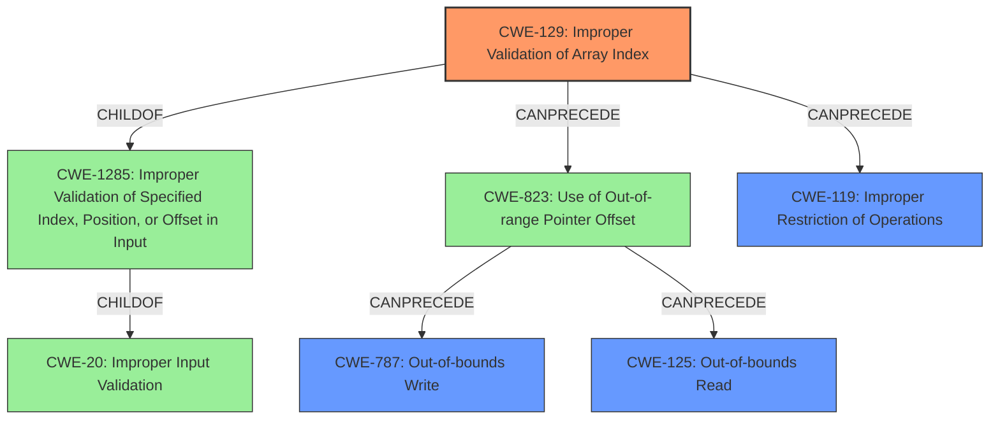

# Analysis for CVE-2021-1111

# Summary
| CWE ID | CWE Name | Confidence | CWE Abstraction Level | CWE Vulnerability Mapping Label | CWE-Vulnerability Mapping Notes |
|---|---|---|---|---|---|
| CWE-129 | Improper Validation of Array Index | 0.9 | Variant | Allowed | Primary CWE |
| CWE-125 | Out-of-bounds Read | 0.7 | Base | Allowed | Secondary Candidate |
| CWE-787 | Out-of-bounds Write | 0.7 | Base | Allowed | Secondary Candidate |
| CWE-119 | Improper Restriction of Operations within the Bounds of a Memory Buffer | 0.5 | Class | Discouraged | Secondary Candidate |

## Evidence and Confidence

*   **Confidence Score:** 0.8
*   **Evidence Strength:** HIGH

## Relationship Analysis
The primary weakness, **CWE-129 (Improper Validation of Array Index)**, is a variant of **CWE-1285 (Improper Validation of Specified Index, Position, or Offset in Input)** and a child of **CWE-20 (Improper Input Validation)**. This indicates the root cause is related to how input is handled and validated, specifically an array index. The vulnerability can lead to **CWE-119 (Improper Restriction of Operations within the Bounds of a Memory Buffer)** which is a more general class of vulnerability. **CWE-129** can also lead to **CWE-823 (Use of Out-of-range Pointer Offset)**, which can lead to **CWE-787 (Out-of-bounds Write)** or **CWE-125 (Out-of-bounds Read)**.

## Vulnerability Chain
The vulnerability chain starts with the NV3P server in the bootloader, where an **incorrect bounds check** (leading to **CWE-129**) allows a user with physical access through USB to cause a **buffer overflow** (leading to **CWE-787** or **CWE-125**), ultimately resulting in information disclosure, data integrity compromise, and denial of service.

## Summary of Analysis
The initial assessment identified **CWE-119** as a potential candidate due to the presence of a buffer overflow. However, **CWE-119** is a broad class and the description specifically mentions an **incorrect bounds check**. This indicates a problem with input validation, specifically related to array indexing. Therefore, **CWE-129 (Improper Validation of Array Index)** is a more accurate and specific classification. The evidence from the Vulnerability Description Key Phrases states the **rootcause** is an **incorrect bounds check** and the **weakness** is a **buffer overflow**, which supports this classification. The "CVE Reference Links Content Summary" further reinforces this, stating: "The vulnerability lies within the NV3P server in the bootloader. It's triggered by an incorrect bounds check." The other CWEs (CWE-125 and CWE-787) describe the potential outcomes of the vulnerability.

CWE-119 is a Class-level CWE and the mapping guidance discourages using it when more specific CWEs are available.

**CWE-129** is preferred as it directly addresses the **incorrect bounds check**, the root cause of the vulnerability.

Relevant CWE Information:

# Enhanced Context (25 CWEs)

## CWE-191: Integer Underflow (Wrap or Wraparound)
**Abstraction Level**: Base
**Similarity Score**: 0.78
**Source**: dense

**Description**:
The product subtracts one value from another, such that the result is less than the minimum allowable integer value, which produces a value that is not equal to the correct result.

**Mapping Guidance**:
- Usage: Allowed
- Rationale: This CWE entry is at the Base level of abstraction, which is a preferred level of abstraction for mapping to the root causes of vulnerabilities.

*Not Selected:* There is no evidence of subtraction operations causing an underflow.

## CWE-131: Incorrect Calculation of Buffer Size
**Abstraction Level**: Base
**Similarity Score**: 0.78
**Source**: dense

**Description**:
The product does not correctly calculate the size to be used when allocating a buffer, which could lead to a buffer overflow.

**Mapping Guidance**:
- Usage: Allowed
- Rationale: This CWE entry is at the Base level of abstraction, which is a preferred level of abstraction for mapping to the root causes of vulnerabilities.

*Not Selected:* The description focuses on an **incorrect bounds check**, not on the buffer size calculation.

## CWE-805: Buffer Access with Incorrect Length Value
**Abstraction Level**: Base
**Similarity Score**: 0.78
**Source**: dense

**Description**:
The product uses a sequential operation to read or write a buffer, but it uses an incorrect length value that causes it to access memory that is outside of the bounds of the buffer.

**Mapping Guidance**:
- Usage: Allowed
- Rationale: This CWE entry is at the Base level of abstraction, which is a preferred level of abstraction for mapping to the root causes of vulnerabilities.

*Not Selected:* While this could be a consequence, the root cause is the improper validation.

## CWE-124: Buffer Underwrite ('Buffer Underflow')
**Abstraction Level**: Base
**Similarity Score**: 0.77
**Source**: dense

**Description**:
The product writes to a buffer using an index or pointer that references a memory location prior to the beginning of the buffer.

**Mapping Guidance**:
- Usage: Allowed
- Rationale: This CWE entry is at the Base level of abstraction, which is a preferred level of abstraction for mapping to the root causes of vulnerabilities.

*Not Selected:* There is no specific evidence of an underwrite, the more generalized **buffer overflow** is more appropriate.

## CWE-126: Buffer Over-read
**Abstraction Level**: Variant
**Similarity Score**: 0.76
**Source**: dense

**Description**:
The product reads from a buffer using buffer access mechanisms such as indexes or pointers that reference memory locations after the targeted buffer.

**Mapping Guidance**:
- Usage: Allowed
- Rationale: This CWE entry is at the Variant level of abstraction, which is a preferred level of abstraction for mapping to the root causes of vulnerabilities.

*Candidate for Secondary Mapping:* This is possible given the **buffer overflow**, but an Out-of-bounds write is also possible so this is being considered.

## CWE-190: Integer Overflow or Wraparound
**Abstraction Level**: Base
**Similarity Score**: 0.76
**Source**: dense

**Description**:
The product performs a calculation that can produce an integer overflow or wraparound when the logic assumes that the resulting value will always be larger than the original value. This occurs when an integer value is incremented to a value that is too large to store in the associated representation. When this occurs, the value may become a very small or negative number.

**Mapping Guidance**:
- Usage: Allowed
- Rationale: This CWE entry is at the Base level of abstraction, which is a preferred level of abstraction for mapping to the root causes of vulnerabilities.

*Not Selected:* This is not the primary cause, the **incorrect bounds check** is more accurate.

## CWE-680: Integer Overflow to Buffer Overflow
**Abstraction Level**: Compound
**Similarity Score**: 0.75
**Source**: dense

**Description**:
The product performs a calculation to determine how much memory to allocate, but an integer overflow can occur that causes less memory to be allocated than expected, leading to a buffer overflow.

**Mapping Guidance**:
- Usage: Discouraged
- Rationale: This CWE entry is