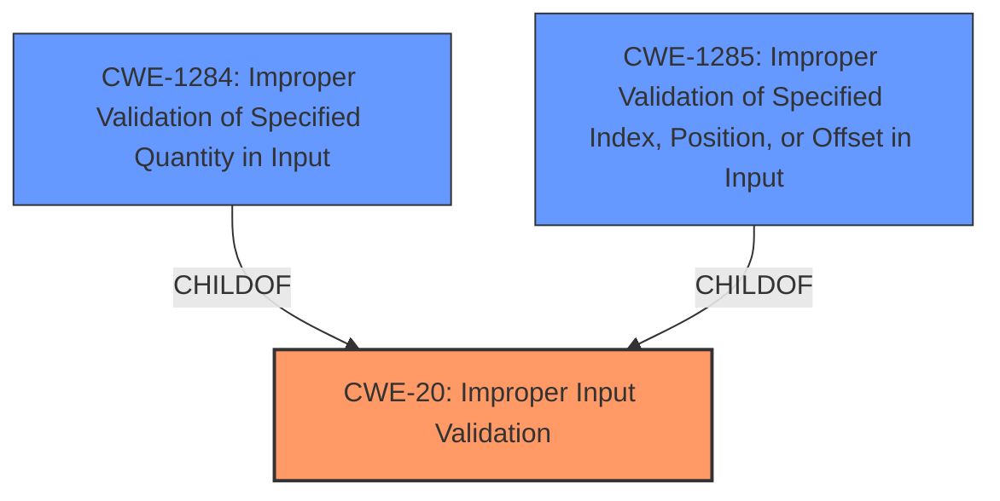

# Analysis for CVE-2021-1117

# Summary
| CWE ID | CWE Name | Confidence | CWE Abstraction Level | CWE Vulnerability Mapping Label | CWE-Vulnerability Mapping Notes |
|---|---|---|---|---|---|
| CWE-20 | Improper Input Validation | 0.8 | Class | Primary | Discouraged - Consider lower-level children |
| CWE-1284 | Improper Validation of Specified Quantity in Input | 0.6 | Base | Secondary | Allowed |
| CWE-1285 | Improper Validation of Specified Index, Position, or Offset in Input | 0.6 | Base | Secondary | Allowed |

## Evidence and Confidence

*   **Confidence Score:** 0.8
*   **Evidence Strength:** HIGH

## Relationship Analysis
The primary CWE identified is CWE-20, which is a class-level CWE. The retriever results also suggest more specific base-level CWEs like CWE-1284 and CWE-1285, which are children of CWE-20. The choice of CWE-20 as the primary is influenced by the direct mention of "**improper input validation**" in the vulnerability description. However, the additional context from the CVE summary suggests that the input might involve a quantity, index, position, or offset.

## Vulnerability Chain
The vulnerability chain starts with **improper input validation** (CWE-20), which leads to a denial of service. The specific type of input (quantity, index, or offset) that's not being validated is not explicitly clear, so we consider CWE-1284 and CWE-1285 as secondary possibilities.

## Summary of Analysis
The initial assessment strongly points towards CWE-20 due to the explicit mention of "**improper input validation**" in the vulnerability description. The CVE reference summary reinforces this by stating the **root cause** as "**improper input validation** within the `nvlddmkm.sys` kernel mode layer, specifically in the handler for DxgkDdiEscape". However, the retriever results and CWE specifications suggest that more specific CWEs like CWE-1284 or CWE-1285 could be considered if the **improper input validation** relates to a specified quantity or index/position/offset. Since the description mentions the DxgkDdiEscape handler in the NVIDIA GPU Display Driver, it's plausible that the input could be related to memory access or resource allocation, making CWE-1284 and CWE-1285 relevant.

The selection of CWE-20 as the primary weakness is based on the direct evidence from the vulnerability description. The inclusion of CWE-1284 and CWE-1285 as secondary weaknesses reflects the possibility of the **improper input validation** being related to specific types of input, based on the context of the vulnerable component. The chosen CWEs are at the appropriate level of specificity, with CWE-20 being a class-level weakness and CWE-1284/CWE-1285 being more specific base-level weaknesses.

Relevant CWE Information:

# Enhanced Context (25 CWEs)
The following CWEs were identified as potentially relevant to this vulnerability:

## CWE-20: Improper Input Validation
**Abstraction:** Class
**Status:** Stable

### Description
The product receives input or data, but it does
        not validate or incorrectly validates that the input has the
        properties that are required to process the data safely and
        correctly.

### Extended Description
Input validation is a frequently-used technique for checking potentially dangerous inputs in order to ensure that the inputs are safe for processing within the code, or when communicating with other components. When software does not validate input properly, an attacker is able to craft the input in a form that is not expected by the rest of the application. This will lead to parts of the system receiving unintended input, which may result in altered control flow, arbitrary control of a resource, or arbitrary code execution.
### Observed Examples
- **CVE-2024-37032:** Large language model (LLM) management tool does not validate the format of a digest value (CWE-1287) from a private, untrusted model registry, enabling relative path traversal (CWE-23), a.k.a. Probllama
- **CVE-2022-45918:** Chain: a learning management tool debugger uses external input to locate previous session logs (CWE-73) and does not properly validate the given path (CWE-20), allowing for filesystem path traversal using "../" sequences (CWE-24)
- **CVE-2021-30860:** Chain: improper input validation (CWE-20) leads to integer overflow (CWE-190) in mobile OS, as exploited in the wild per CISA KEV.

The vulnerability description explicitly states "**improper input validation**", making CWE-20 a strong candidate. The security implication is that an attacker can craft unexpected input, leading to altered control flow or resource issues. The mapping guidance discourages using CWE-20 directly due to its generality. However, given the information available, it serves as a suitable starting point.

## CWE-1284: Improper Validation of Specified Quantity in Input
**Abstraction:** Base
**Status:** Incomplete

### Description
The product receives input that is expected to specify a quantity (such as size or length), but it does not validate or incorrectly validates that the quantity has the required properties.

### Extended Description
Specified quantities include size, length, frequency, price, rate, number of operations, time, and others. Code may rely on specified quantities to allocate resources, perform calculations, control iteration, etc. When the quantity is not properly validated, then attackers can specify malicious quantities to cause excessive resource allocation, trigger unexpected failures, enable buffer overflows, etc.

### Observed Examples
- **CVE-2022-21668:** Chain: Python library does not limit the resources used to process images that specify a very large number of bands (CWE-1284), leading to excessive memory consumption (CWE-789) or an integer overflow (CWE-190).
- **CVE-2008-1440:** lack of validation of length field leads to infinite loop
- **CVE-2008-2374:** lack of validation of string length fields allows memory consumption or buffer over-read

The DxgkDdiEscape handler potentially deals with memory allocation or buffer sizes, making CWE-1284 a plausible candidate. The security implication is that an attacker could specify a large quantity, leading to excessive resource allocation and denial of service. The mapping guidance allows this CWE, supporting its potential relevance.

## CWE-1285: Improper Validation of Specified Index, Position, or Offset in Input
**Abstraction:** Base
**Status:** Incomplete

### Description
The product receives input that is expected to specify an index, position, or offset into an indexable resource such as a buffer or file, but it does not validate or incorrectly validates that the specified index/position/offset has the required properties.

### Extended Description
Often, indexable resources such as memory buffers or files can be accessed using a specific position, index, or offset, such as an index for an array or a position for a file. When untrusted input is not properly validated before it is used as an index, attackers could access (or attempt to access) unauthorized portions of these resources. This could be used to cause buffer overflows, excessive resource allocation, or trigger unexpected failures.

### Observed Examples
- **CVE-2005-0369:** large ID in packet used as array index
- **CVE-2001-1009:** negative array index as argument to POP LIST command

Similar to CWE-1284, the DxgkDdiEscape handler could also involve handling indexes or offsets within memory buffers. If the input is used as an index without proper validation, it could lead to out-of-bounds access and a denial of service. The mapping guidance allows this CWE.

## CWE-787: Out-of-bounds Write
**Abstraction:** Base
**Status:** Stable
The retriever results does not include CWE-787, but it is a common result of improper input validation. The provided document does not include an "out-of-bounds write". Therefore CWE-787 is not a good fit.

## CWE-119: Improper Restriction of Operations within the Bounds of a Memory Buffer
**Abstraction:** Class
**Status:** Stable

Although CWE-119 is in the retriever results, it's mapping guidance says