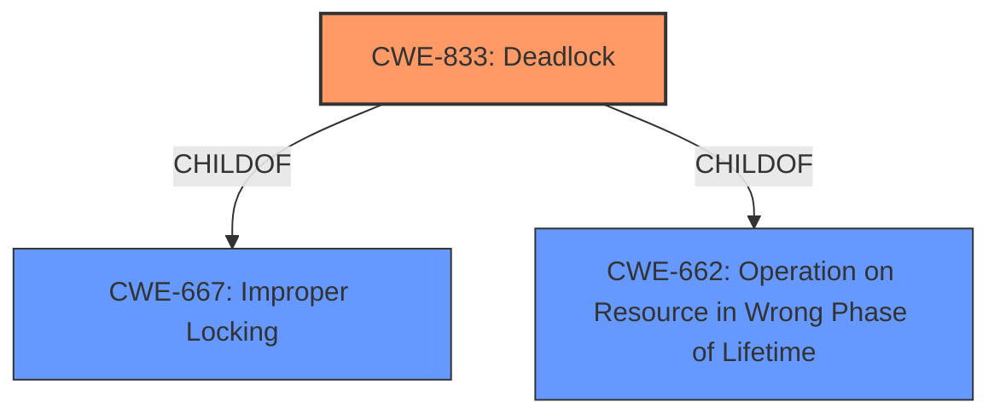

# Enhanced Analysis for CVE-2021-1123

# Summary
| CWE ID | CWE Name | Confidence | CWE Abstraction Level | CWE Vulnerability Mapping Label | CWE-Vulnerability Mapping Notes |
|---|---|---|---|---|---|
| CWE-833 | Deadlock | 1.0 | Base | Allowed | Primary CWE |

## Evidence and Confidence

*   **Confidence Score:** 1.0
*   **Evidence Strength:** HIGH

## Relationship Analysis
The primary relationship considered was the parent-child relationship. CWE-833 (Deadlock) is a child of CWE-667 (Improper Locking) and CWE-662 (Operation on Resource in Wrong Phase of Lifetime). Since the vulnerability explicitly states a **deadlock** condition, selecting the base CWE-833 is more appropriate than the class CWE-667.



## Vulnerability Chain
The vulnerability chain is quite simple here:
1.  **Deadlock** (CWE-833) is the root cause.
2.  Denial of Service is the impact.

## Summary of Analysis
The initial assessment aligns directly with the provided vulnerability description, which mentions a **deadlock** condition. The "CVE Reference Links Content Summary" confirms this by stating, "The vulnerability is caused by a deadlock condition within the Virtual GPU Manager (vGPU plugin)." The "Vulnerability Description Key Phrases" also highlight "**weakness: deadlock**".

The retriever results also list CWE-833 as the top combined result, further supporting this selection.

The CWE-833 entry is at the Base level of abstraction, which is the preferred level.

Therefore, based on the evidence, the most appropriate CWE is CWE-833.

Relevant CWE Information:

# Enhanced Context (25 CWEs)

## CWE-833: Deadlock
**Abstraction:** Base
**Status:** Incomplete

### Description
The product contains multiple threads or executable segments that are waiting for each other to release a necessary lock, resulting in deadlock.

### Extended Description
Not provided

### Alternative Terms
None

### Relationships
ChildOf -> CWE-667
ChildOf -> CWE-662

### Mapping Guidance
**Usage:** Allowed
**Rationale:** This CWE entry is at the Base level of abstraction, which is a preferred level of abstraction for mapping to the root causes of vulnerabilities.
**Comments:** Carefully read both the name and description to ensure that this mapping is an appropriate fit. Do not try to 'force' a mapping to a lower-level Base/Variant simply to comply with this preferred level of abstraction.
**Reasons:**
- Acceptable-Use


## CWE Relationship Analysis

Current CWEs represent these abstraction levels: .


### Vulnerability Chain Analysis

**Chain starting from CWE-667:**
- 667 (Improper Locking) - ROOT


**Chain starting from CWE-662:**
- 662 (Improper Synchronization) - ROOT


### CWE Relationship Diagram

```mermaid
graph TD
    classDef primary fill:#f96,stroke:#333,stroke-width:2px
    classDef secondary fill:#69f,stroke:#333
    classDef tertiary fill:#9e9,stroke:#333
```