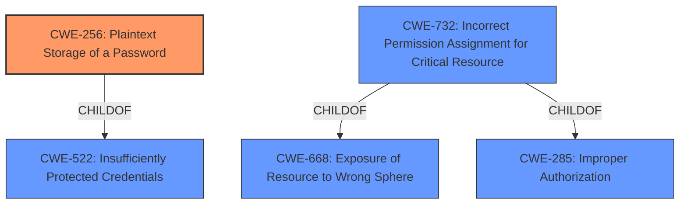

# Raw Analyzer Response for CVE-2021-1126

# Summary
| CWE ID  | CWE Name                                                  | Confidence | CWE Abstraction Level | CWE Vulnerability Mapping Label | CWE-Vulnerability Mapping Notes |
| :-------- | :-------------------------------------------------------- | :--------- | :-------------------- | :------------------------------ | :------------------------------ |
| CWE-256   | Plaintext Storage of a Password                         | 1          | Base                  | Primary                         | Allowed                       |
| CWE-732   | Incorrect Permission Assignment for Critical Resource   | 0.9        | Class                 | Secondary                       | Allowed-with-Review           |

## Evidence and Confidence

*   **Confidence Score:** 0.95
*   **Evidence Strength:** HIGH

## Relationship Analysis
The primary weakness is **clear-text storage of credentials**, which directly maps to CWE-256. The secondary weakness involves **weak permissions on configuration files**, relating to CWE-732. CWE-256 is a base level CWE, which is the preferred level of abstraction. CWE-732 is a class level CWE, and although it would be preferred to have a base or variant level CWE, it is a reasonable match given the information available.

## Vulnerability Chain
The vulnerability chain starts with the **clear-text storage** of proxy server credentials in configuration files, coupled with **weak permissions** on these files. This leads to the exposure of sensitive information, specifically the proxy server credentials, to an authenticated, local attacker. The root cause is the **clear-text storage**, and the weak permission is a contributing factor in the vulnerability chain.

## Summary of Analysis
The initial assessment identifies **clear-text storage** as the primary weakness and **weak permissions** as a contributing factor. The final conclusion is based on the evidence that the **clear-text storage** (CWE-256) directly enables unauthorized credential disclosure. The graph relationships support this by highlighting the connection between **clear-text storage** and broader credential protection issues. The selected CWEs are at the optimal level of specificity because they directly represent the root cause (CWE-256) and the contributing factor (CWE-732) described in the vulnerability.
>Vulnerability Description Key Phrases
> -   **rootcause:** **clear-text storage and weak permissions of related configuration files**

Relevant CWE Information:

# Enhanced Context (25 CWEs)

## CWE-538: Insertion of Sensitive Information into Externally-Accessible File or Directory
**Abstraction Level**: Base
**Similarity Score**: 0.78
**Source**: dense
**Description**: The product places sensitive information into files or directories that are accessible to actors who are allowed to have access to the files, but not to the sensitive information.

## CWE-256: Plaintext Storage of a Password
**Abstraction:** Base
**Status:** Incomplete
### Description
Storing a password in plaintext may result in a system compromise.
### Extended Description
Password management issues occur when a password is stored in plaintext in an application's properties, configuration file, or memory. Storing a plaintext password in a configuration file allows anyone who can read the file access to the password-protected resource. In some contexts, even storage of a plaintext password in memory is considered a security risk if the password is not cleared immediately after it is used.
### Mapping Guidance
**Usage:** Allowed
**Rationale:** This CWE entry is at the Base level of abstraction, which is a preferred level of abstraction for mapping to the root causes of vulnerabilities.
**Comments:** Carefully read both the name and description to ensure that this mapping is an appropriate fit. Do not try to 'force' a mapping to a lower-level Base/Variant simply to comply with this preferred level of abstraction.

### Observed Examples
-   **CVE-2022-30275:** Remote Terminal Unit (RTU) uses a driver that relies on a password stored in plaintext.
The vulnerability description states the "vulnerability is due to **clear-text storage** and weak permissions of related configuration files." The **clear-text storage** part of the rootcause maps directly to this CWE. This CWE is at the base level of abstraction and the Mapping Guidance Usage is ALLOWED.

## CWE-732: Incorrect Permission Assignment for Critical Resource
**Abstraction:** Class
### Description
The product specifies permissions for a security-critical resource in a way that allows that resource to be read or modified by unintended actors.
### Extended Description
When a resource is given a permission setting that provides access to a wider range of actors than required, it could lead to the exposure of sensitive information, or the modification of that resource by unintended parties. This is especially dangerous when the resource is related to program configuration, execution, or sensitive user data. For example, consider a misconfigured storage account for the cloud that can be read or written by a public or anonymous user.
### Mapping Guidance
**Usage:** Allowed-with-Review
**Rationale:** While the name itself indicates an assignment of permissions for resources, this is often misused for vulnerabilities in which "permissions" are not checked, which is an "authorization" weakness (CWE-285 or descendants) within CWE's model [REF-1287].
**Comments:** Closely analyze the specific mistake that is allowing the resource to be exposed, and perform a CWE mapping for that mistake.

The vulnerability description states the "vulnerability is due to clear-text storage and **weak permissions** of related configuration files." The **weak permissions** part of the rootcause maps directly to this CWE. The Mapping Guidance Usage is Allowed-with-Review and is a Class level of abstraction.

## CWE-259: Use of Hard-coded Password
**Abstraction:** Variant
### Description
The product contains a hard-coded password, which it uses for its own inbound authentication or for outbound communication to external components.
### Extended Description
A hard-coded password typically leads to a significant authentication failure that can be difficult for the system administrator to detect. Once detected, it can be difficult to fix, so the administrator may be forced into disabling the product entirely. There are two main variations:
### Mapping Guidance
**Usage:** Allowed
**Rationale:** This CWE entry is at the Variant level of abstraction, which is a preferred level of abstraction for mapping to the root causes of vulnerabilities.
**Comments:** Carefully read both the name and description to ensure that this mapping is an appropriate fit. Do not try to 'force' a mapping to a lower-level Base/Variant simply to comply with this preferred level of abstraction.

This CWE was considered because passwords are being stored, but it does not apply because the passwords are not hardcoded, just stored in **clear-text**.

## CWE-321: Use of Hard-coded Cryptographic Key
**Abstraction:** Variant
### Description
The use of a hard-coded cryptographic key significantly increases the possibility that encrypted data may be recovered.
### Mapping Guidance
**Usage:** Allowed
**Rationale:** This CWE entry is at the Variant level of abstraction, which is a preferred level of abstraction for mapping to the root causes of vulnerabilities.

This CWE was considered because it is about cryptographic keys, but it does not apply because the cryptographic keys are not hardcoded, just stored in **clear-text**.