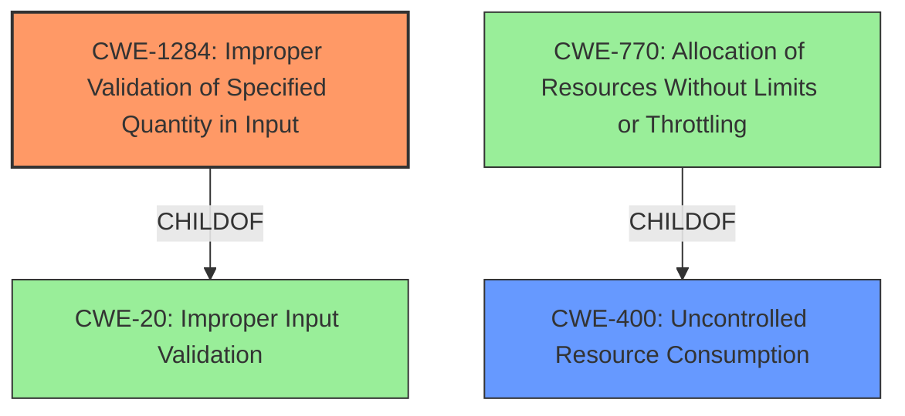

# Raw Analyzer Response for CVE-2021-1131

# Summary
| CWE ID | CWE Name | Confidence | CWE Abstraction Level | CWE Vulnerability Mapping Label | CWE-Vulnerability Mapping Notes |
|---|---|---|---|---|---|
| CWE-1284 | Improper Validation of Specified Quantity in Input | 0.8 | Base | Primary | Allowed |
| CWE-400 | Uncontrolled Resource Consumption | 0.6 | Class | Secondary | Discouraged |

## Evidence and Confidence

*   **Confidence Score:** 0.7
*   **Evidence Strength:** MEDIUM

## Relationship Analysis
The primary CWE is CWE-1284, which highlights the **missing checks** on the Cisco Discovery Protocol messages. This leads to a potential for an attacker to send a malicious packet. CWE-1284 is a child of CWE-20 (Improper Input Validation). CWE-400 is a class-level CWE, which is a parent of CWE-770 (Allocation of Resources Without Limits or Throttling).

## Vulnerability Chain
The vulnerability chain starts with **missing checks** (CWE-1284), which allows a malicious packet to be sent, potentially leading to a denial of service (CWE-400) due to excessive resource consumption when the device attempts to handle the malformed packet.

## Summary of Analysis
The initial assessment considered CWE-787 due to the similar CVE descriptions and the top CWEs listed. However, the root cause is more aligned with the **missing checks** on the input, rather than a memory corruption issue. The description mentions "**missing checks** when Cisco Discovery Protocol messages are processed," which directly relates to improper input validation. The malicious packet causes the IP camera to reload, leading to a DoS condition, indicating uncontrolled resource consumption.

CWE-1284 is selected as the primary CWE because the **missing checks** directly correspond to **Improper Validation of Specified Quantity in Input**. This is further supported by the CVE Reference Links Content Summary, which mentions "Improper validation of CDP messages" and "Lack of input sanitization when handling CDP packets."

CWE-400 is considered as a secondary CWE because the ultimate impact is a denial of service, which is a form of uncontrolled resource consumption. However, it's a more general consequence, and the root cause lies in the input validation issue.

The CWEs selected are at the optimal level of specificity because CWE-1284 directly addresses the **missing checks** on the input data, while CWE-400 describes the high-level impact of the vulnerability.

Relevant CWE Information:

# Enhanced Context (25 CWEs)

## CWE-664: Improper Control of a Resource Through its Lifetime
**Abstraction Level**: Pillar
**Similarity Score**: 0.75

**Description**:
The product does not maintain or incorrectly maintains control over a resource throughout its lifetime of creation, use, and release.
- **Not Used:** Too high level

## CWE-405: Asymmetric Resource Consumption (Amplification)
**Abstraction Level**: Class
**Similarity Score**: 0.75

**Description**:
The product does not properly control situations in which an adversary can cause the product to consume or produce excessive resources without requiring the adversary to invest equivalent work or otherwise prove authorization, i.e., the adversary's influence is "asymmetric."
- **Not Used:** While amplification may occur, the root cause is the improper validation.

## CWE-404: Improper Resource Shutdown or Release
**Abstraction Level**: Class
**Similarity Score**: 0.74

**Description**:
The product does not release or incorrectly releases a resource before it is made available for re-use.
- **Not Used:** Not related to the **missing checks** of the input.

## CWE-226: Sensitive Information in Resource Not Removed Before Reuse
**Abstraction Level**: Base
**Similarity Score**: 0.73

**Description**:
The product releases a resource such as memory or a file so that it can be made available for reuse, but it does not clear or "zeroize" the information contained in the resource before the product performs a critical state transition or makes the resource available for reuse by other entities.
- **Not Used:** Not applicable to the vulnerability description.

## CWE-1325: Improperly Controlled Sequential Memory Allocation
**Abstraction Level**: Base
**Similarity Score**: 0.72

**Description**:
The product manages a group of objects or resources and performs a separate memory allocation for each object, but it does not properly limit the total amount of memory that is consumed by all of the combined objects.
- **Not Used:** Not applicable to the vulnerability description.

## CWE-772: Missing Release of Resource after Effective Lifetime
**Abstraction Level**: Base
**Similarity Score**: 0.72

**Description**:
The product does not release a resource after its effective lifetime has ended, i.e., after the resource is no longer needed.
- **Not Used:** Not applicable to the vulnerability description.

## CWE-771: Missing Reference to Active Allocated Resource
**Abstraction Level**: Base
**Similarity Score**: 0.71

**Description**:
The product does not properly maintain a reference to a resource that has been allocated, which prevents the resource from being reclaimed.
- **Not Used:** Not applicable to the vulnerability description.

## CWE-668: Exposure of Resource to Wrong Sphere
**Abstraction Level**: Class
**Similarity Score**: 0.71

**Description**:
The product exposes a resource to the wrong control sphere, providing unintended actors with inappropriate access to the resource.
- **Not Used:** Not applicable to the vulnerability description.

## CWE-789: Memory Allocation with Excessive Size Value
**Abstraction Level**: Variant
**Similarity Score**: 0.71

**Description**:
The product allocates memory based on an untrusted, large size value, but it does not ensure that the size is within expected limits, allowing arbitrary amounts of memory to be allocated.
- **Not Used:** The **missing checks** do not directly relate to excessive memory allocation.

## CWE-667: Improper Locking
**Abstraction Level**: Class
**Similarity Score**: 0.70

**Description**:
The product does not properly acquire or release a lock on a resource, leading to unexpected resource state changes and behaviors.
- **Not Used:** Not applicable to the vulnerability description.

## CWE-190: Integer Overflow or Wraparound
**Abstraction Level**: Base
**Similarity Score**: 9724.85

**Description**:
The product performs a calculation that can produce an integer overflow or wraparound when the logic assumes that the resulting value will always be larger than the original value.
- **Not Used:** Not the primary issue, but an integer overflow might occur as a result of improper validation, so it is not the root cause.

## CWE-1284: Improper Validation of Specified Quantity in Input
**Abstraction Level**: Base
**Similarity Score**: 9589.50

**Description**:
The product receives input that is expected to specify a quantity (such as size or length), but it does not validate or incorrectly validates that the quantity has the required properties.
- **Used:** Primary CWE as the **missing checks** is the rootcause.

## CWE-770: Allocation of Resources Without Limits or Throttling
**Abstraction Level**: Base
**Similarity Score**: 9328.79

**Description**:
The product allocates a reusable resource or group of resources on behalf of an actor without imposing any restrictions on the size or number of resources that can be allocated, in violation of the intended security policy for that actor.
- **Not Used:** Not the rootcause

## CWE-119: Improper Restriction of Operations within the Bounds of a Memory Buffer
**Abstraction Level**: Class
**Similarity Score**: 9255.23

**Description**:
The product performs operations on a memory buffer, but it reads from or writes to a memory location outside the buffer's intended boundary.
- **Not Used:** Not the root cause, the issue stems from **missing checks** of the input.

## CWE-789: Memory Allocation with Excessive Size Value
**Abstraction Level**: Variant
**Similarity Score**: 9212.35

**Description**:
The product allocates memory based on an untrusted, large size value, but it does not ensure that the size is within expected limits, allowing arbitrary amounts of memory to be allocated.
- **Not Used:**