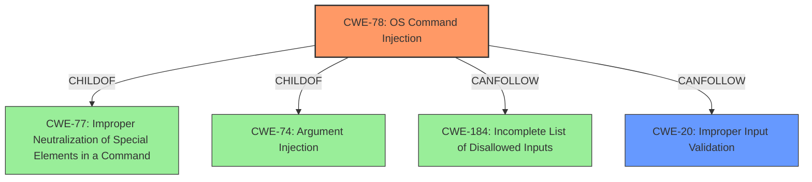

# Enhanced Analysis for CVE-2021-1138

# Summary
| CWE ID  | CWE Name                                                                          | Confidence | CWE Abstraction Level | CWE Vulnerability Mapping Label | CWE-Vulnerability Mapping Notes |
| :-------- | :---------------------------------------------------------------------------------- | :--------- | :---------------------- | :------------------------------ | :------------------------------ |
| CWE-78  | Improper Neutralization of Special Elements used in an OS Command ('OS Command Injection') | 1          | Base                    | Primary                       | Allowed                       |
| CWE-20  | Improper Input Validation                                                           | 0.7        | Class                   | Secondary                       | Discouraged                    |

## Evidence and Confidence

*   **Confidence Score:** 0.9
*   **Evidence Strength:** HIGH

## Relationship Analysis
The primary relationship influencing the decision is the ChildOf relationship where CWE-78 is a child of CWE-77 (Improper Neutralization of Special Elements used in a Command) and CWE-74 (Improper Neutralization of Special Elements in Output Used as an Argument ('Argument Injection')). This indicates that CWE-78 is a more specific type of command injection. Additionally, CWE-78 can follow CWE-184 (Incomplete List of Disallowed Inputs), indicating that an incomplete list of disallowed inputs can lead to command injection.



## Vulnerability Chain
The vulnerability chain starts with **insufficient input validation** (CWE-20), which then leads to the ability to inject special elements into an OS command, resulting in **OS command injection** (CWE-78).

## Summary of Analysis
The initial analysis focused on identifying the root cause of the vulnerability, which is the ability to execute arbitrary commands on the underlying operating system through the web UI of Cisco Smart Software Manager Satellite.

The primary CWE match identified was CWE-78, which aligns directly with the **"execute arbitrary commands"** impact and the **"unauthenticated remote attacker"** vector described in the vulnerability description. The CVE Reference Links Content Summary confirms this, stating that the **root cause** is **insufficient input validation**, leading to **command injection**. The high CVSS score (9.8) also indicates a critical vulnerability with significant impact, consistent with command injection scenarios.

CWE-20 was also considered, as the **root cause** mentioned **insufficient input validation** in the web UI. However, CWE-20 is a class-level CWE that is often misused, and it is recommended to use more specific CWEs when available. Since the **insufficient input validation** directly leads to **OS command injection**, CWE-78 is the more appropriate choice.
The evidence supports CWE-78 due to the direct cause-and-effect relationship between the **lack of input validation** and the ability to **execute arbitrary commands**.

The final decision to prioritize CWE-78 is based on its precise alignment with the vulnerability's **root cause** and impact, as well as the mapping guidance to avoid using overly general CWEs like CWE-20 when more specific options exist. CWE-78 is at the Base level of abstraction, which is the preferred level.

Relevant CWE Information:

# Enhanced Context (25 CWEs)
The following CWEs were identified as potentially relevant to this vulnerability:

## CWE-289: Authentication Bypass by Alternate Name
**Abstraction Level**: Base
**Similarity Score**: 0.71
**Source**: dense

**Description**:
The product performs authentication based on the name of a resource being accessed, or the name of the actor performing the access, but it does not properly check all possible names for that resource or actor.

**Mapping Guidance**:
- Usage: Allowed
- Rationale: This CWE entry is at the Base level of abstraction, which is a preferred level of abstraction for mapping to the root causes of vulnerabilities.

*   This CWE is not relevant as the description states that no authentication is required.

## CWE-300: Channel Accessible by Non-Endpoint
**Abstraction Level**: Class
**Similarity Score**: 0.69
**Source**: dense

**Description**:
The product does not adequately verify the identity of actors at both ends of a communication channel, or does not adequately ensure the integrity of the channel, in a way that allows the channel to be accessed or influenced by an actor that is not an endpoint.

**Mapping Guidance**:
- Usage: Discouraged
- Rationale: CWE-300 is commonly misused for vulnerabilities in which the prerequisites for exploitation require the adversary to be in a privileged "in-the-middle" position.

*   This CWE is not relevant as the vulnerability does not depend on a compromised communication channel.

## CWE-807: Reliance on Untrusted Inputs in a Security Decision
**Abstraction Level**: Base
**Similarity Score**: 0.69
**Source**: dense

**Description**:
The product uses a protection mechanism that relies on the existence or values of an input, but the input can be modified by an untrusted actor in a way that bypasses the protection mechanism.

**Mapping Guidance**:
- Usage: Allowed
- Rationale: This CWE entry is at the Base level of abstraction, which is a preferred level of abstraction for mapping to the root causes of vulnerabilities.

*   This CWE could be considered. However, the more precise cause is the command injection.

## CWE-1289: Improper Validation of Unsafe Equivalence in Input
**Abstraction Level**: Base
**Similarity Score**: 0.69
**Source**: dense

**Description**:
The product receives an input value that is used as a resource identifier or other type of reference, but it does not validate or incorrectly validates that the input is equivalent to a potentially-unsafe value.

**Mapping Guidance**:
- Usage: Allowed
- Rationale: This CWE entry is at the Base level of abstraction, which is a preferred level of abstraction for mapping to the root causes of vulnerabilities.

*   This CWE is not a close fit. The issue is not with equivalent unsafe values, but with injecting code.

## CWE-302: Authentication Bypass by Assumed-Immutable Data
**Abstraction Level**: Base
**Similarity Score**: 0.69
**Source**: dense

**Description**:
The authentication scheme or implementation uses key data elements that are assumed to be immutable, but can be controlled or modified by the attacker.

**Mapping Guidance**:
- Usage: Allowed
- Rationale: This CWE entry is at the Base level of abstraction, which is a preferred level of abstraction for mapping to the root causes of vulnerabilities.

*   This CWE is not relevant as the description states that no authentication is required.

## CWE-653: Improper Isolation or Compartmentalization
**Abstraction Level**: Class
**Similarity Score**: 0.69
**Source**: dense

**Description**:
The product does not properly compartmentalize or isolate functionality, processes, or resources that require different privilege levels, rights, or permissions.

**Mapping Guidance**:
- Usage: Allowed
- Rationale: This CWE entry is at the Base level of abstraction, which is a preferred level of abstraction for mapping to the root causes of vulnerabilities.

*   This CWE is not a good fit as there is no discussion of privileges.

## CWE-303: Incorrect Implementation of Authentication Algorithm
**Abstraction Level**: Base
**Similarity Score**: 0.68
**Source**: dense

**Description**:
The requirements for the product dictate the use of an established authentication algorithm, but the implementation of the algorithm is incorrect.

**Mapping Guidance**:
- Usage: Allowed
- Rationale: This CWE entry is at the Base level of abstraction, which is a preferred level of abstraction for mapping to the root causes of vulnerabilities.

*   This CWE is not relevant as the description states that no authentication is required.

## CWE-304: Missing Critical Step in Authentication
**Abstraction Level**: Base
**Similarity Score**: 0.68
**Source**: dense

**Description**:
The product implements an authentication technique, but it skips a step that weakens the technique.

**Mapping Guidance**:
- Usage: Allowed
- Rationale: This CWE entry is at the Base level of abstraction, which is a preferred level of abstraction for mapping to the root causes of vulnerabilities.

*   This CWE is not relevant as the description states that no authentication is required.

## CWE-305: Authentication Bypass by Primary Weakness
**Abstraction Level**: Base
**Similarity Score**:


## CWE Relationship Analysis

Current CWEs represent these abstraction levels: .


### Vulnerability Chain Analysis

**Chain starting from CWE-303:**
- 303 (Incorrect Implementation of Authentication Algorithm) - ROOT


**Chain starting from CWE-653:**
- 653 (Improper Isolation or Compartmentalization) - ROOT


### CWE Relationship Diagram

```mermaid
graph TD
    classDef primary fill:#f96,stroke:#333,stroke-width:2px
    classDef secondary fill:#69f,stroke:#333
    classDef tertiary fill:#9e9,stroke:#333
```