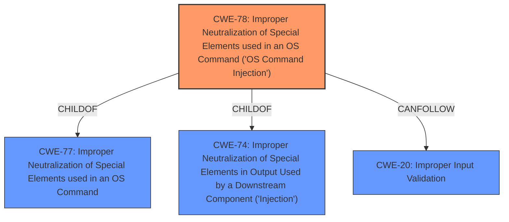

# Enhanced Analysis for CVE-2021-1139

# Summary
| CWE ID | CWE Name | Confidence | CWE Abstraction Level | CWE Vulnerability Mapping Label | CWE-Vulnerability Mapping Notes |
|---|---|---|---|---|---|
| CWE-78 | Improper Neutralization of Special Elements used in an OS Command ('OS Command Injection') | 1 | Base | Allowed | Primary CWE |
| CWE-20 | Improper Input Validation | 0.7 | Class | Discouraged | Secondary Candidate |

## Evidence and Confidence

*   **Confidence Score:** 0.9
*   **Evidence Strength:** HIGH

## Relationship Analysis
The primary relationship that influenced the selection was that CWE-78 is a **Base** level CWE, providing a specific description of the vulnerability, while CWE-20 is a **Class** level CWE, a more general category. The **ChildOf** relationship of CWE-78 to CWE-77 and CWE-74 shows it is a specific type of command injection and injection respectively.



## Vulnerability Chain
The vulnerability chain starts with **insufficient input validation** in the web UI, which leads to **OS Command Injection**, allowing an attacker to **execute arbitrary commands**.
  - The root cause is the **insufficient input validation**.
  - The weakness is **OS Command Injection**.
  - The impact is **arbitrary command execution**.

## Summary of Analysis
The initial analysis identified CWE-78 as the primary weakness due to the **Command Injection** vulnerability, stemming from **insufficient input validation**. This assessment is strongly based on the provided evidence, specifically:

*   "**Weaknesses**: [ "Command Injection" ]" from the CVE Reference Links Content Summary.
*   "**root_cause**: Insufficient input validation in the web UI of Cisco Smart Software Manager Satellite." from the CVE Reference Links Content Summary.
*   "Multiple vulnerabilities in the web UI of Cisco Smart Software Manager Satellite could allow an unauthenticated, remote attacker to execute arbitrary commands on the underlying operating system." from the Vulnerability Description.
*   "CWE for similar CVE Descriptions":  lists CWE-78 as the Primary CWE Match and most frequent Top CWE.

CWE-20 was considered as a contributing factor because the root cause was described as "**insufficient input validation**". However, CWE-20 is a **Class** level CWE and the MITRE mapping guidance **Discourages** using CWE-20 when lower-level CWEs could be used instead. The evidence specifically indicates **Command Injection**, making CWE-78 a more precise classification.

The decision to use CWE-78 is further supported by its **Base** level of abstraction and the specific description aligning with the vulnerability details. The graph relationships show that CWE-78 is a **ChildOf** CWE-77 and CWE-74, indicating it is a specific type of injection, making it more appropriate than the **Class** level CWE-20.

**CWE-22**, **CWE-23**, **CWE-61**, **CWE-269**, **CWE-73**, **CWE-119**, **CWE-305**, **CWE-287**, **CWE-770**, **CWE-190**, **CWE-125**, **CWE-88**, **CWE-426**, **CWE-434**, **CWE-98**, **CWE-386**, **CWE-1289**, **CWE-807**, **CWE-303**, **CWE-1390**, **CWE-41**, **CWE-74**, **CWE-1391**, **CWE-639**, **CWE-184**, **CWE-345**, were considered but ultimately not selected because they did not align as directly with the core issue of command injection as CWE-78 did. These CWEs describe other types of weaknesses or vulnerabilities that were not explicitly present in the provided information.

The selected CWEs are at the optimal level of specificity because CWE-78 directly addresses the **Command Injection** vulnerability, while CWE-20 is a more general description of **Improper Input Validation**, and the supporting evidence points towards the command injection as the primary issue.

Relevant CWE Information:

# Enhanced Context (25 CWEs)
The following CWEs were identified as potentially relevant to this vulnerability:

## CWE-1289: Improper Validation of Unsafe Equivalence in Input
**Abstraction Level**: Base
**Similarity Score**: 0.77
**Source**: dense

**Description**:
The product receives an input value that is used as a resource identifier or other type of reference, but it does not validate or incorrectly validates that the input is equivalent to a potentially-unsafe value.

**Mapping Guidance**:
- Usage: Allowed
- Rationale: This CWE entry is at the Base level of abstraction, which is a preferred level of abstraction for mapping to the root causes of vulnerabilities.


## CWE-807: Reliance on Untrusted Inputs in a Security Decision
**Abstraction Level**: Base
**Similarity Score**: 0.77
**Source**: dense

**Description**:
The product uses a protection mechanism that relies on the existence or values of an input, but the input can be modified by an untrusted actor in a way that bypasses the protection mechanism.

**Mapping Guidance**:
- Usage: Allowed
- Rationale: This CWE entry is at the Base level of abstraction, which is a preferred level of abstraction for mapping to the root causes of vulnerabilities.


## CWE-303: Incorrect Implementation of Authentication Algorithm
**Abstraction Level**: Base
**Similarity Score**: 0.77
**Source**: dense

**Description**:
The requirements for the product dictate the use of an established authentication algorithm, but the implementation of the algorithm is incorrect.

**Mapping Guidance**:
- Usage: Allowed
- Rationale: This CWE entry is at the Base level of abstraction, which is a preferred level of abstraction for mapping to the root causes of vulnerabilities.


## CWE-1390: Weak Authentication
**Abstraction Level**: Class
**Similarity Score**: 0.76
**Source**: dense

**Description**:
The product uses an authentication mechanism to restrict access to specific users or identities, but the mechanism does not sufficiently prove that the claimed identity is correct.

**Mapping Guidance**:
- Usage: Allowed-with-Review
- Rationale: This CWE entry is a Class and might have Base-level children that would be more appropriate


## CWE-41: Improper Resolution of Path Equivalence
**Abstraction Level**: Base
**Similarity Score**: 0.76
**Source**: dense

**Description**:
The product is vulnerable to file system contents disclosure through path equivalence. Path equivalence involves the use of special characters in file and directory names. The associated manipulations are intended to generate multiple names for the same object.

**Mapping Guidance**:
- Usage: Allowed
- Rationale: This CWE entry is at the Base level of abstraction, which is a preferred level of abstraction for mapping to the root causes of vulnerabilities.


## CWE-74: Improper Neutralization of Special Elements in Output Used by a Downstream Component ('Injection')
**Abstraction Level**: Class
**Similarity Score**: 0.76
**Source**: dense

**Description**:
The product constructs all or part of a command, data structure, or record using externally-influenced input from an upstream component, but it does not neutralize or incorrectly neutralizes special elements that could modify how it is parsed or interpreted when it is sent to a downstream component.

**Mapping Guidance**:
- Usage: Discouraged
- Rationale: CWE-74 is high-level and often misused when lower-level weaknesses are more appropriate.


## CWE-1391: Use of Weak Credentials
**Abstraction Level**: Class
**Similarity Score**: 0.76
**Source**: dense

**Description**:
The product uses weak credentials (such as a default key or hard-coded password) that can be calculated, derived, reused, or guessed by an attacker.

**Mapping Guidance**:
- Usage: Allowed-with-Review
- Rationale: This CWE entry is a Class and might have Base-level children that would be more appropriate


## CWE-639: Authorization Bypass Through User-Controlled Key
**Abstraction Level**: Base
**Similarity Score**: 0


## CWE Relationship Analysis

Current CWEs represent these abstraction levels: .


### Vulnerability Chain Analysis

**Chain starting from CWE-434:**
- 434 (Unrestricted Upload of File with Dangerous Type) - ROOT


**Chain starting from CWE-1391:**
- 1391 (Use of Weak Credentials) - ROOT


### CWE Relationship Diagram

```mermaid
graph TD
    classDef primary fill:#f96,stroke:#333,stroke-width:2px
    classDef secondary fill:#69f,stroke:#333
    classDef tertiary fill:#9e9,stroke:#333
```