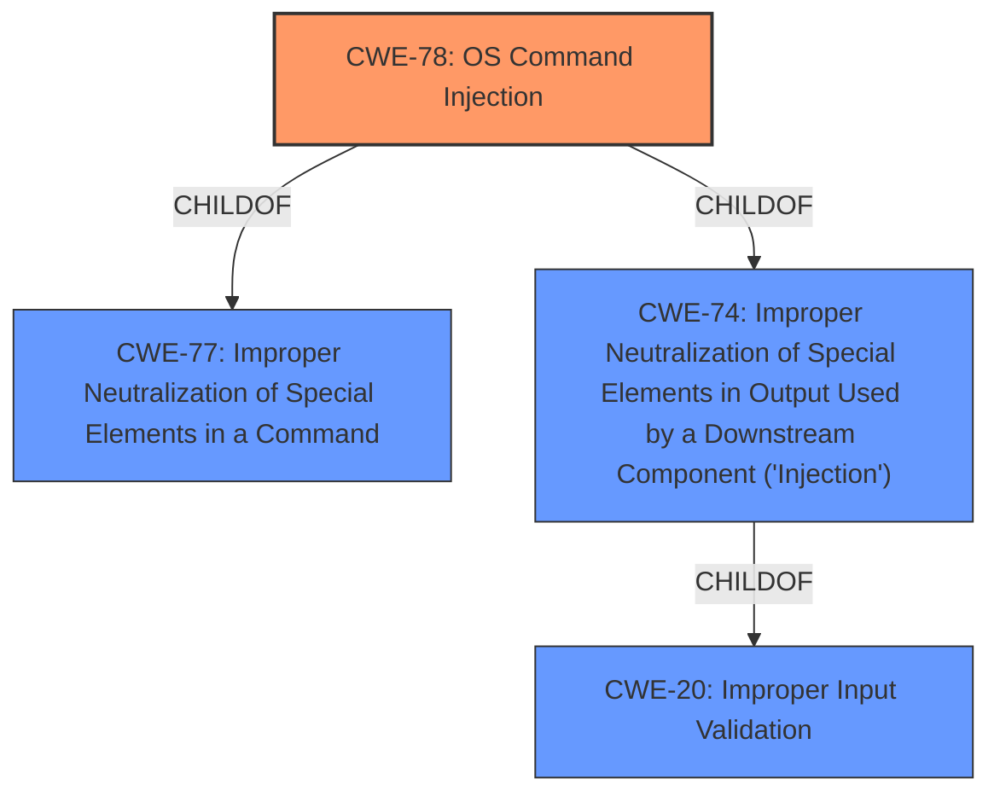

# Raw Analyzer Response for CVE-2021-1140

# Summary
| CWE ID | CWE Name | Confidence | CWE Abstraction Level | CWE Vulnerability Mapping Label | CWE-Vulnerability Mapping Notes |
|---|---|---|---|---|---|
| CWE-78 | Improper Neutralization of Special Elements used in an OS Command ('OS Command Injection') | 1.0 | Base | Primary | Allowed |
| CWE-20 | Improper Input Validation | 0.7 | Class | Secondary | Discouraged |

## Evidence and Confidence

*   **Confidence Score:** 0.9
*   **Evidence Strength:** HIGH

## Relationship Analysis
The primary relationship that influenced the selection was the ChildOf relationship between CWE-78 (OS Command Injection) and its parent CWE-77 (Improper Neutralization of Special Elements used in a Command). While CWE-77 is more general, the description clearly indicates that the commands being injected are OS commands, making CWE-78 the more appropriate choice. CWE-78 is also a child of CWE-74 (Improper Neutralization of Special Elements in Output Used by a Downstream Component ('Injection')). CWE-20 is the parent of CWE-78, but is too general for this case.

## Vulnerability Chain
The vulnerability chain starts with **insufficient input validation** (CWE-20), which leads to the ability to inject OS commands (CWE-78). The final impact is the execution of arbitrary commands on the underlying operating system with high privileges.

## Summary of Analysis
The analysis concludes that the primary CWE for this vulnerability is CWE-78 (Improper Neutralization of Special Elements used in an OS Command ('OS Command Injection')).

This decision is based on the following evidence:

*   The **Vulnerability Description** explicitly states that the vulnerability allows an unauthenticated, remote attacker to **execute arbitrary commands** on the underlying operating system.
*   The **CVE Reference Links Content Summary** confirms that the **root cause** is **insufficient input validation** in the web UI, leading to a **command injection** vulnerability that allows for the execution of commands as a high-privileged user. The attacker exploits the vulnerability by sending crafted, malicious HTTP requests.
*   The **CWE for similar CVE Descriptions** lists CWE-78 as the **Primary CWE Match**.
*   The **Retriever Results** lists CWE-78 as a high-ranking CWE.
*   The description for CWE-78 clearly states that the product constructs all or part of an OS command using externally-influenced input but does not neutralize special elements.

CWE-20 (Improper Input Validation) was considered as a secondary CWE because the **root cause** was **insufficient input validation**. However, CWE-20 is a high-level class and the evidence points to the more specific CWE-78, which is a base level CWE. The MITRE mapping guidance discourages the use of CWE-20 when more specific CWEs are available.

Other CWEs were considered but deemed less relevant:

*   CWE-22 and CWE-23 (Path Traversal) are related to file path manipulation, which is not the primary issue in this vulnerability.
*   CWE-61 (UNIX Symbolic Link (Symlink) Following) is specific to symlink vulnerabilities, which are not mentioned in the vulnerability description.
*   CWE-269 (Improper Privilege Management) is related to privilege assignment, but the core issue is command injection, not privilege management.
*   CWE-73 (External Control of File Name or Path) is related to file name or path manipulation, which is not the primary issue in this vulnerability.
*   CWE-119 (Improper Restriction of Operations within the Bounds of a Memory Buffer) is related to memory buffer issues, which are not mentioned in the vulnerability description.
*   CWE-305 (Authentication Bypass by Primary Weakness) and CWE-287 (Improper Authentication) are related to authentication issues, but the vulnerability can be exploited by an unauthenticated attacker.

The selected CWEs are at the optimal level of specificity because they accurately represent the root cause (CWE-20) and the resulting weakness (CWE-78) of the vulnerability, based on the available evidence.