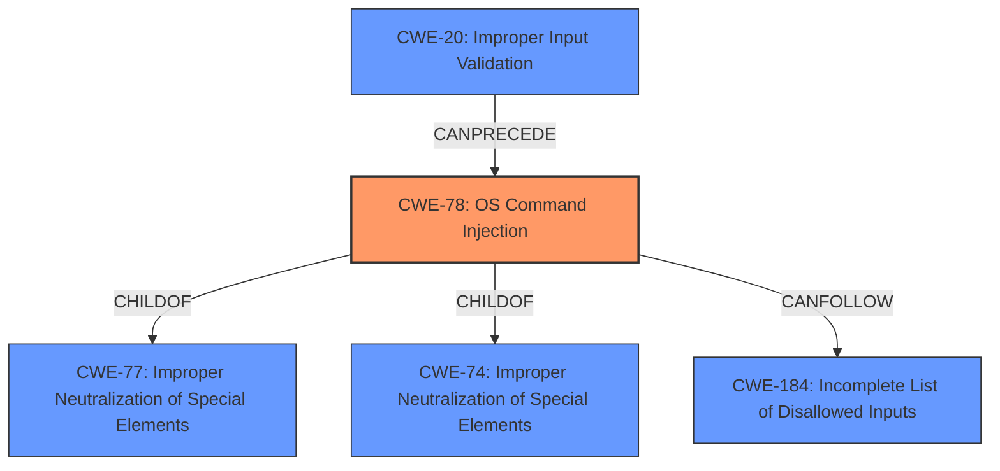

# Raw Analyzer Response for CVE-2021-1141

# Summary
| CWE ID  | CWE Name                                                                       | Confidence | CWE Abstraction Level | CWE Vulnerability Mapping Label | CWE-Vulnerability Mapping Notes |
| ------- | ------------------------------------------------------------------------------ | ---------- | --------------------- | ------------------------------- | ----------------------------- |
| CWE-78  | Improper Neutralization of Special Elements used in an OS Command ('OS Command Injection') | 1          | Base                  | Allowed                       | Primary CWE                 |
| CWE-20  | Improper Input Validation                                                      | 0.7        | Class                 | Discouraged                      | Secondary Candidate         |

## Evidence and Confidence

*   **Confidence Score:** 0.9
*   **Evidence Strength:** HIGH

## Relationship Analysis
The primary relationship influencing the decision is that CWE-78 is a child of CWE-77 (Improper Neutralization of Special Elements) and CWE-74 (Improper Neutralization of Special Elements in Output Used by a Downstream Component ('Injection')). CWE-78 represents the specific case of OS Command Injection, which aligns directly with the vulnerability description. The relationship of CWE-78 with CWE-184 (Incomplete List of Disallowed Inputs) is also relevant, as incomplete input validation can lead to command injection. Additionally, CWE-20's (Improper Input Validation) relationship as a parent of CWE-78 is also relevant but is not the best fit. I chose the base level CWE-78 because it directly reflects the vulnerability rather than the more general class CWE-20.

## Vulnerability Chain
The vulnerability chain starts with **insufficient input validation** which leads to **OS Command Injection** and finally results in **arbitrary command execution as root**.
  - **Root Cause:** Insufficient Input Validation
  - **Weakness:** OS Command Injection (CWE-78)
  - **Impact:** Arbitrary command execution as root

## Summary of Analysis
The initial assessment focused on the provided evidence from the "CVE Reference Links Content Summary" which states that the "**vulnerability is due to insufficient input validation** in the web UI of Cisco Smart Software Manager Satellite" and "**command injection**." The primary CWE match suggested was CWE-78, which aligns with the vulnerability description. The retriever results also listed CWE-78 as a top match. The analysis of CWE relationships reinforced the selection of CWE-78 as the most specific and relevant CWE. While CWE-20 (Improper Input Validation) is related and also present in the Retriever Results, it's a more general class and less descriptive of the specific flaw.

The decision is based on direct evidence from the vulnerability description indicating a **command injection** vulnerability due to **insufficient input validation**. The graph relationships show that CWE-78 is a specific type of injection and is often preceded by input validation issues.

The selected CWEs are at the optimal level of specificity because CWE-78 directly describes the **OS Command Injection** vulnerability, while CWE-20 identifies the broader issue of **improper input validation** that contributed to the vulnerability.

Relevant CWE Information:

# Enhanced Context (25 CWEs)
The following CWEs were identified as potentially relevant to this vulnerability:

## CWE-78: Improper Neutralization of Special Elements used in an OS Command ('OS Command Injection')
**Abstraction Level**: Base
**Similarity Score**: 5.03
**Source**: graph

**Description**:
CWE-78: Improper Neutralization of Special Elements used in an OS Command ('OS Command Injection')

**Mapping Guidance**:
- Usage: Allowed
- Rationale: This CWE entry is at the Base level of abstraction, which is a preferred level of abstraction for mapping to the root causes of vulnerabilities.

**Relationships**:
- CANFOLLOW -> CWE-184
- CANALSOBE -> CWE-88
- CHILDOF -> CWE-77
- CHILDOF -> CWE-77
- CHILDOF -> CWE-74

## CWE-20: Improper Input Validation
**Abstraction:** Class
**Status:** Stable

### Description
The product receives input or data, but it does
        not validate or incorrectly validates that the input has the
        properties that are required to process the data safely and
        correctly.

### Extended Description

Input validation is a frequently-used technique for checking potentially dangerous inputs in order to ensure that the inputs are safe for processing within the code, or when communicating with other components. When software does not validate input properly, an attacker is able to craft the input in a form that is not expected by the rest of the application. This will lead to parts of the system receiving unintended input, which may result in altered control flow, arbitrary control of a resource, or arbitrary code execution.