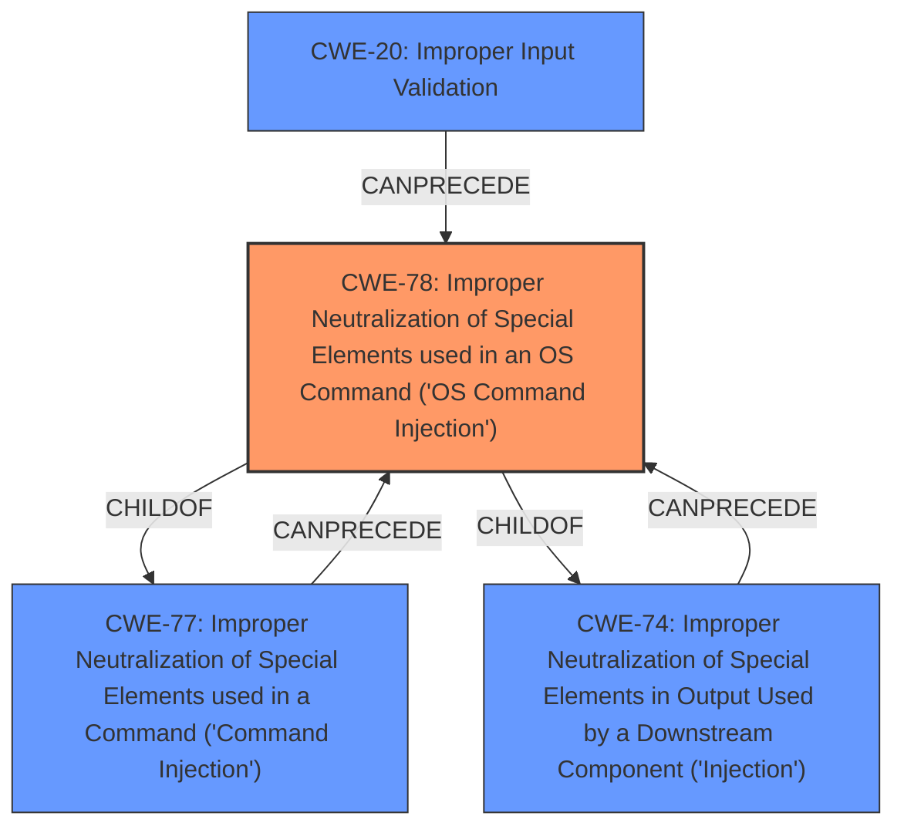

# Enhanced Analysis for CVE-2021-1147

# Summary
| CWE ID | CWE Name | Confidence | CWE Abstraction Level | CWE Vulnerability Mapping Label | CWE-Vulnerability Mapping Notes |
|---|---|---|---|---|---|
| CWE-78 | Improper Neutralization of Special Elements used in an OS Command ('OS Command Injection') | 1.0 | Base | Primary | Allowed |
| CWE-20 | Improper Input Validation | 0.7 | Class | Secondary | Discouraged |

## Evidence and Confidence

*   **Confidence Score:** 0.9
*   **Evidence Strength:** HIGH

## Relationship Analysis
The primary CWE is CWE-78, which is a base CWE and a child of CWE-77 and CWE-74. CWE-77 is command injection, and CWE-74 is Improper Neutralization of Special Elements in Output Used by a Downstream Component. CWE-78 is more specific than CWE-77 because it is specific to OS commands. CWE-20 is a class CWE that is too general but is related to the root cause **improper validation of user-supplied input**.



## Vulnerability Chain
The vulnerability chain starts with **improper validation of user-supplied input** (potentially CWE-20, although too general), which leads to the ability to inject arbitrary commands (CWE-78) that are executed with root privileges.

## Summary of Analysis
The primary weakness is CWE-78, "Improper Neutralization of Special Elements used in an OS Command ('OS Command Injection')". The vulnerability description states that the root cause is **improper validation of user-supplied input** in the web-based management interface. An attacker can then "inject arbitrary commands that are executed with root privileges." This aligns directly with the description of CWE-78, where the product constructs an OS command using externally-influenced input but does not properly neutralize special elements. The "CVE Reference Links Content Summary" confirms that the root cause is **improper validation of user-supplied input** and the impact is that an attacker can execute arbitrary code as the root user.

CWE-20 "Improper Input Validation" was considered, as the vulnerability description mentions **improper validation of user-supplied input**. However, CWE-20 is a Class-level CWE and is discouraged when more specific CWEs are available. Since the **impact** is OS Command Injection, CWE-78 is a more specific and appropriate choice. The retriever also recommends CWE-78.

CWE-77 "Improper Neutralization of Special Elements used in a Command ('Command Injection')" was also considered. While the vulnerability involves command injection, CWE-78 is more specific because it is specific to OS commands, making it a better fit.

The selected CWEs are at the optimal level of specificity. CWE-78 is a Base-level CWE that accurately describes the vulnerability, while CWE-20 is a Class-level CWE that is too general. The evidence strongly supports the selection of CWE-78 as the primary CWE.


## CWE Relationship Analysis

Current CWEs represent these abstraction levels: .


### Vulnerability Chain Analysis

**Chain starting from CWE-78:**
- 78 (Improper Neutralization of Special Elements used in an OS Command ('OS Command Injection')) - ROOT


**Chain starting from CWE-74:**
- 74 (Improper Neutralization of Special Elements in Output Used by a Downstream Component ('Injection')) - ROOT


### CWE Relationship Diagram

```mermaid
graph TD
    classDef primary fill:#f96,stroke:#333,stroke-width:2px
    classDef secondary fill:#69f,stroke:#333
    classDef tertiary fill:#9e9,stroke:#333
```