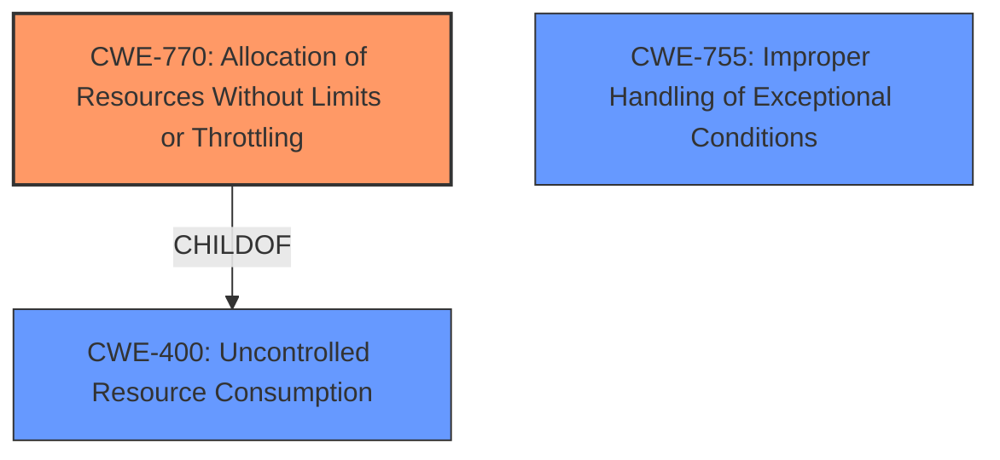

# Analysis Report for CVE-2021-1220

# Vulnerability Analysis Report: CVE-2021-1220

## Description


## Analysis (with Relationship Data)

# Summary
| CWE ID | CWE Name | Confidence | CWE Abstraction Level | CWE Vulnerability Mapping Label | CWE-Vulnerability Mapping Notes |
|---|---|---|---|---|---|
| CWE-770 | Allocation of Resources Without Limits or Throttling | 0.8 | Base | Allowed | Primary CWE |
| CWE-755 | Improper Handling of Exceptional Conditions | 0.6 | Class | Discouraged | Secondary Candidate |
| CWE-400 | Uncontrolled Resource Consumption | 0.5 | Class | Discouraged | Secondary Candidate |

## Evidence and Confidence

*   **Confidence Score:** 0.8
*   **Evidence Strength:** HIGH

## Relationship Analysis
The primary relationship that influenced the selection was the parent-child relationship between CWE-400 (Uncontrolled Resource Consumption) and CWE-770 (Allocation of Resources Without Limits or Throttling). CWE-770 is a child of CWE-400 and provides a more specific description of the vulnerability, focusing on the **allocation of resources without limits**, which directly aligns with the vulnerability description. Although the description mentions **insufficient error handling**, the main issue described involves resource exhaustion due to **unrestricted allocation**.



## Vulnerability Chain
The vulnerability chain starts with the attacker sending crafted HTTP packets, which triggers the **allocation of resources without limits** (CWE-770). This leads to the consumption of vty lines and ultimately results in a denial-of-service (DoS) condition.

## Summary of Analysis
Initially, CWE-755 (Improper Handling of Exceptional Conditions) seemed like a potential match due to the description mentioning **insufficient error handling**. However, a deeper analysis of the vulnerability revealed that the core issue is the **uncontrolled allocation of resources**, making CWE-770 (Allocation of Resources Without Limits or Throttling) a more accurate classification. The vulnerability description indicates that sending crafted HTTP packets leads to the web UI becoming unresponsive and consuming all available vty lines, which aligns with the concept of resource exhaustion due to **unrestricted resource allocation**.
The relationship graph highlights that CWE-770 is a child of CWE-400 (Uncontrolled Resource Consumption), and the MITRE mapping guidance allows the use of CWE-770 as it is at the Base level of abstraction.
The confidence in selecting CWE-770 is high (0.8) because the evidence clearly points to **uncontrolled resource allocation** as the primary weakness.

Relevant CWE Information:

# Enhanced Context (25 CWEs)

## CWE-404: Improper Resource Shutdown or Release
**Abstraction Level**: Class
**Similarity Score**: 0.78
**Source**: dense

**Description**:
The product does not release or incorrectly releases a resource before it is made available for re-use.

**Mapping Guidance**:
- Usage: Allowed-with-Review
- Rationale: This CWE entry is a Class and might have Base-level children that would be more appropriate

*   **Reason for Not Using:** This CWE describes a failure to release resources which is not the primary issue described, which focuses on allocating resources without limits.

## CWE-789: Memory Allocation with Excessive Size Value
**Abstraction Level**: Variant
**Similarity Score**: 0.77
**Source**: dense

**Description**:
The product allocates memory based on an untrusted, large size value, but it does not ensure that the size is within expected limits, allowing arbitrary amounts of memory to be allocated.

**Mapping Guidance**:
- Usage: Allowed
- Rationale: This CWE entry is at the Variant level of abstraction, which is a preferred level of abstraction for mapping to the root causes of vulnerabilities.

*   **Reason for Not Using:** This CWE is too specific, focusing on memory allocation with excessive size. While the described vulnerability leads to resource exhaustion, it is not limited to just memory.

## CWE-405: Asymmetric Resource Consumption (Amplification)
**Abstraction Level**: Class
**Similarity Score**: 0.77
**Source**: dense

**Description**:
The product does not properly control situations in which an adversary can cause the product to consume or produce excessive resources without requiring the adversary to invest equivalent work or otherwise prove authorization, i.e., the adversary's influence is "asymmetric."

**Mapping Guidance**:
- Usage: Allowed-with-Review
- Rationale: This CWE entry is a Class and might have Base-level children that would be more appropriate

*   **Reason for Not Using:** This CWE is too broad, describing asymmetric resource consumption. The described vulnerability does involve resource consumption, but the core issue is allocating resources without limits, rather than asymmetric consumption.

## CWE-799: Improper Control of Interaction Frequency
**Abstraction Level**: Class
**Similarity Score**: 0.77
**Source**: dense

**Description**:
The product does not properly limit the number or frequency of interactions that it has with an actor, such as the number of incoming requests.

**Mapping Guidance**:
- Usage: Allowed-with-Review
- Rationale: This CWE entry is a Class and might have Base-level children that would be more appropriate

*   **Reason for Not Using:** This CWE focuses on interaction frequency. While related to DoS, the root cause is the lack of limits on resource allocation, not merely the frequency of interaction.

## CWE-226: Sensitive Information in Resource Not Removed Before Reuse
**Abstraction Level**: Base
**Similarity Score**: 0.76
**Source**: dense

**Description**:
The product releases a resource such as memory or a file so that it can be made available for reuse, but it does not clear or "zeroize" the information contained in the resource before the product performs a critical state transition or makes the resource available for reuse by other entities.

**Mapping Guidance**:
- Usage: Allowed
- Rationale: This CWE entry is at the Base level of abstraction, which is a preferred level of abstraction for mapping to the root causes of vulnerabilities.

*   **Reason for Not Using:** This vulnerability is not about sensitive information being exposed.

## CWE-1325: Improperly Controlled Sequential Memory Allocation
**Abstraction Level**: Base
**Similarity Score**: 0.76
**Source**: dense

**Description**:
The product manages a group of objects or resources and performs a separate memory allocation for each object, but it does not properly limit the total amount of memory that is consumed by all of the combined objects.

**Mapping Guidance**:
- Usage: Allowed
- Rationale: This CWE entry is at the Base level of abstraction, which is a preferred level of abstraction for mapping to the root causes of vulnerabilities.

*   **Reason for Not Using:** This CWE is focused on sequential memory allocation, which is not explicitly mentioned in the vulnerability description.

## CWE-667: Improper Locking
**Abstraction Level**: Class
**Similarity Score**: 0.76
**Source**: dense

**Description**:
The product does not properly acquire or release a lock on a resource, leading to unexpected resource state changes and behaviors.

**Mapping Guidance**:
- Usage: Allowed-with-Review
- Rationale: This CWE entry is a Class and might have Base-level children that would be more appropriate

*   **Reason for Not Using:** The vulnerability description does not involve locking issues.

## CWE-119: Improper Restriction of Operations within the Bounds of a Memory Buffer
**Abstraction Level**: Class
**Similarity Score**: 0.76
**Source**: dense

**Description**:
The product performs operations on a memory buffer, but it reads from or writes to a memory location outside the buffer's intended boundary. This may result in read or write operations on unexpected memory locations that could be linked to other variables, data structures, or internal program data.

**Mapping Guidance**:
- Usage: Discouraged
- Rationale: CWE-119 is commonly misused in low-information vulnerability reports when lower-level CWEs could be used instead, or when more details about the vulnerability are available.

*   **Reason for Not Using:** This CWE is not about buffer overflows or out-of-bounds access.

## CWE-664: Improper Control of a Resource Through its Lifetime
**Abstraction Level**: Pillar
**Similarity Score**: 0.76
**Source**: dense

**Description**:
The product does not maintain or incorrectly maintains control over a resource throughout its lifetime of creation, use, and release.

**Mapping Guidance**:
- Usage: Discouraged
- Rationale: This CWE entry is high-level when lower-level children are available.

*   **Reason for Not Using:** This CWE is too abstract and high-level.

## CWE-131: Incorrect Calculation of Buffer Size
**Abstraction Level**: Base
**Similarity Score**: 0.76
**Source**: dense


## CWE Relationship Analysis

Current CWEs represent these abstraction levels: .


### Vulnerability Chain Analysis

**Chain starting from CWE-667:**
- 667 (Improper Locking) - ROOT


**Chain starting from CWE-664:**
- 664 (Improper Control of a Resource Through its Lifetime) - ROOT


### CWE Relationship Diagram

```mermaid
graph TD
    classDef primary fill:#f96,stroke:#333,stroke-width:2px
    classDef secondary fill:#69f,stroke:#333
    classDef tertiary fill:#9e9,stroke:#333
```


*Report generated on 2025-04-02 17:01:58*
