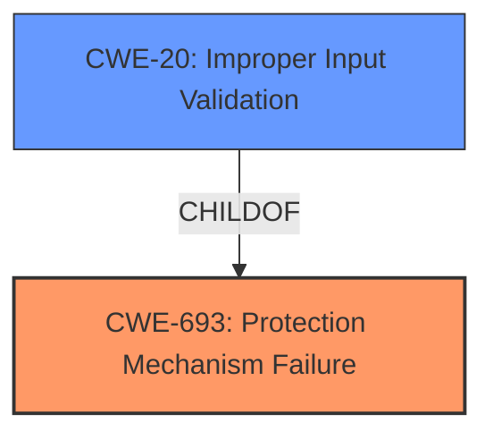

# Analysis for CVE-2021-1224

# Summary
| CWE ID | CWE Name | Confidence | CWE Abstraction Level | CWE Vulnerability Mapping Label | CWE-Vulnerability Mapping Notes |
|---|---|---|---|---|---|
| CWE-693 | Protection Mechanism Failure | 0.75 | Pillar | Discouraged | The product does not use or incorrectly uses a protection mechanism that provides sufficient defense against directed attacks against the product.  |
| CWE-20 | Improper Input Validation | 0.6 | Class | Discouraged | The product receives input or data, but it does not validate or incorrectly validates that the input has the properties that are required to process the data safely and correctly. |

## Evidence and Confidence

*   **Confidence Score:** 0.7
*   **Evidence Strength:** MEDIUM

## Relationship Analysis
The primary relationship influencing the selection is the parent-child relationship. CWE-693 is a high-level *Pillar* that encompasses various protection mechanism failures. A more specific child, such as CWE-20, represents a more detailed aspect of the vulnerability related to input validation. However, given the **incorrect detection of the HTTP payload** is at the core of the vulnerability, CWE-693 best captures the broad failure of the snort detection engine which does not properly detect the HTTP payload.

## Vulnerability Chain
The vulnerability chain starts with the **incorrect detection of the HTTP payload** within TFO packets. This leads to a failure in the Snort detection engine's ability to apply configured file policies, ultimately allowing an attacker to deliver a malicious payload.

## Summary of Analysis
The initial analysis identified that the vulnerability stems from the Snort detection engine's **incorrect detection of the HTTP payload** within TCP Fast Open (TFO) packets, allowing attackers to bypass configured file policies. This suggests a failure in the protection mechanism.

The primary CWE selected is CWE-693 (Protection Mechanism Failure). This selection is based on the fact that the core issue is an overall failure of the Snort detection engine to properly detect HTTP payloads within TFO packets. The vulnerability description key phrases "**incorrect detection of the HTTP payload**" and the CVE reference summary's "**weaknesses**: Incorrect handling of HTTP payloads within the TFO handshake. This allows an attacker to send crafted TFO packets with an HTTP payload, bypassing file policies intended to prevent malicious file delivery" support this. The "**root_cause**: The vulnerability is due to the Snort detection engine incorrectly handling HTTP payloads when they are contained at least partially within the TCP Fast Open (TFO) connection handshake" explicitly points to the Snort engine as the source of the weakness.

CWE-20 (Improper Input Validation) was considered as a secondary CWE since the **incorrect detection of the HTTP payload** can be viewed as a form of improper input handling. However, the weakness is not just about validating a specific input property but about correctly interpreting the entire HTTP payload within the TFO handshake. So it is not a good fit.

The selection of CWE-693 is at the *Pillar* level due to the broad nature of the protection mechanism failure. A more specific *Base* or *Variant* CWE would be preferable if the evidence pointed to a more precise cause. The provided evidence focuses on the overall detection failure and therefore aligns better with the higher-level CWE.

The confidence score is 0.7, reflecting reasonable confidence based on the available evidence.