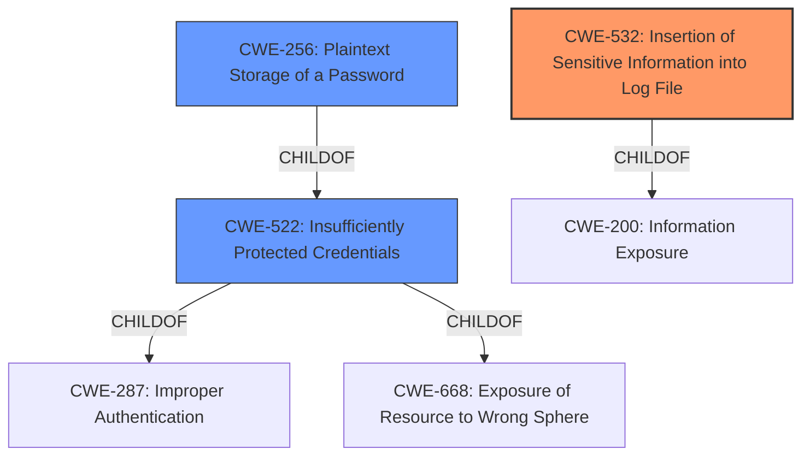

# Analysis Report for CVE-2021-1226

# Vulnerability Analysis Report: CVE-2021-1226

## Description


## Analysis (with Relationship Data)

# Summary
| CWE ID | CWE Name | Confidence | CWE Abstraction Level | CWE Vulnerability Mapping Label | CWE-Vulnerability Mapping Notes |
|---|---|---|---|---|---|
| CWE-532 | Insertion of Sensitive Information into Log File | 1.0 | Base | Primary | Allowed |
| CWE-256 | Plaintext Storage of a Password | 0.7 | Base | Secondary | Allowed |
| CWE-522 | Insufficiently Protected Credentials | 0.6 | Class | Secondary | Allowed-with-Review |

## Evidence and Confidence

*   **Confidence Score:** 0.8
*   **Evidence Strength:** HIGH

## Relationship Analysis
The primary CWE is CWE-532 (Insertion of Sensitive Information into Log File). The secondary CWEs considered are CWE-256 (Plaintext Storage of a Password) and CWE-522 (Insufficiently Protected Credentials). CWE-532 is a child of CWE-200 (Information Exposure). CWE-256 is a child of CWE-522, which in turn is related to CWE-287 (Improper Authentication) and CWE-668 (Exposure of Resource to Wrong Sphere). CWE-532 and CWE-256 are at the Base level of abstraction, which is preferred, while CWE-522 is a Class, suggesting that a more specific child might be appropriate.



## Vulnerability Chain
The vulnerability chain begins with the **storage of unencrypted credentials**. This leads to sensitive information being present in the audit logs. An attacker with authenticated access can then view this sensitive information in clear text, potentially gaining access to network devices.

Root Cause: **Storage of unencrypted credentials**
Weakness: Insertion of Sensitive Information into Log File (CWE-532)
Impact: Exposure of Sensitive Information

## Summary of Analysis
The initial assessment identifies the **storage of unencrypted credentials** in audit logs as the root cause. The primary CWE selected is CWE-532 (Insertion of Sensitive Information into Log File) because the vulnerability description explicitly states that the issue is due to the storage of certain unencrypted credentials in the audit logs, which directly aligns with the CWE's description. The "CVE Reference Links Content Summary" further supports this by stating "The vulnerability is due to the **storage of certain unencrypted credentials** in the audit logs".

CWE-256 (Plaintext Storage of a Password) was considered because the stored credentials are unencrypted. However, since the credentials are not necessarily passwords and are stored in a log file, CWE-532 is a more precise fit. CWE-522 (Insufficiently Protected Credentials) is a more general class of weakness and less descriptive than CWE-532.

The graph relationships highlight that CWE-532 is a child of CWE-200 (Information Exposure), which accurately reflects the impact of the vulnerability. The selected CWEs are at the optimal level of specificity because they directly describe the root cause and the resulting exposure of sensitive information in log files.

The final decision is based on the evidence that the vulnerability involves storing unencrypted credentials in audit logs, making CWE-532 the most accurate and specific classification.

Relevant CWE Information:

# Enhanced Context (25 CWEs)
The following CWEs were identified as potentially relevant to this vulnerability:

## CWE-807: Reliance on Untrusted Inputs in a Security Decision
**Abstraction Level**: Base
**Similarity Score**: 0.78
**Source**: dense

**Description**:
The product uses a protection mechanism that relies on the existence or values of an input, but the input can be modified by an untrusted actor in a way that bypasses the protection mechanism.

**Mapping Guidance**:
- Usage: Allowed
- Rationale: This CWE entry is at the Base level of abstraction, which is a preferred level of abstraction for mapping to the root causes of vulnerabilities.


## CWE-1220: Insufficient Granularity of Access Control
**Abstraction Level**: Base
**Similarity Score**: 0.76
**Source**: dense

**Description**:
The product implements access controls via a policy or other feature with the intention to disable or restrict accesses (reads and/or writes) to assets in a system from untrusted agents. However, implemented access controls lack required granularity, which renders the control policy too broad because it allows accesses from unauthorized agents to the security-sensitive assets.

**Mapping Guidance**:
- Usage: Allowed
- Rationale: This CWE entry is at the Base level of abstraction, which is a preferred level of abstraction for mapping to the root causes of vulnerabilities.


## CWE-274: Improper Handling of Insufficient Privileges
**Abstraction Level**: Base
**Similarity Score**: 0.75
**Source**: dense

**Description**:
The product does not handle or incorrectly handles when it has insufficient privileges to perform an operation, leading to resultant weaknesses.

**Mapping Guidance**:
- Usage: Discouraged
- Rationale: This CWE entry could be deprecated in a future version of CWE.


## CWE-1289: Improper Validation of Unsafe Equivalence in Input
**Abstraction Level**: Base
**Similarity Score**: 0.75
**Source**: dense

**Description**:
The product receives an input value that is used as a resource identifier or other type of reference, but it does not validate or incorrectly validates that the input is equivalent to a potentially-unsafe value.

**Mapping Guidance**:
- Usage: Allowed
- Rationale: This CWE entry is at the Base level of abstraction, which is a preferred level of abstraction for mapping to the root causes of vulnerabilities.


## CWE-280: Improper Handling of Insufficient Permissions or Privileges 
**Abstraction Level**: Base
**Similarity Score**: 0.75
**Source**: dense

**Description**:
The product does not handle or incorrectly handles when it has insufficient privileges to access resources or functionality as specified by their permissions. This may cause it to follow unexpected code paths that may leave the product in an invalid state.

**Mapping Guidance**:
- Usage: Allowed
- Rationale: This CWE entry is at the Base level of abstraction, which is a preferred level of abstraction for mapping to the root causes of vulnerabilities.


## CWE-639: Authorization Bypass Through User-Controlled Key
**Abstraction Level**: Base
**Similarity Score**: 0.75
**Source**: dense

**Description**:
The system's authorization functionality does not prevent one user from gaining access to another user's data or record by modifying the key value identifying the data.

**Mapping Guidance**:
- Usage: Allowed
- Rationale: This CWE entry is at the Base level of abstraction, which is a preferred level of abstraction for mapping to the root causes of vulnerabilities.


## CWE-653: Improper Isolation or Compartmentalization
**Abstraction Level**: Class
**Similarity Score**: 0.75
**Source**: dense

**Description**:
The product does not properly compartmentalize or isolate functionality, processes, or resources that require different privilege levels, rights, or permissions.

**Mapping Guidance**:
- Usage: Allowed
- Rationale: This CWE entry is at the Base level of abstraction, which is a preferred level of abstraction for mapping to the root causes of vulnerabilities.


## CWE-691: Insufficient Control Flow Management
**Abstraction Level**: Pillar
**Similarity Score**: 0.75
**Source**: dense

**Description**:
The code does not sufficiently manage its control flow during execution, creating conditions in which the control flow can be modified in unexpected ways.

**Mapping Guidance**:
- Usage: Discouraged
- Rationale: This CWE entry is extremely high-level, a Pillar. However, classification research is limited for weaknesses of this type, so there can be gaps or organizational difficulties within CWE that force use of this weakness, even at such a high level of abstraction.


## CWE-657: Violation of Secure Design Principles
**Abstraction Level**: Class
**Similarity Score**: 0.74
**Source**: dense

**Description**:
The product violates well-established principles for secure design.

**Mapping Guidance**:
- Usage: Discouraged
- Rationale: This CWE entry is a level-1 Class (i.e., a child of a Pillar). It might have lower-level children


## CWE Relationship Analysis

Current CWEs represent these abstraction levels: .


### Vulnerability Chain Analysis

**Chain starting from CWE-691:**
- 691 (Insufficient Control Flow Management) - ROOT


**Chain starting from CWE-657:**
- 657 (Violation of Secure Design Principles) - ROOT


### CWE Relationship Diagram

```mermaid
graph TD
    classDef primary fill:#f96,stroke:#333,stroke-width:2px
    classDef secondary fill:#69f,stroke:#333
    classDef tertiary fill:#9e9,stroke:#333
```


*Report generated on 2025-04-01 16:14:27*
