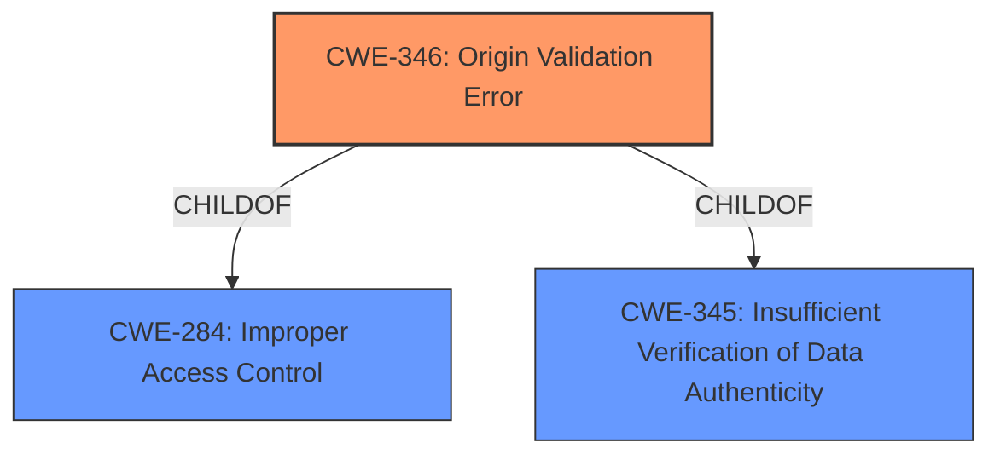

# Enhanced Analysis for CVE-2021-1231

# Summary
| CWE ID    | CWE Name                                                                  | Confidence | CWE Abstraction Level | CWE Vulnerability Mapping Label | CWE-Vulnerability Mapping Notes |
| :-------- | :------------------------------------------------------------------------ | :--------- | :---------------------- | :------------------------------ | :------------------------------ |
| CWE-346   | Origin Validation Error                                                     | 0.9        | Class                   | Primary                         | Allowed-with-Review             |

## Evidence and Confidence

*   **Confidence Score:** 0.9
*   **Evidence Strength:** HIGH

## Relationship Analysis
The primary CWE selected is CWE-346 (Origin Validation Error).

CWE-346 is a child of CWE-284 (Improper Access Control), indicating a hierarchical relationship where origin validation is a specific type of access control. CWE-346 is also related to CWE-345 (Insufficient Verification of Data Authenticity).

The abstraction level of CWE-346 is Class, which is higher than Base or Variant. A more specific CWE may exist, but based on the available information, CWE-346 is the most appropriate.



## Vulnerability Chain
The vulnerability chain starts with **incomplete validation of the source of a received LLDP packet**, leading to a potential attack vector where a crafted LLDP packet can disable switching on the SFP interface.

Root Cause: **Incomplete Validation of Source** -> Impact: Disable switching

## Summary of Analysis
The initial analysis focused on identifying the root cause of the vulnerability, which is the **incomplete validation of the source of the LLDP packet**. The vulnerability description and CVE reference links consistently highlight this as the primary weakness.

The retriever results suggested CWE-346 (Origin Validation Error) as the top candidate. The description of CWE-346, "The product does not properly verify that the source of data or communication is valid," aligns directly with the vulnerability description.

The choice of CWE-346 is based on the provided evidence:
- "This vulnerability is due to **incomplete validation of the source of a received LLDP packet**."
- CVE Reference Links Content Summary indicates: "rootCause": "Incomplete validation of the source of a received LLDP packet." and "weaknesses": ["CWE-284"]

CWE-284 (Improper Access Control) was also in the CVE details, but is too high level and the children are more specific.

The graph relationships influenced the final selection by showing how origin validation is a specific type of access control issue.

CWE-346 is at the Class level of specificity, which is appropriate.

Relevant CWE Information:

# Enhanced Context (25 CWEs)

## CWE-346: Origin Validation Error
**Abstraction Level**: Class
**Similarity Score**: 0.955
**Source**: dense

**Description**:
The product does not properly verify that the source of data or communication is valid.

**Mapping Guidance**:
- Usage: Allowed-with-Review
- Rationale: This CWE entry is a Class and might have Base-level children that would be more appropriate

CWE-346 is the selected CWE. The vulnerability description matches the CWE description which indicates that source validation is not properly verified. The CVE also lists CWE-284 (Improper Access Control), but this is too high level.


## CWE Relationship Analysis

Current CWEs represent these abstraction levels: .


### Vulnerability Chain Analysis

**Chain starting from CWE-346:**
- 346 (Origin Validation Error) - ROOT


**Chain starting from CWE-284:**
- 284 (Improper Access Control) - ROOT


### CWE Relationship Diagram

```mermaid
graph TD
    classDef primary fill:#f96,stroke:#333,stroke-width:2px
    classDef secondary fill:#69f,stroke:#333
    classDef tertiary fill:#9e9,stroke:#333
```