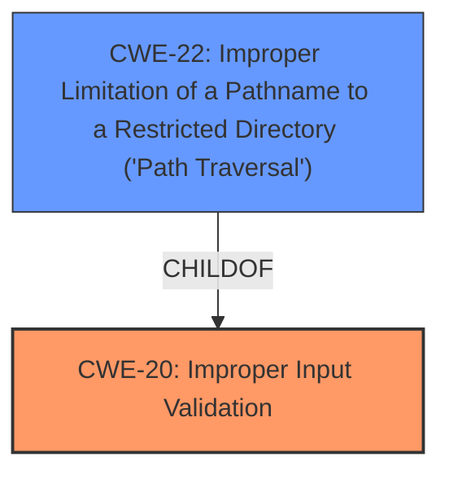

# Raw Analyzer Response for CVE-2021-1233

# Summary
| CWE ID | CWE Name | Confidence | CWE Abstraction Level | CWE Vulnerability Mapping Label | CWE-Vulnerability Mapping Notes |
|---|---|---|---|---|---|
| CWE-20 | Improper Input Validation | 0.9 | Class | Primary | Discouraged |
| CWE-22 | Improper Limitation of a Pathname to a Restricted Directory ('Path Traversal') | 0.7 | Base | Secondary | Allowed |

## Evidence and Confidence

*   **Confidence Score:** 0.8
*   **Evidence Strength:** HIGH

## Relationship Analysis
The primary relationship that influences my decision is the hierarchical structure, with CWE-20 as a class and CWE-22 as a base. The vulnerability description clearly points to **insufficient input validation** as the root cause, which aligns with CWE-20. However, the impact of the vulnerability – accessing any file from the filesystem – suggests a potential path traversal issue, which is best captured by CWE-22. Thus, while CWE-20 is the more general root cause, CWE-22 describes the specific type of input validation failure, so I am including both.

## Vulnerability Chain
The vulnerability chain starts with the **insufficient input validation** (CWE-20) of requests sent to the iperf tool. This leads to the possibility of crafting requests that can access any file from the filesystem, which is a path traversal issue (CWE-22).

## Summary of Analysis
Initially, the focus was on identifying the **root cause**, which is the **insufficient input validation**. The vulnerability description and CVE reference links content summary strongly support this.

> Vulnerability Description Key Phrases:
> - **rootcause:** **insufficient input validation**
>
> CVE Reference Links Content Summary:
> - The vulnerability is due to **insufficient input validation** of requests sent to the `iperf` tool, which is included in Cisco SD-WAN Software.

The Retriever Results also suggest CWE-20 as a potential match, but also include more specific CWEs related to path traversal, such as CWE-22.

While CWE-20 is a high-level Class, it accurately represents the **root cause**. However, the impact of the vulnerability (accessing any file from the filesystem) suggests a path traversal issue. CWE-22, which is a base, captures this aspect more specifically. Therefore, I am mapping both CWE-20 and CWE-22.

Relevant CWE Information:

# Enhanced Context (25 CWEs)
The following CWEs were identified as potentially relevant to this vulnerability:

## CWE-20: Improper Input Validation
**Abstraction:** Class
**Status:** Stable

### Description
The product receives input or data, but it does
        not validate or incorrectly validates that the input has the
        properties that are required to process the data safely and
        correctly.

## CWE-22: Improper Limitation of a Pathname to a Restricted Directory ('Path Traversal')
**Abstraction:** Base
**Status:** Stable

### Description
The product uses external input to construct a pathname that is intended to identify a file or directory that is located underneath a restricted parent directory, but the product does not properly neutralize special elements within the pathname that can cause the pathname to resolve to a location that is outside of the restricted directory.