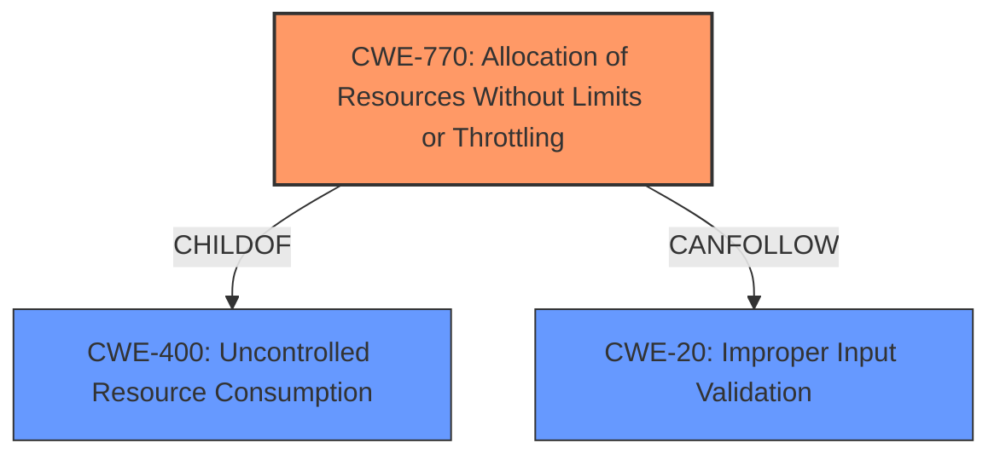

# Analysis for CVE-2021-1241

# Summary
| CWE ID  | CWE Name   | Confidence | CWE Abstraction Level | CWE Vulnerability Mapping Label | CWE-Vulnerability Mapping Notes |
|-----------------|-------------------------------------------------------------------------------------------------|------------|-------------------------|-----------------------------------|-------------------------------------------------------------------------------------------------------------------------------------------------------------------|
| CWE-770 | Allocation of Resources Without Limits or Throttling | 0.75  | Base   | Primary    | Allowed    |
| CWE-20  | Improper Input Validation   | 0.6 | Class  | Secondary   | Discouraged  |

## Evidence and Confidence

*   **Confidence Score:** 0.7
*   **Evidence Strength:** MEDIUM

## Relationship Analysis
The primary relationship influencing the selection was the parent-child relationship where CWE-770 is a base CWE with more specificity than its parent CWE-400.
CWE-20 is a high level class that is often misused in low information vulnerability reports when lower-level CWEs could be used instead, or when more details about the vulnerability are available.

## Vulnerability Chain
The vulnerability chain starts with the **insufficient handling of malformed packets** which leads to **improper input validation** and **insufficient bounds checking**. This ultimately results in a denial-of-service (DoS) condition, potentially causing a device reboot due to the **allocation of resources without limits or throttling.**

## Summary of Analysis
The initial assessment considered CWE-78 based on the provided "CWE for similar CVE Descriptions." However, after analyzing the "CVE Reference Links Content Summary," the root cause appears to be related to resource management and input validation rather than command injection. The **insufficient handling of malformed packets** combined with **improper input validation** and **insufficient bounds checking** points toward a vulnerability where the system does not properly manage resource allocation when processing these packets.

The "CVE Reference Links Content Summary" provides the following evidence: "Root cause: Insufficient handling of malformed packets in VPN tunneling features." and "Weaknesses: [Improper input validation, Insufficient bounds checking]". This indicates that the core issue is related to how the system handles potentially malicious or malformed input, which can lead to resource exhaustion and a denial-of-service condition.

CWE-770 (Allocation of Resources Without Limits or Throttling) is selected as the primary CWE because it directly addresses the root cause of the vulnerability which causes a denial-of-service. The system **fails to limit or throttle resource allocation**, allowing an attacker to cause a denial-of-service condition by sending crafted packets.

CWE-20 (Improper Input Validation) is considered as a secondary CWE because the **insufficient handling of malformed packets** points to a lack of proper input validation. However, the resource allocation issue is more directly tied to the DoS impact.

The selection is based on the evidence provided in the vulnerability description and the "CVE Reference Links Content Summary". The graph relationships helped clarify the connections between resource management, input validation, and denial-of-service. The selected CWEs are at the optimal level of specificity, providing a clear understanding of the vulnerability's root cause and potential impact.

Relevant CWE Information:

# Enhanced Context (25 CWEs)
The following CWEs were identified as potentially relevant to this vulnerability:

## CWE-61: UNIX Symbolic Link (Symlink) Following
**Abstraction Level**: Compound
**Similarity Score**: 0.81
**Source**: dense

**Description**:
The product, when opening a file or directory, does not sufficiently account for when the file is a symbolic link that resolves to a target outside of the intended control sphere. This could allow an attacker to cause the product to operate on unauthorized files.

**Mapping Guidance**:
- Usage: Allowed
- Rationale: This is a well-known Composite of multiple weaknesses that must all occur simultaneously, although it is attack-oriented in nature.

## CWE-59: Improper Link Resolution Before File Access ('Link Following')
**Abstraction Level**: Base
**Similarity Score**: 0.80
**Source**: dense

**Description**:
The product attempts to access a file based on the filename, but it does not properly prevent that filename from identifying a link or shortcut that resolves to an unintended resource.

**Mapping Guidance**:
- Usage: Allowed
- Rationale: This CWE entry is at the Base level of abstraction, which is a preferred level of abstraction for mapping to the root causes of vulnerabilities.

## CWE-41: Improper Resolution of Path Equivalence
**Abstraction Level**: Base
**Similarity Score**: 0.77
**Source**: dense

**Description**:
The product is vulnerable to file system contents disclosure through path equivalence. Path equivalence involves the use of special characters in file and directory names. The associated manipulations are intended to generate multiple names for the same object.

**Mapping Guidance**:
- Usage: Allowed
- Rationale: This CWE entry is at the Base level of abstraction, which is a preferred level of abstraction for mapping to the root causes of vulnerabilities.

## CWE-23: Relative Path Traversal
**Abstraction Level**: Base
**Similarity Score**: 0.74
**Source**: dense

**Description**:
The product uses external input to construct a pathname that should be within a restricted directory, but it does not properly neutralize sequences such as ".." that can resolve to a location that is outside of that directory.

**Mapping Guidance**:
- Usage: Allowed
- Rationale: This CWE entry is at the Base level of abstraction, which is a preferred level of abstraction for mapping to the root causes of vulnerabilities.

## CWE-667: Improper Locking
**Abstraction Level**: Class
**Similarity Score**: 0.74
**Source**: dense

**Description**:
The product does not properly acquire or release a lock on a resource, leading to unexpected resource state changes and behaviors.

**Mapping Guidance**:
- Usage: Allowed-with-Review
- Rationale: This CWE entry is a Class and might have Base-level children that would be more appropriate

## CWE-668: Exposure of Resource to Wrong Sphere
**Abstraction Level**: Class
**Similarity Score**: 0.74
**Source**: dense

**Description**:
The product exposes a resource to the wrong control sphere, providing unintended actors with inappropriate access to the resource.

**Mapping Guidance**:
- Usage: Discouraged
- Rationale: CWE-668 is high-level and is often misused as a catch-all when lower-level CWE IDs might be applicable. It is sometimes used for low-information vulnerability reports [REF-1287]. It is a level-1 Class (i.e., a child of a Pillar). It is not useful for trend analysis.

## CWE-62: UNIX Hard Link
**Abstraction Level**: Variant
**Similarity Score**: 0.74
**Source**: dense

**Description**:
The product, when opening a file or directory, does not sufficiently account for when the name is associated with a hard link to a target that is outside of the intended control sphere. This could allow an attacker to cause the product to operate on unauthorized files.

**Mapping Guidance**:
- Usage: Allowed
- Rationale: This CWE entry is at the Variant level of abstraction, which is a preferred level of abstraction for mapping to the root causes of vulnerabilities.

## CWE-1289: Improper Validation of Unsafe Equivalence in Input
**Abstraction Level**: Base
**Similarity Score**: 0.74
**Source**: dense

**Description**:
The product receives an input value that is used as a resource identifier or other type of reference, but it does not validate or incorrectly validates that the input is equivalent to a potentially-unsafe value.

**Mapping Guidance**:
- Usage: Allowed
- Rationale: This CWE entry is at the Base level of abstraction, which is a preferred level of abstraction for mapping to the root causes of vulnerabilities.

## CWE-74: Improper Neutralization of Special Elements in Output Used by a Downstream Component ('Injection')
**Abstraction Level**: Class
**Similarity Score**: 0.74
**Source**: dense

**Description**:
The product constructs all or part of a command, data structure, or record using externally-influenced input from an upstream component, but it does not neutralize or incorrectly neutralizes special elements that could modify how it is parsed or interpreted when it is sent to a downstream component.

**Mapping Guidance**:
- Usage: Discouraged
- Rationale: CWE-74 is high-level and often misused when lower-level weaknesses are more appropriate.

## CWE-73: External Control of File Name or Path
**Abstraction Level**: Base
**Similarity Score**: 0.74
**Source**: dense

**Description**:
The product allows user input to control or influence