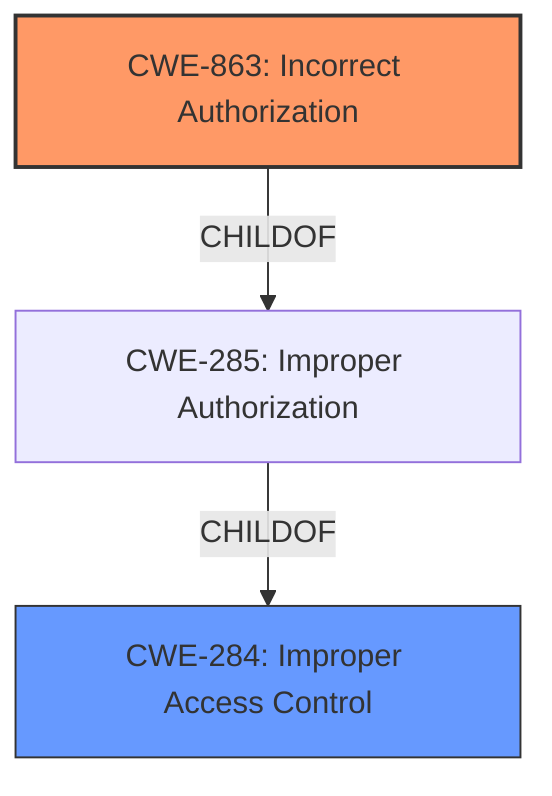

# Raw Analyzer Response for CVE-2021-1243

# Summary
| CWE ID    | CWE Name                                                               | Confidence | CWE Abstraction Level | CWE Vulnerability Mapping Label | CWE-Vulnerability Mapping Notes |
| :--------- | :--------------------------------------------------------------------- | :--------- | :-------------------- | :------------------------------ | :------------------------------ |
| CWE-863 | Incorrect Authorization                                                               | 0.95      | Class                    | Primary                         | Allowed-with-Review            |
| CWE-284 | Improper Access Control                                                                 | 0.70      | Pillar                  | Secondary                       | Discouraged                   |

## Evidence and Confidence

*   **Confidence Score:** 0.90
*   **Evidence Strength:** HIGH

## Relationship Analysis
The primary CWE is CWE-863 **Incorrect Authorization**.
  - CWE-863 is a child of CWE-285 **Improper Authorization** and CWE-284 **Improper Access Control**.
  - CWE-284 is a high-level Pillar, while CWE-863 is a Class.
  - Choosing CWE-863 provides a more specific classification than CWE-284.

## Vulnerability Chain
The vulnerability chain involves an **incorrect LPTS programming** leading to the bypass of management plane protection, ultimately allowing unauthorized connections to the SNMP server.
  - The root cause is the **incorrect LPTS programming**.
  - The weakness is the **incorrect authorization** due to this programming error.
  - The impact is the bypass of management plane protection and unauthorized connections.

## Summary of Analysis
The initial analysis focused on identifying the root cause and the resulting impact of the vulnerability. The **Vulnerability Description** clearly states that the vulnerability is due to "**incorrect LPTS programming when using SNMP with management plane protection**". The impact is that an attacker could "**allow connections despite the management plane protection**". The **CVE Reference Links Content Summary** corroborates this information, stating that the root cause is "**Incorrect LPTS programming when using SNMP with management plane protection**" and lists "**Incorrect management plane protection for SNMP**" as a weakness.

The retriever results suggested several potential CWEs, including CWE-1392 (Use of Default Credentials), CWE-284 (Improper Access Control), and CWE-798 (Use of Hard-coded Credentials). However, these CWEs do not accurately reflect the **root cause** of the vulnerability, which is related to **incorrect authorization** due to **incorrect LPTS programming**.

CWE-863 (Incorrect Authorization) is the most appropriate CWE because it directly addresses the **incorrect** performance of an authorization check, which is precisely what is happening in this vulnerability. Although CWE-863 is a Class, it is more specific and accurate than the Pillar CWE-284 (Improper Access Control), aligning well with the MITRE mapping guidance to prefer more detailed classifications when available.

CWE-284 is considered a secondary candidate due to its high-level nature. While the vulnerability does involve improper access control, the root cause is more precisely related to **incorrect authorization**, making CWE-863 a better fit.

Relevant CWE Information:

# Enhanced Context (25 CWEs)
The following CWEs were identified as potentially relevant to this vulnerability:

## CWE-807: Reliance on Untrusted Inputs in a Security Decision
**Abstraction Level**: Base
**Similarity Score**: 0.77
**Source**: dense

**Description**:
The product uses a protection mechanism that relies on the existence or values of an input, but the input can be modified by an untrusted actor in a way that bypasses the protection mechanism.

**Mapping Guidance**:
- Usage: Allowed
- Rationale: This CWE entry is at the Base level of abstraction, which is a preferred level of abstraction for mapping to the root causes of vulnerabilities.

## CWE-1289: Improper Validation of Unsafe Equivalence in Input
**Abstraction Level**: Base
**Similarity Score**: 0.76
**Source**: dense

**Description**:
The product receives an input value that is used as a resource identifier or other type of reference, but it does not validate or incorrectly validates that the input is equivalent to a potentially-unsafe value.

**Mapping Guidance**:
- Usage: Allowed
- Rationale: This CWE entry is at the Base level of abstraction, which is a preferred level of abstraction for mapping to the root causes of vulnerabilities.

## CWE-303: Incorrect Implementation of Authentication Algorithm
**Abstraction Level**: Base
**Similarity Score**: 0.75
**Source**: dense

**Description**:
The requirements for the product dictate the use of an established authentication algorithm, but the implementation of the algorithm is incorrect.

**Mapping Guidance**:
- Usage: Allowed
- Rationale: This CWE entry is at the Base level of abstraction, which is a preferred level of abstraction for mapping to the root causes of vulnerabilities.

## CWE-280: Improper Handling of Insufficient Permissions or Privileges 
**Abstraction Level**: Base
**Similarity Score**: 0.75
**Source**: dense

**Description**:
The product does not handle or incorrectly handles when it has insufficient privileges to access resources or functionality as specified by their permissions. This may cause it to follow unexpected code paths that may leave the product in an invalid state.

**Mapping Guidance**:
- Usage: Allowed
- Rationale: This CWE entry is at the Base level of abstraction, which is a preferred level of abstraction for mapping to the root causes of vulnerabilities.

## CWE-288: Authentication Bypass Using an Alternate Path or Channel
**Abstraction Level**: Base
**Similarity Score**: 0.75
**Source**: dense

**Description**:
The product requires authentication, but the product has an alternate path or channel that does not require authentication.

**Mapping Guidance**:
- Usage: Allowed
- Rationale: This CWE entry is at the Base level of abstraction, which is a preferred level of abstraction for mapping to the root causes of vulnerabilities.

## CWE-274: Improper Handling of Insufficient Privileges
**Abstraction Level**: Base
**Similarity Score**: 0.75
**Source**: dense

**Description**:
The product does not handle or incorrectly handles when it has insufficient privileges to perform an operation, leading to resultant weaknesses.

**Mapping Guidance**:
- Usage: Discouraged
- Rationale: This CWE entry could be deprecated in a future version of CWE.

## CWE-289: Authentication Bypass by Alternate Name
**Abstraction Level**: Base
**Similarity Score**: 0.75
**Source**: dense

**Description**:
The product performs authentication based on the name of a resource being accessed, or the name of the actor performing the access, but it does not properly check all possible names for that resource or actor.

**Mapping Guidance**:
- Usage: Allowed
- Rationale: This CWE entry is at the Base level of abstraction, which is a preferred level of abstraction for mapping to the root causes of vulnerabilities.

## CWE-653: Improper Isolation or Compartmentalization
**Abstraction Level**: Class
**Similarity Score**: 0.75
**Source**: dense

**Description**:
The product does not properly compartmentalize or isolate functionality, processes, or resources that require different privilege levels, rights, or permissions.

**Mapping Guidance**:
- Usage: Allowed
- Rationale: This CWE entry is at the Base level of abstraction, which is a preferred level of abstraction for mapping to the root causes of vulnerabilities.

## CWE-1391: Use of Weak Credentials
**Abstraction Level**: Class
**Similarity Score**: 0.75
**Source**: dense

**Description**:
The product uses weak credentials (such as a default key or hard-coded password) that can be calculated, derived, reused, or guessed by an attacker.

**Mapping Guidance**:
- Usage: Allowed-with-Review
- Rationale: This CWE entry is a Class and might have Base-level children that would be more appropriate

## CWE-1390: Weak Authentication
**Abstraction Level**: Class
**Similarity Score**: 0.75
**Source**: dense

**Description**:
The product uses an authentication mechanism to restrict access to specific users or identities, but the mechanism does not sufficiently prove that the claimed identity is correct.

**Mapping Guidance**:
- Usage: Allowed-with-Review
- Rationale: This CWE entry is a Class and might have Base-level children that would be more appropriate

## CWE-863: Incorrect Authorization
**Abstraction Level**: Class
**Similarity Score**: 6693.69
**Source**: sparse

**Description**:
The product performs an authorization check when an actor attempts to access a resource or perform an action, but it does not correctly