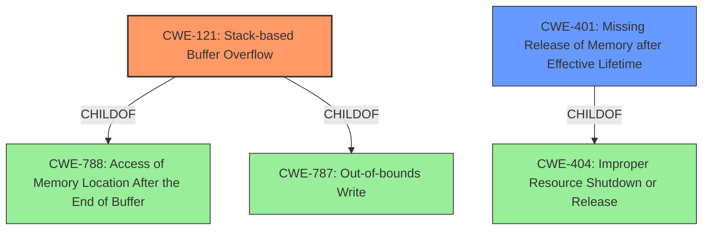

# Enhanced Analysis for CVE-2021-1251

# Summary
| CWE ID | CWE Name | Confidence | CWE Abstraction Level | CWE Vulnerability Mapping Label | CWE-Vulnerability Mapping Notes |
|---|---|---|---|---|---|
| CWE-121 | Stack-based Buffer Overflow | 0.9 | Variant | Allowed | Primary CWE |
| CWE-401 | Missing Release of Memory after Effective Lifetime | 0.7 | Variant | Allowed | Secondary Candidate |

## Evidence and Confidence

*   **Confidence Score:** 0.8
*   **Evidence Strength:** HIGH

## Relationship Analysis
The primary CWE is CWE-121, which is a variant of CWE-788 and CWE-787. The secondary CWE considered is CWE-401, which is a variant of CWE-404. The relationship between buffer overflows (CWE-121) and memory leaks (CWE-401) are distinct. The evidence points to a stack overflow due to missing length validation of LLDP packets, and a separate memory leak issue that can also cause a denial of service.



## Vulnerability Chain
The vulnerability chain involves:
1.  **Missing length validation** of LLDP packet header fields.
2.  This leads to a **stack overflow** (CWE-121) and/or **memory leak** (CWE-401)
3.  Both can cause a denial-of-service (DoS) condition due to device reload or continuous memory consumption.

## Summary of Analysis
Based on the provided evidence, the primary weakness is a **stack overflow**, which is caused by **missing length validation** in LLDP packets. This corresponds to CWE-121 (Stack-based Buffer Overflow). Additionally, the CVE description indicates a memory leak that can cause a denial of service. This corresponds to CWE-401 (Missing Release of Memory after Effective Lifetime).

The decision to select CWE-121 is supported by the vulnerability description and the retriever results. The vulnerability description key phrases mention "stack overflow", while the CVE reference links content summary mentions "Missing length validation of certain LLDP packet header fields.". CWE-121 is a variant, which is the preferred level of abstraction.

The selection of CWE-401 is supported by the CVE reference which states that **missing length validation** could cause "continuous memory consumption on an affected device and eventually cause it to reload, resulting in a DoS condition.". CWE-401 is a variant, which is the preferred level of abstraction.

Other CWEs considered but not used:

*   CWE-119 (Improper Restriction of Operations within the Bounds of a Memory Buffer): While this is a general buffer overflow class, CWE-121 is a more specific variant for stack-based overflows.
*   CWE-190 (Integer Overflow or Wraparound): While integer overflows can lead to buffer overflows, the primary cause here is the missing length validation, not an integer overflow.
*   CWE-1284 (Improper Validation of Specified Quantity in Input): This is related to the missing length validation, but it does not specify the type of vulnerability that results from it. The **stack overflow** is more directly linked to the **missing length validation**, so CWE-121 is more appropriate.
*   CWE-20 (Improper Input Validation): This is a very general weakness, and more specific CWEs like CWE-121 and CWE-401 are more appropriate.


## CWE Relationship Analysis

Current CWEs represent these abstraction levels: .


### Vulnerability Chain Analysis

**Chain starting from CWE-121:**
- 121 (Stack-based Buffer Overflow) - ROOT


**Chain starting from CWE-787:**
- 787 (Out-of-bounds Write) - ROOT


### CWE Relationship Diagram

```mermaid
graph TD
    classDef primary fill:#f96,stroke:#333,stroke-width:2px
    classDef secondary fill:#69f,stroke:#333
    classDef tertiary fill:#9e9,stroke:#333
```