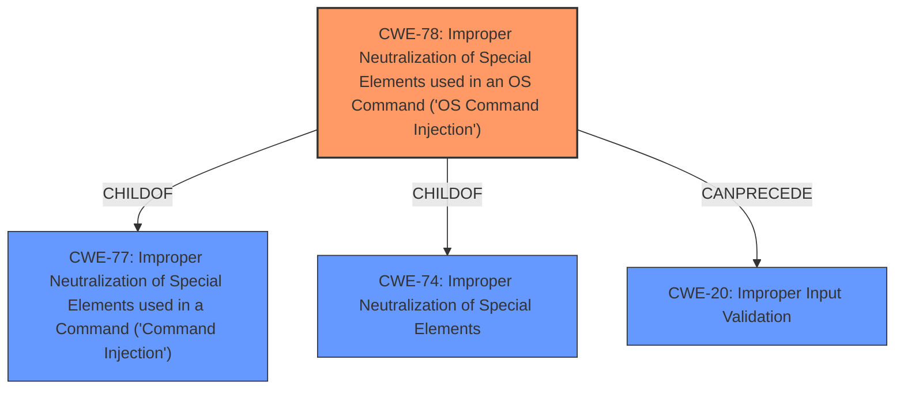

# Raw Analyzer Response for CVE-2021-1260

# Summary
| CWE ID | CWE Name | Confidence | CWE Abstraction Level | CWE Vulnerability Mapping Label | CWE-Vulnerability Mapping Notes |
|---|---|---|---|---|---|
| CWE-78 | Improper Neutralization of Special Elements used in an OS Command ('OS Command Injection') | 1.0 | Base | Allowed | Primary CWE |
| CWE-20 | Improper Input Validation | 0.7 | Class | Discouraged | Secondary Candidate |

## Evidence and Confidence

*   **Confidence Score:** 0.9
*   **Evidence Strength:** HIGH

## Relationship Analysis
The primary relationship influencing the CWE selection is the ChildOf relationship. CWE-78 "Improper Neutralization of Special Elements used in an OS Command ('OS Command Injection')" is a child of CWE-77 "Improper Neutralization of Special Elements used in a Command ('Command Injection')" and CWE-74 "Improper Neutralization of Special Elements in a Command". Because the vulnerability description indicates that the command being injected is an OS command, CWE-78 is more specific and thus more appropriate than its parents.

## Vulnerability Chain
The vulnerability chain starts with **insufficient validation of user-supplied input** on the CLI (as per the CVE Reference Links Content Summary), leading to a command injection vulnerability, and ultimately resulting in the ability to execute arbitrary commands with root privileges.

## Summary of Analysis
The initial assessment, based on the vulnerability description, points strongly towards command injection. The "CVE Reference Links Content Summary" confirms **insufficient validation of user-supplied input** as the root cause. The primary CWE match from similar CVE descriptions is CWE-77, but the technical details clarify that the injection leads to OS commands, making CWE-78 a more precise fit.

The selection of CWE-78 is based on the following evidence:

*   Vulnerability Description: "Multiple vulnerabilities in Cisco SD-WAN products could allow an authenticated attacker to perform **command injection attacks** against an affected device..."
*   CVE Reference Links Content Summary: "Insufficient validation of user-supplied input on the CLI...Command injection vulnerability..."
*   CWE-78 Description: "The product constructs all or part of an OS command using externally-influenced input...but it does not neutralize or incorrectly neutralizes special elements..."

CWE-20 was considered as a secondary weakness, since the root cause involves **insufficient validation of user-supplied input**. However, CWE-20 is a Class-level CWE and is discouraged. The "CVE Reference Links Content Summary" confirms that "**insufficient validation** of user-supplied input on the CLI" is the root cause.
The selection of CWE-78 is at the optimal level of specificity because it directly addresses the **improper neutralization of special elements used in an OS command**, which is the core issue described in the vulnerability.