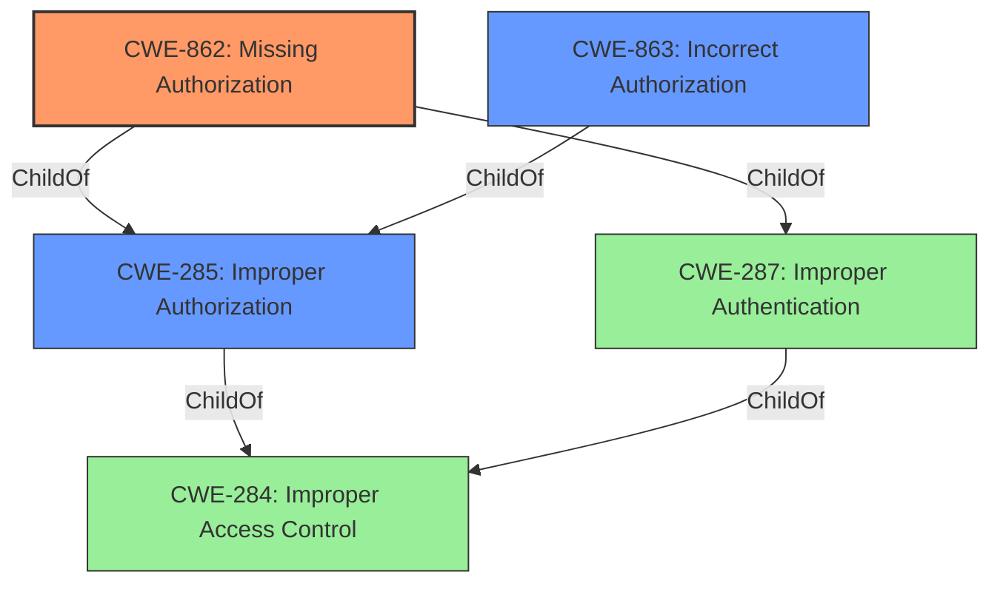

# Analysis for CVE-2021-1269

# Summary
| CWE ID | CWE Name | Confidence | CWE Abstraction Level | CWE Vulnerability Mapping Label | CWE-Vulnerability Mapping Notes |
|---|---|---|---|---|---|
| CWE-862 | Missing Authorization | 0.9 | Base | Allowed | Primary CWE |
| CWE-285 | Improper Authorization | 0.6 | Class | Discouraged | Secondary Candidate |
| CWE-863 | Incorrect Authorization | 0.5 | Class | Allowed-with-Review | Secondary Candidate |

## Evidence and Confidence

*   **Confidence Score:** 0.9
*   **Evidence Strength:** HIGH

## Relationship Analysis
The primary relationship influencing the CWE selection is the hierarchical relationship between CWE-284 (Improper Access Control), CWE-285 (Improper Authorization), CWE-863 (Incorrect Authorization), and CWE-862 (Missing Authorization). CWE-284 is a Pillar, making it too abstract. CWE-285 and CWE-863 are Classes, which are less preferred than Base-level CWEs. CWE-862 is a Base-level CWE and a child of both CWE-285 and CWE-287 (Improper Authentication). The evidence strongly suggests a **lack of authorization**, thus leading to the selection of CWE-862.

## Vulnerability Chain
The vulnerability chain starts with the **missing authorization** check, leading to unauthorized data access and modification.

## Summary of Analysis
The initial assessment identified several potential CWEs, including CWE-78, CWE-20, CWE-79, and those related to authorization. However, based on the provided evidence, the root cause of the vulnerability is the **failure to properly limit access to resources**, which aligns with **missing authorization**.

The "CVE Reference Links Content Summary" clearly states that the vulnerability exists due to a "**failure to properly limit access**" and results in "**authorization bypass**". This bypass allows low-privileged users to perform actions intended for administrators.

The selection of CWE-862 is based on the detailed analysis of the vulnerability description and supporting evidence, including the "CVE Reference Links Content Summary". The relationship analysis further reinforces this selection by highlighting the hierarchical structure of access control-related CWEs and the preference for Base-level CWEs. The mapping guidance for CWE-285 and CWE-284 explicitly discourages their use when more specific CWEs are available.

The selected CWE, CWE-862, is at the optimal level of specificity as it accurately reflects the **missing authorization** check that leads to the vulnerability.

Relevant CWE Information:

# Enhanced Context (25 CWEs)

## CWE-653: Improper Isolation or Compartmentalization
**Abstraction Level**: Class
**Similarity Score**: 0.75
**Source**: dense
Not considered because it doesn't accurately describe the weakness which is related to missing authorization.

## CWE-41: Improper Resolution of Path Equivalence
**Abstraction Level**: Base
**Similarity Score**: 0.74
**Source**: dense
Not considered because it is not related to the described vulnerability.

## CWE-691: Insufficient Control Flow Management
**Abstraction Level**: Pillar
**Similarity Score**: 0.74
**Source**: dense
Not considered because it is too high level.

## CWE-73: External Control of File Name or Path
**Abstraction Level**: Base
**Similarity Score**: 0.74
**Source**: dense
Not considered because it is not related to the described vulnerability.

## CWE-1289: Improper Validation of Unsafe Equivalence in Input
**Abstraction Level**: Base
**Similarity Score**: 0.73
**Source**: dense
Not considered because it is not related to the described vulnerability.

## CWE-23: Relative Path Traversal
**Abstraction Level**: Base
**Similarity Score**: 0.73
**Source**: dense
Not considered because it is not related to the described vulnerability.

## CWE-274: Improper Handling of Insufficient Privileges
**Abstraction Level**: Base
**Similarity Score**: 0.73
**Source**: dense
Not considered because it is not related to the described vulnerability.

## CWE-664: Improper Control of a Resource Through its Lifetime
**Abstraction Level**: Pillar
**Similarity Score**: 0.73
**Source**: dense
Not considered because it is too high level.

## CWE-404: Improper Resource Shutdown or Release
**Abstraction Level**: Class
**Similarity Score**: 0.72
**Source**: dense
Not considered because it is not related to the described vulnerability.

## CWE-667: Improper Locking
**Abstraction Level**: Class
**Similarity Score**: 0.72
**Source**: dense
Not considered because it is not related to the described vulnerability.

## CWE-22: Improper Limitation of a Pathname to a Restricted Directory ('Path Traversal')
**Abstraction Level**: Base
**Similarity Score**: 9687.94
**Source**: sparse
Not considered because it is not related to the described vulnerability.

## CWE-23: Relative Path Traversal
**Abstraction Level**: Base
**Similarity Score**: 9276.04
**Source**: sparse
Not considered because it is not related to the described vulnerability.

## CWE-863: Incorrect Authorization
**Abstraction Level**: Class
**Similarity Score**: 8939.99
**Source**: sparse
Considered as a secondary CWE because it indicates an authorization issue, but it is more specific than the primary issue which is a **missing authorization** check.

## CWE-639: Authorization Bypass Through User-Controlled Key
**Abstraction Level**: Base
**Similarity Score**: 8826.08
**Source**: sparse
Not considered because it is not related to the described vulnerability.

## CWE-184: Incomplete List of Disallowed Inputs
**Abstraction Level**: Base
**Similarity Score**: 8806.61
**Source**: sparse
Not considered because it is not related to the described vulnerability.

## CWE-78: Improper Neutralization of Special Elements used in an OS Command ('OS Command Injection')
**Abstraction Level**: base
**Similarity Score**: 5.03
**Source**: graph
Not considered because it is not related to the described vulnerability.

## CWE-98: Improper Control of Filename for Include/Require Statement in PHP Program ('PHP Remote File Inclusion')
**Abstraction Level**: variant
**Similarity Score**: 4.53
**Source**: graph
Not considered because it is not related to the described vulnerability.

## CWE-434: Unrestricted Upload of File with Dangerous Type
**Abstraction Level**: base
**Similarity Score**: 4.33
**Source**: graph
Not considered because it is not related to the described vulnerability.

## CWE-79: Improper Neutralization of Input During Web Page Generation ('Cross-site Scripting')
**Abstraction Level**: base
**Similarity Score**: 4.33
**Source**: graph
Not considered because it is not related to the described vulnerability.

## CWE-22: Improper Limitation of a Pathname to a Restricted Directory ('Path Traversal')
**Abstraction Level**: base
**Similarity Score**: 4.33
**Source**: graph
Not considered because it is not related to the described vulnerability.

## CWE-770: Allocation of Resources Without Limits or Throttling
**Abstraction Level**: base
**Similarity Score**: 4.33
**Source**: graph
Not considered because it is not related to the described vulnerability.

## CWE-190: Integer Overflow or Wraparound
**Abstraction Level**: base
**Similarity Score**: 4.33
**Source**: graph
Not considered because it is not related to the described vulnerability.

## CWE-125: Out-of-bounds Read
**Abstraction Level**: base
**Similarity Score**: 3.89
**Source**: graph
Not considered because it is not related to the described vulnerability.

## CWE-88: Improper Neutralization of Argument Delimiters in a Command ('Argument Injection')