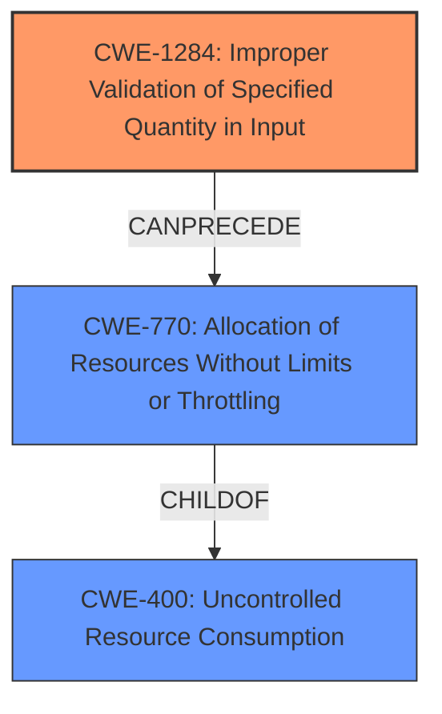

# Analysis for CVE-2021-1273

# Summary
| CWE ID | CWE Name | Confidence | CWE Abstraction Level | CWE Vulnerability Mapping Label | CWE-Vulnerability Mapping Notes |
|---|---|---|---|---|---|
| CWE-1284 | Improper Validation of Specified Quantity in Input | 0.75 | Base | Allowed | Primary CWE |
| CWE-770 | Allocation of Resources Without Limits or Throttling | 0.65 | Base | Allowed | Secondary Candidate |
| CWE-400 | Uncontrolled Resource Consumption | 0.5 | Class | Allowed | Secondary Candidate |

## Evidence and Confidence

*   **Confidence Score:** 0.7
*   **Evidence Strength:** MEDIUM

## Relationship Analysis
The primary CWE selected is CWE-1284, which represents the **IMPROPER VALIDATION** of a specified quantity in the input. This can **CANPRECEDE** other issues such as excessive memory allocation CWE-789. CWE-770, Allocation of Resources Without Limits or Throttling, represents the actual **ALLOCATION** of resources without proper limits, which can **FOLLOW** CWE-1284. CWE-770 is a ChildOf CWE-400. The relationship analysis shows the progression from **IMPROPER VALIDATION** to resource allocation and potentially to resource exhaustion.

## Vulnerability Chain
The vulnerability chain begins with the receipt of crafted IPv4 or IPv6 packets. The **IMPROPER VALIDATION** of the size or quantity within these packets (CWE-1284) leads to the **ALLOCATION** of resources without limits (CWE-770), ultimately resulting in uncontrolled resource consumption and a denial-of-service (DoS) condition.
  - Initial Flaw: Receipt of crafted IPv4/IPv6 packets
  - Root Cause: CWE-1284: Improper Validation of Specified Quantity in Input
  - Weakness: CWE-770: Allocation of Resources Without Limits or Throttling
  - Impact: Denial of Service (DoS)

## Summary of Analysis
The initial analysis considered CWE-78 due to its presence in the similar CVE descriptions, but upon reviewing the provided details, the root cause is related to resource management due to **INSUFFICIENT BOUNDS CHECKING**. The crafted packets are not directly injecting commands, but rather exploiting the lack of validation on the packet size or quantity, which leads to a denial of service. The evidence for this is in the **CVE Reference Links Content Summary** section that states:
*   "**Root Cause:** The vulnerability lies in the insufficient bounds checking within the forwarding plane of the IPSec tunnel management functionality in Cisco SD-WAN products."
*   "**Weaknesses:** The vulnerability is caused by improper handling of crafted IPv4 or IPv6 packets during IPSec tunnel management. **Lack of proper validation and bounds checking** allows the attacker to cause a denial of service."

This aligns with CWE-1284, "Improper Validation of Specified Quantity in Input," as the root cause. The subsequent allocation of resources without limits aligns with CWE-770, ultimately leading to a denial-of-service condition. These selected CWEs are at the optimal level of specificity, representing the root cause and the immediate consequence of the vulnerability.

Relevant CWE Information:

# Enhanced Context (25 CWEs)
The following CWEs were identified as potentially relevant to this vulnerability:

## CWE-61: UNIX Symbolic Link (Symlink) Following
**Abstraction Level**: Compound
**Similarity Score**: 0.81
**Source**: dense

**Description**:
The product, when opening a file or directory, does not sufficiently account for when the file is a symbolic link that resolves to a target outside of the intended control sphere. This could allow an attacker to cause the product to operate on unauthorized files.

**Mapping Guidance**:
- Usage: Allowed
- Rationale: This is a well-known Composite of multiple weaknesses that must all occur simultaneously, although it is attack-oriented in nature.

## CWE-59: Improper Link Resolution Before File Access ('Link Following')
**Abstraction Level**: Base
**Similarity Score**: 0.80
**Source**: dense

**Description**:
The product attempts to access a file based on the filename, but it does not properly prevent that filename from identifying a link or shortcut that resolves to an unintended resource.

**Mapping Guidance**:
- Usage: Allowed
- Rationale: This CWE entry is at the Base level of abstraction, which is a preferred level of abstraction for mapping to the root causes of vulnerabilities.

## CWE-41: Improper Resolution of Path Equivalence
**Abstraction Level**: Base
**Similarity Score**: 0.77
**Source**: dense

**Description**:
The product is vulnerable to file system contents disclosure through path equivalence. Path equivalence involves the use of special characters in file and directory names. The associated manipulations are intended to generate multiple names for the same object.

**Mapping Guidance**:
- Usage: Allowed
- Rationale: This CWE entry is at the Base level of abstraction, which is a preferred level of abstraction for mapping to the root causes of vulnerabilities.

## CWE-23: Relative Path Traversal
**Abstraction Level**: Base
**Similarity Score**: 0.75
**Source**: dense

**Description**:
The product uses external input to construct a pathname that should be within a restricted directory, but it does not properly neutralize sequences such as ".." that can resolve to a location that is outside of that directory.

**Mapping Guidance**:
- Usage: Allowed
- Rationale: This CWE entry is at the Base level of abstraction, which is a preferred level of abstraction for mapping to the root causes of vulnerabilities.

## CWE-668: Exposure of Resource to Wrong Sphere
**Abstraction Level**: Class
**Similarity Score**: 0.74
**Source**: dense

**Description**:
The product exposes a resource to the wrong control sphere, providing unintended actors with inappropriate access to the resource.

**Mapping Guidance**:
- Usage: Discouraged
- Rationale: CWE-668 is high-level and is often misused as a catch-all when lower-level CWE IDs might be applicable. It is sometimes used for low-information vulnerability reports [REF-1287]. It is a level-1 Class (i.e., a child of a Pillar). It is not useful for trend analysis.

## CWE-667: Improper Locking
**Abstraction Level**: Class
**Similarity Score**: 0.74
**Source**: dense

**Description**:
The product does not properly acquire or release a lock on a resource, leading to unexpected resource state changes and behaviors.

**Mapping Guidance**:
- Usage: Allowed-with-Review
- Rationale: This CWE entry is a Class and might have Base-level children that would be more appropriate

## CWE-74: Improper Neutralization of Special Elements in Output Used by a Downstream Component ('Injection')
**Abstraction Level**: Class
**Similarity Score**: 0.74
**Source**: dense

**Description**:
The product constructs all or part of a command, data structure, or record using externally-influenced input from an upstream component, but it does not neutralize or incorrectly neutralizes special elements that could modify how it is parsed or interpreted when it is sent to a downstream component.

**Mapping Guidance**:
- Usage: Discouraged
- Rationale: CWE-74 is high-level and often misused when lower-level weaknesses are more appropriate.

## CWE-755: Improper Handling of Exceptional Conditions
**Abstraction Level**: Class
**Similarity Score**: 0.74
**Source**: dense

**Description**:
The product does not handle or incorrectly handles an exceptional condition.

**Mapping Guidance**:
- Usage: Discouraged
- Rationale: This CWE entry is a level-1 Class (i.e., a child of a Pillar). It might have lower-level children that would be more appropriate

## CWE-73: External Control of File Name or Path
**Abstraction Level**: Base
**Similarity Score**: 0.74
**Source**: dense

**Description**:
The product allows user input to control or influence paths or file names that are used in filesystem operations.

**Mapping Guidance**:
- Usage: Allowed
- Rationale: This CWE entry is at the Base level of abstraction, which is a preferred level of abstraction for mapping to the root causes of vulnerabilities.

## CWE-1289: Improper Validation of Unsafe Equivalence in Input
**Abstraction Level**: Base
**Similarity Score**: 0.74
**Source**: dense

**Description**:
The product receives an input value that is used