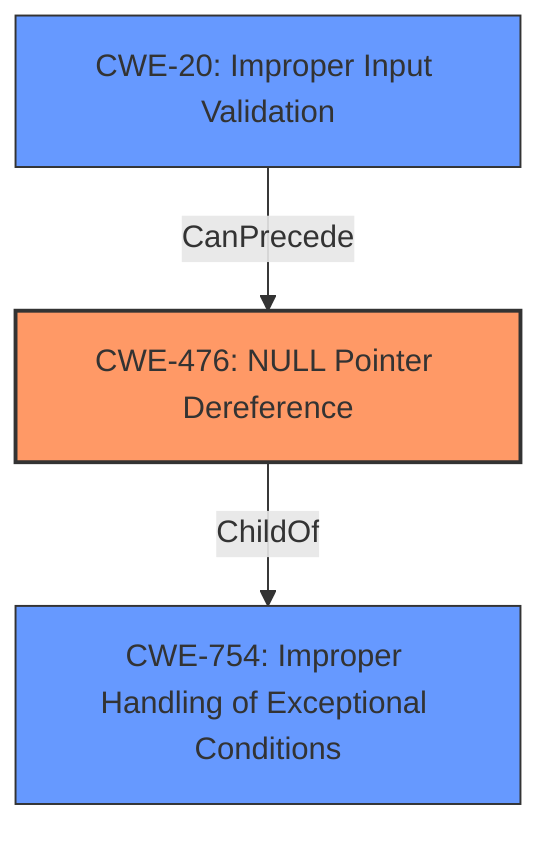

# Analysis Report for CVE-2021-1274

# Vulnerability Analysis Report: CVE-2021-1274

## Description


## Analysis (with Relationship Data)

# Summary
| CWE ID  | CWE Name | Confidence | CWE Abstraction Level | CWE Vulnerability Mapping Label | CWE-Vulnerability Mapping Notes |
|----------------|---------------------------------------------------------------------------------------------------|----------------|-------------------------|---------------------------------------|-----------------------------------------------------------------------------------------------------------------------------------------------------------------------------------------------------------------------------------------------------------------------------------------------------------------------------------------------------------------------------------------------------------------------------------------------------------------------------------------------------------------------------------------------------------------------------------------------------------------------------------------------------------------------------------------------------------------------------------------------------------------------------------------------------------------------------------------------------------------------------------------------------------------------------------------------------------------------------------------------------------------------------------------------------------------------------------------------------------------------------------------------------------------------------------------------------------------------------------------------------------------------------------------------------------------------------------------------------------------------------------------------------------------------------------------------------------------------------------------------------------------------------------------------------------------------------------------------------------------------------------------------------------------------------------------------------------------------------------------------------------------------------------------------------------------------------------------------------------------------------------------------------------------------------------------------------------------------------------------------------------------------------------------------------------------------------------------------------------------------------------------------------------------------------------------------------------------------------------------------------------------------------------------------------------------|
| CWE-476  | NULL Pointer Dereference | 0.9 | Base | Allowed | This is the Primary CWE. The **root cause** of the vulnerability is a **null pointer dereference** in the `vDaemon` process. The crafted UDP traffic triggers this condition.|
| CWE-20  | Improper Input Validation | 0.7 | Class | Discouraged | This is a secondary CWE. The crafted UDP traffic suggests there is **improper input validation** of network traffic. This allows for unexpected traffic patterns to trigger the **null pointer dereference**.|
| CWE-754  | Improper Handling of Exceptional Conditions | 0.6 | Class | Allowed | This is a secondary CWE. The **null pointer dereference** can be viewed as the application **fails to handle exceptional conditions** where a pointer is unexpectedly NULL.|

## Evidence and Confidence

*   **Confidence Score:** 0.8
*   **Evidence Strength:** HIGH

## Relationship Analysis
The primary weakness is CWE-476, which is the direct cause of the denial of service. CWE-20 is a contributing factor, as the lack of proper input validation allows the crafted UDP traffic to trigger the null pointer dereference. CWE-754 is a more general classification that encompasses the failure to handle the exceptional condition of a null pointer.



## Vulnerability Chain
The vulnerability chain starts with the **improper input validation** (CWE-20) of the crafted UDP traffic. This leads to a **null pointer dereference** (CWE-476) in the `vDaemon` process, which ultimately results in a denial of service (DoS).
  - CWE-20: Improper Input Validation (Root Cause)
  - CWE-476: NULL Pointer Dereference (Weakness)
  - DoS (Impact)

## Summary of Analysis
Based on the provided information, the primary root cause of this vulnerability is a **null pointer dereference** (CWE-476) in the `vDaemon` process of Cisco SD-WAN devices, triggered by crafted UDP traffic. This is supported by the CVE Reference Links Content Summary, which states "The vulnerability is due to a **null pointer dereference** in the `vDaemon` process of Cisco SD-WAN devices."

The crafted UDP traffic also suggests **improper input validation** (CWE-20), as the software does not adequately handle unexpected traffic patterns.

The relationship analysis shows that CWE-476 is a child of CWE-754 (Improper Handling of Exceptional Conditions), indicating that the vulnerability can be viewed as a failure to handle the exceptional condition of a null pointer. However, CWE-476 is more specific and therefore a better fit for the root cause.

The retriever results also list CWE-119 (Improper Restriction of Operations within the Bounds of a Memory Buffer), CWE-78 (Improper Neutralization of Special Elements used in an OS Command) and CWE-770 (Allocation of Resources Without Limits or Throttling). CWE-119 is not applicable as there's no explicit buffer involved. CWE-78 is not applicable as the vulnerability is not related to OS command injection. CWE-770 is also not applicable as the vulnerability does not involve resource allocation without limits.

Therefore, the selected CWEs are at the optimal level of specificity, accurately representing the **root cause** and contributing factors to the vulnerability.


## CWE Relationship Analysis

Current CWEs represent these abstraction levels: .


### Vulnerability Chain Analysis

**Chain starting from CWE-476:**
- 476 (NULL Pointer Dereference) - ROOT


**Chain starting from CWE-754:**
- 754 (Improper Check for Unusual or Exceptional Conditions) - ROOT


### CWE Relationship Diagram

```mermaid
graph TD
    classDef primary fill:#f96,stroke:#333,stroke-width:2px
    classDef secondary fill:#69f,stroke:#333
    classDef tertiary fill:#9e9,stroke:#333
```


*Report generated on 2025-04-01 23:37:34*
