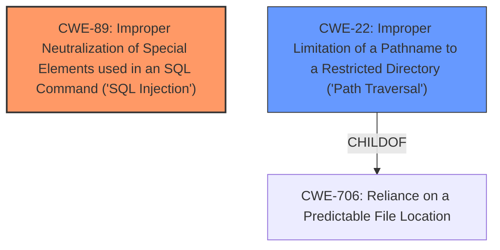

# Raw Analyzer Response for CVE-2021-1282

# Summary

| CWE ID | CWE Name | Confidence | CWE Abstraction Level | CWE Vulnerability Mapping Label | CWE-Vulnerability Mapping Notes |
|---|---|---|---|---|---|
| CWE-89 | Improper Neutralization of Special Elements used in an SQL Command ('SQL Injection') | 1.0 | Base | Allowed | Primary CWE |
| CWE-22 | Improper Limitation of a Pathname to a Restricted Directory ('Path Traversal') | 1.0 | Base | Allowed | Secondary Candidate |

## Evidence and Confidence

*   **Confidence Score:** 1.0
*   **Evidence Strength:** HIGH

## Relationship Analysis

The primary relationship impacting the decision is the direct match of the described vulnerabilities (SQL injection and path traversal) to specific CWEs. CWE-89 and CWE-22 are both base-level CWEs that directly represent the identified weaknesses. CWE-22 is a child of CWE-706 which describes the broader category of "Reliance on a Predictable File Location". No other relationships significantly influenced the mapping, as the evidence strongly supports these direct classifications.

## Vulnerability Chain

The vulnerability chain involves the following:
  1. **Root Cause:** **Improper validation** of user-submitted parameters (from CVE Reference Links Content Summary).
  2. **Weakness 1:** Resulting in **SQL Injection** (CWE-89) due to **improper neutralization** of special elements in SQL commands.
  3. **Weakness 2:** Leading to **Path Traversal** (CWE-22) due to **improper limitation** of a pathname to a restricted directory.
  4. **Impact:** Attackers can obtain data stored in the underlying database or access unauthorized files.

## Summary of Analysis

The analysis is based on the provided evidence, which includes the vulnerability description and CVE reference links content summary. The **Vulnerability Description** explicitly mentions "path traversal attacks and SQL injection attacks". The **CVE Reference Links Content Summary** further supports this by stating: "The vulnerability is due to **improper validation** of user-submitted parameters in the web-based management interface" and listing "SQL Injection" as a weakness.

The graph relationships, while providing context, did not significantly alter the decision-making process as the provided evidence directly maps to the selected CWEs.

The selected CWEs (CWE-89 and CWE-22) are at the optimal level of specificity because they directly represent the identified weaknesses (SQL injection and path traversal respectively) as stated in the vulnerability description.

Relevant CWE Information:

*   **CWE-89**: The vulnerability description explicitly mentions "SQL injection attacks," and the CVE reference link summary confirms "SQL Injection" as a weakness. This aligns with the description of CWE-89, which focuses on improper neutralization of special elements in SQL commands.
*   **CWE-22**: The vulnerability description explicitly mentions "path traversal attacks." This aligns with the description of CWE-22, which focuses on improper limitation of a pathname to a restricted directory.

Other CWEs Considered But Not Used:

*   **CWE-20 (Improper Input Validation):** While the CVE reference link summary mentions "improper validation," using CWE-20 would be too general. The vulnerability description provides specific attack types (SQL injection and path traversal), allowing for more precise CWE assignments. CWE-20 is a discouraged mapping according to its specifications.
*   **CWE-73 (External Control of File Name or Path):** While related to path traversal, CWE-22 is a more specific and accurate representation of the vulnerability, as it focuses on the improper limitation of pathnames to a restricted directory, which is the core issue in path traversal attacks.
*   **CWE-94 (Improper Control of Generation of Code ('Code Injection')):** Although SQL injection *can* lead to code execution in some cases, the primary weakness is the improper handling of SQL commands, not the generation of code. Therefore, CWE-89 is a more accurate representation.
*   **CWE-184 (Incomplete List of Disallowed Inputs):** This CWE could be applicable if a list of disallowed inputs was incomplete leading to path traversal or SQL injection, but the evidence doesn't suggest this is the case. Instead, it points towards a more general lack of proper input validation or neutralization.