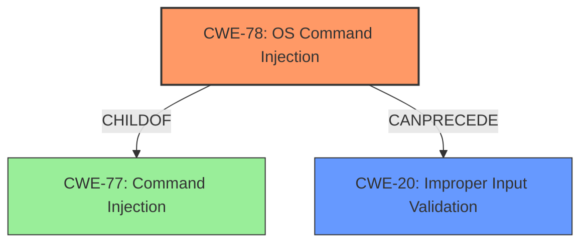

# Analysis Report for CVE-2021-1298

# Vulnerability Analysis Report: CVE-2021-1298

## Description


## Analysis (with Relationship Data)

# Summary
| CWE ID | CWE Name | Confidence | CWE Abstraction Level | CWE Vulnerability Mapping Label | CWE-Vulnerability Mapping Notes |
|---|---|---|---|---|---|
| CWE-78 | Improper Neutralization of Special Elements used in an OS Command ('OS Command Injection') | 1.0 | Base | Allowed | Primary CWE |
| CWE-20 | Improper Input Validation | 0.5 | Class | Discouraged | Secondary Candidate |

## Evidence and Confidence

*   **Confidence Score:** 0.8
*   **Evidence Strength:** HIGH

## Relationship Analysis
The primary relationship impacting the decision is the hierarchical relationship where CWE-78 is a child of CWE-77. Since the vulnerability involves OS commands, CWE-78 is more specific and appropriate. CWE-20 is a class-level CWE and is generally discouraged, making it a less suitable primary classification but potentially relevant as a secondary factor.



## Vulnerability Chain
The vulnerability chain starts with **improper input validation**, potentially leading to **OS Command Injection**.

## Summary of Analysis
Initially, the primary CWE match from the provided data was CWE-77, "Improper Neutralization of Special Elements used in a Command ('Command Injection')." However, a closer examination of the vulnerability description and the "CVE Reference Links Content Summary" indicates that the **command injection** occurs specifically within the context of OS commands. The "CVE Reference Links Content Summary" explicitly states, "Command injection due to **improper input validation**" and "Successful exploitation allows a remote attacker to execute arbitrary commands as the root user on the affected system, gaining root-level access." This strongly suggests that CWE-78, "Improper Neutralization of Special Elements used in an OS Command ('OS Command Injection')" is a more accurate classification.

CWE-78 is a Base level CWE, which is preferred, and a child of CWE-77, making it more specific. The relationship analysis supports this decision, as CWE-78 being a child of CWE-77 implies it's a more specialized form of command injection, specifically related to OS commands.

CWE-20, "Improper Input Validation," was considered as a contributing factor, as the root cause analysis in the "CVE Reference Links Content Summary" mentions **improper input validation**. However, CWE-20 is a Class-level CWE and is discouraged for direct mapping when more specific weaknesses are identifiable. While **improper input validation** contributes to the vulnerability, the direct consequence is **OS command injection**, making CWE-78 the more appropriate primary classification.

The evidence from the "CVE Reference Links Content Summary" and the hierarchical relationship between CWE-77 and CWE-78 heavily influence the decision to classify this vulnerability as CWE-78. The selected CWE is at the optimal level of specificity because it accurately reflects the type of command injection and is a Base level CWE.

Relevant CWE Information:

# Enhanced Context (25 CWEs)

## CWE-78: Improper Neutralization of Special Elements used in an OS Command ('OS Command Injection')
**Abstraction:** Base
**Status:** Stable

### Description
The product constructs all or part of an OS command using externally-influenced input from an upstream component, but it does not neutralize or incorrectly neutralizes special elements that could modify the intended OS command when it is sent to a downstream component.

### Extended Description
This weakness can lead to a vulnerability in environments in which the attacker does not have direct access to the operating system, such as in web applications. Alternately, if the weakness occurs in a privileged program, it could allow the attacker to specify commands that normally would not be accessible, or to call alternate commands with privileges that the attacker does not have. The problem is exacerbated if the compromised process does not follow the principle of least privilege, because the attacker-controlled commands may run with special system privileges that increases the amount of damage.

### Relationships
ChildOf -> CWE-77
ChildOf -> CWE-74
ChildOf -> CWE-77
ChildOf -> CWE-77
CanAlsoBe -> CWE-88

### Mapping Guidance
**Usage:** Allowed
**Rationale:** This CWE entry is at the Base level of abstraction, which is a preferred level of abstraction for mapping to the root causes of vulnerabilities.

## CWE-20: Improper Input Validation
**Abstraction:** Class
**Status:** Stable

### Description
The product receives input or data, but it does
        not validate or incorrectly validates that the input has the
        properties that are required to process the data safely and
        correctly.

### Extended Description
Input validation is a frequently-used technique for checking potentially dangerous inputs in order to ensure that the inputs are safe for processing within the code, or when communicating with other components. When software does not validate input properly, an attacker is able to craft the input in a form that is not expected by the rest of the application. This will lead to parts of the system receiving unintended input, which may result in altered control flow, arbitrary control of a resource, or arbitrary code execution.

### Relationships
ChildOf -> CWE-707
PeerOf -> CWE-345
CanPrecede -> CWE-22
CanPrecede -> CWE-41
CanPrecede -> CWE-74
CanPrecede -> CWE-119
CanPrecede -> CWE-770

### Mapping Guidance
**Usage:** Discouraged
**Rationale:** CWE-20 is commonly misused in low-information vulnerability reports when lower-level CWEs could be used instead, or when more details about the vulnerability are available [REF-1287]. It is not useful for trend analysis. It is also a level-1 Class (i.e., a child of a Pillar).


## CWE Relationship Analysis

Current CWEs represent these abstraction levels: .


### Vulnerability Chain Analysis

**Chain starting from CWE-88:**
- 88 (Improper Neutralization of Argument Delimiters in a Command ('Argument Injection')) - ROOT


**Chain starting from CWE-41:**
- 41 (Improper Resolution of Path Equivalence) - ROOT


### CWE Relationship Diagram

```mermaid
graph TD
    classDef primary fill:#f96,stroke:#333,stroke-width:2px
    classDef secondary fill:#69f,stroke:#333
    classDef tertiary fill:#9e9,stroke:#333
```


*Report generated on 2025-04-01 21:57:50*
