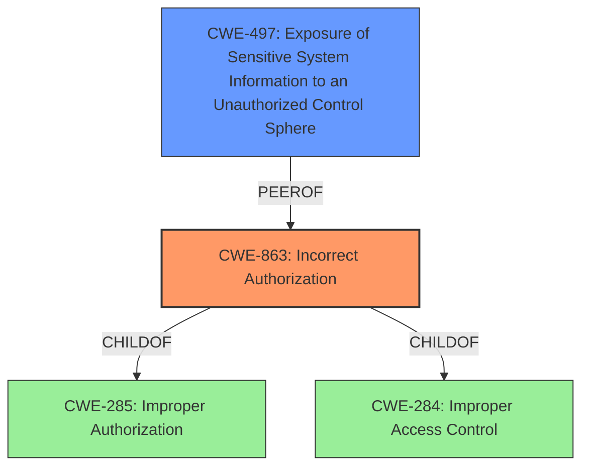

# Raw Analyzer Response for CVE-2021-1305

# Summary
| CWE ID | CWE Name | Confidence | CWE Abstraction Level | CWE Vulnerability Mapping Label | CWE-Vulnerability Mapping Notes |
|---|---|---|---|---|---|
| CWE-863 | Incorrect Authorization | 0.9 | Class | Primary | Allowed-with-Review |
| CWE-497 | Exposure of Sensitive System Information to an Unauthorized Control Sphere | 0.7 | Base | Secondary | Allowed |

## Evidence and Confidence

*   **Confidence Score:** 0.8
*   **Evidence Strength:** MEDIUM

## Relationship Analysis
The primary CWE selected is CWE-863, "Incorrect Authorization," which is a Class-level CWE. It is a child of CWE-285 "Improper Authorization" and CWE-284 "Improper Access Control" representing a more specific form of access control failure. CWE-497 "Exposure of Sensitive System Information to an Unauthorized Control Sphere" is a base CWE related to information disclosure due to inadequate access restrictions.

## Vulnerability Chain
The vulnerability chain begins with **insufficient authorization checks** within the Cisco SD-WAN vManage Software's web-based management interface. This **incorrect authorization** allows authenticated remote attackers with low privileges to bypass intended access controls. The result of this **incorrect authorization** includes attackers being able to modify configurations, gain access to sensitive information, and view unauthorized information.

## Summary of Analysis
The initial assessment identified that the vulnerability involves an **incorrect authorization** mechanism in Cisco SD-WAN vManage Software. The "CVE Reference Links Content Summary" states the root cause is "Insufficient authorization checks of user account privileges." The vulnerability description indicates that an authenticated remote attacker can bypass authorization and modify configurations, gain access to sensitive information, and view information that they are not authorized to access.

CWE-863, "Incorrect Authorization," is the most appropriate primary CWE because the vulnerability involves a flaw in how authorization checks are performed. The description of CWE-863 states: "The product performs an authorization check when an actor attempts to access a resource or perform an action, but it does not correctly perform the check." This aligns directly with the vulnerability where authorization checks are insufficient.

CWE-497, "Exposure of Sensitive System Information to an Unauthorized Control Sphere," is a secondary CWE since the impact includes gaining access to sensitive information. The description of CWE-497 states: "The product does not properly prevent sensitive system-level information from being accessed by unauthorized actors who do not have the same level of access to the underlying system as the product does."

The retriever results showed other potential CWEs, but they were not as fitting. CWE-285 "Improper Authorization" is too high level and the guidance suggests using more specific child CWEs, therefore CWE-863 is better. CWE-20 "Improper Input Validation" does not fit as well because the root cause is not related to validation of input, but rather the authorization process.

The selection of CWE-863 and CWE-497 reflects the **incorrect authorization** leading to unauthorized access and exposure of sensitive information. These CWEs are at the optimal level of specificity, providing a clear and accurate representation of the vulnerability.