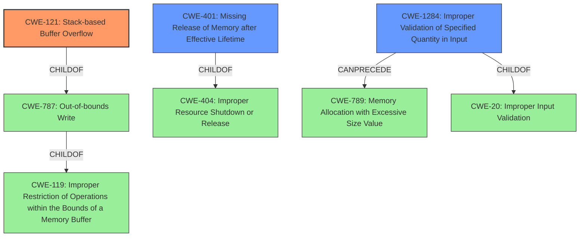

# Raw Analyzer Response for CVE-2021-1308

# Summary
| CWE ID | CWE Name | Confidence | CWE Abstraction Level | CWE Vulnerability Mapping Label | CWE-Vulnerability Mapping Notes |
|---|---|---|---|---|---|
| CWE-121 | Stack-based Buffer Overflow | 0.9 | Variant | Primary | Allowed |
| CWE-1284 | Improper Validation of Specified Quantity in Input | 0.7 | Base | Secondary | Allowed |
| CWE-401 | Missing Release of Memory after Effective Lifetime | 0.7 | Variant | Secondary | Allowed |

## Evidence and Confidence

*   **Confidence Score:** 0.8
*   **Evidence Strength:** HIGH

## Relationship Analysis
The primary CWE is CWE-121, which is a variant of CWE-787 (Out-of-bounds Write), which in turn is a child of CWE-119 (Improper Restriction of Operations within the Bounds of a Memory Buffer). CWE-1284 (Improper Validation of Specified Quantity in Input) can precede CWE-789 (Memory Allocation with Excessive Size Value), which could lead to a buffer overflow. CWE-401 (Missing Release of Memory after Effective Lifetime) is a child of CWE-404 (Improper Resource Shutdown or Release). These relationships help understand the potential chain of events and the nature of the vulnerabilities.

## Vulnerability Chain
The vulnerability chain starts with a **missing length validation** (likely related to CWE-1284), which leads to a **stack-based buffer overflow** (CWE-121). Additionally, the advisory mentions a memory leak which can be represented by CWE-401.
- **Root Cause:** Missing length validation of LLDP packet header fields (likely related to CWE-1284)
- **Weakness:** Stack-based buffer overflow (CWE-121), Memory Leak (CWE-401)
- **Impact:** Execute arbitrary code, information disclosure, and denial of service (DoS)

## Summary of Analysis
The initial assessment focuses on the **stack-based buffer overflow** as the primary **weakness**, which aligns with the "Vulnerability Description Key Phrases". The content summary supports this by highlighting the **missing length validation**, which suggests a potential cause. The retriever results also point towards CWE-119, CWE-121, and CWE-401 as relevant.

The analysis concludes that CWE-121 (Stack-based Buffer Overflow) is the most appropriate primary CWE because the vulnerability description explicitly mentions it. The root cause for CVE-2021-1308 is a missing length validation, so CWE-1284 (Improper Validation of Specified Quantity in Input) is included as a secondary CWE to represent this root cause. The description also notes a memory leak, so CWE-401 (Missing Release of Memory after Effective Lifetime) is included as well.

CWE-119 (Improper Restriction of Operations within the Bounds of a Memory Buffer) was considered but deemed too general, as CWE-121 provides a more specific classification. CWE-190 (Integer Overflow or Wraparound) was considered, but there is no direct evidence in the description to support it. CWE-20 (Improper Input Validation) was also considered but the more specific CWE-1284 was chosen to describe the root cause.

The selected CWEs are at the optimal level of specificity because they accurately represent the **weakness** (CWE-121) and contributing factor, the **missing length validation** (CWE-1284) and memory leak (CWE-401).

Relevant CWE Information:

# Enhanced Context (25 CWEs)
The following CWEs were identified as potentially relevant to this vulnerability:

## CWE-405: Asymmetric Resource Consumption (Amplification)
**Abstraction Level**: Class
**Similarity Score**: 0.77
**Source**: dense

**Description**:
The product does not properly control situations in which an adversary can cause the product to consume or produce excessive resources without requiring the adversary to invest equivalent work or otherwise prove authorization, i.e., the adversary's influence is "asymmetric."

**Mapping Guidance**:
- Usage: Allowed-with-Review
- Rationale: This CWE entry is a Class and might have Base-level children that would be more appropriate

## CWE-1325: Improperly Controlled Sequential Memory Allocation
**Abstraction Level**: Base
**Similarity Score**: 0.77
**Source**: dense

**Description**:
The product manages a group of objects or resources and performs a separate memory allocation for each object, but it does not properly limit the total amount of memory that is consumed by all of the combined objects.

**Mapping Guidance**:
- Usage: Allowed
- Rationale: This CWE entry is at the Base level of abstraction, which is a preferred level of abstraction for mapping to the root causes of vulnerabilities.

## CWE-404: Improper Resource Shutdown or Release
**Abstraction Level**: Class
**Similarity Score**: 0.77
**Source**: dense

**Description**:
The product does not release or incorrectly releases a resource before it is made available for re-use.

**Mapping Guidance**:
- Usage: Allowed-with-Review
- Rationale: This CWE entry is a Class and might have Base-level children that would be more appropriate

## CWE-789: Memory Allocation with Excessive Size Value
**Abstraction Level**: Variant
**Similarity Score**: 0.77
**Source**: dense

**Description**:
The product allocates memory based on an untrusted, large size value, but it does not ensure that the size is within expected limits, allowing arbitrary amounts of memory to be allocated.

**Mapping Guidance**:
- Usage: Allowed
- Rationale: This CWE entry is at the Variant level of abstraction, which is a preferred level of abstraction for mapping to the root causes of vulnerabilities.

## CWE-664: Improper Control of a Resource Through its Lifetime
**Abstraction Level**: Pillar
**Similarity Score**: 0.76
**Source**: dense

**Description**:
The product does not maintain or incorrectly maintains control over a resource throughout its lifetime of creation, use, and release.

**Mapping Guidance**:
- Usage: Discouraged
- Rationale: This CWE entry is high-level when lower-level children are available.

## CWE-226: Sensitive Information in Resource Not Removed Before Reuse
**Abstraction Level**: Base
**Similarity Score**: 0.76
**Source**: dense

**Description**:
The product releases a resource such as memory or a file so that it can be made available for reuse, but it does not clear or "zeroize" the information contained in the resource before the product performs a critical state transition or makes the resource available for reuse by other entities.

**Mapping Guidance**:
- Usage: Allowed
- Rationale: This CWE entry is at the Base level of abstraction, which is a preferred level of abstraction for mapping to the root causes of vulnerabilities.

## CWE-191: Integer Underflow (Wrap or Wraparound)
**Abstraction Level**: Base
**Similarity Score**: 0.74
**Source**: dense

**Description**:
The product subtracts one value from another, such that the result is less than the minimum allowable integer value, which produces a value that is not equal to the correct result.

**Mapping Guidance**:
- Usage: Allowed
- Rationale: This CWE entry is at the Base level of abstraction, which is a preferred level of abstraction for mapping to the root causes of vulnerabilities.

## CWE-131: Incorrect Calculation of Buffer Size
**Abstraction Level**: Base
**Similarity Score**: 0.74