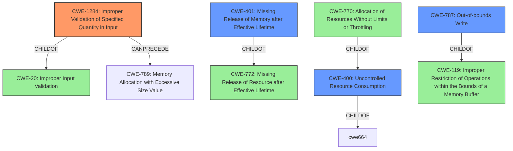

# Analysis for CVE-2021-1309

# Summary
| CWE ID  | CWE Name                                                                   | Confidence | CWE Abstraction Level | CWE Vulnerability Mapping Label | CWE-Vulnerability Mapping Notes |
| :-------- | :------------------------------------------------------------------------- | :--------- | :---------------------- | :------------------------------ | :---------------------------- |
| CWE-1284  | Improper Validation of Specified Quantity in Input                         | 0.8        | Base                    | Primary                       | Allowed                       |
| CWE-401   | Missing Release of Memory after Effective Lifetime                          | 0.7        | Variant                 | Secondary                       | Allowed                       |
| CWE-787 | Out-of-bounds Write                                                               | 0.6       | Base                    | Secondary                       | Allowed  |
| CWE-400   | Uncontrolled Resource Consumption                                         | 0.5        | Class                   | Secondary                       | Discouraged                   |

## Evidence and Confidence

*   **Confidence Score:** 0.7
*   **Evidence Strength:** MEDIUM

## Relationship Analysis
The primary CWE is CWE-1284, which is a child of CWE-20 (Improper Input Validation). CWE-1284 can precede CWE-789 (Memory Allocation with Excessive Size Value). CWE-401 is a variant and a child of CWE-772 (Missing Release of Resource after Effective Lifetime). CWE-400 is a class level CWE, but can be caused by weaknesses like CWE-770 (Allocation of Resources Without Limits or Throttling).

## Vulnerability Chain
The vulnerability chain starts with **missing length validation of certain LLDP packet header fields** (CWE-1284). This **weakness** can lead to an attacker sending a malicious LLDP packet with an excessive size value (CWE-789), potentially leading to a memory leak (CWE-401) and device reload, causing a DoS condition (CWE-400), and possibly arbitrary code execution (CWE-787).

## Summary of Analysis
The analysis is based on the vulnerability description provided, the key phrases, and the CVE Reference Links Content Summary. The description clearly states that the vulnerability is due to **missing length validation of certain LLDP packet header fields**. This directly aligns with CWE-1284 (Improper Validation of Specified Quantity in Input), indicating that the input validation for the length of the LLDP packet header fields is either missing or insufficient. The **impact** of this vulnerability includes the possibility of executing arbitrary code, leaking system memory, and causing device reloads, all of which lead to a denial-of-service (DoS) condition.

The retriever results also point to several potentially relevant CWEs, including CWE-401 (Missing Release of Memory after Effective Lifetime), CWE-119 (Improper Restriction of Operations within the Bounds of a Memory Buffer), CWE-20 (Improper Input Validation), CWE-1284 (Improper Validation of Specified Quantity in Input), and CWE-400 (Uncontrolled Resource Consumption).

The initial assessment favored CWE-120 based on the "CWE for similar CVE Descriptions" section, which listed CWE-120 as the primary match. However, after a thorough review of the vulnerability details, the root cause is clearly related to **missing length validation**, making CWE-1284 the most appropriate primary CWE.

The final decision is based on the following considerations:

*   **Root Cause Identification:** The vulnerability description explicitly states that the root cause is **missing length validation of certain LLDP packet header fields**.
*   **CWE-1284 Alignment:** CWE-1284 (Improper Validation of Specified Quantity in Input) directly addresses the issue of missing or incorrect validation of input quantities, such as size or length.
*   **Impact Analysis:** The impacts described (arbitrary code execution, memory leak, device reload, DoS) are consistent with the potential consequences of improper input validation.

The selected CWEs are at the optimal level of specificity because they directly address the root cause (CWE-1284) and the immediate consequences like memory leak (CWE-401), potential out-of-bounds write (CWE-787) and resource consumption (CWE-400). While a more general CWE like CWE-20 could be considered, CWE-1284 provides a more precise characterization of the vulnerability.

Relevant CWE Information:

# Enhanced Context (25 CWEs)
The following CWEs were identified as potentially relevant to this vulnerability:

## CWE-807: Reliance on Untrusted Inputs in a Security Decision
**Abstraction Level**: Base
**Similarity Score**: 0.77
**Source**: dense

**Description**:
The product uses a protection mechanism that relies on the existence or values of an input, but the input can be modified by an untrusted actor in a way that bypasses the protection mechanism.

**Mapping Guidance**:
- Usage: Allowed
- Rationale: This CWE entry is at the Base level of abstraction, which is a preferred level of abstraction for mapping to the root causes of vulnerabilities.

**Why Not Used:**
This CWE is not applicable because the vulnerability is not related to reliance on untrusted inputs for a security decision, but rather the **lack of validation** of input lengths.

## CWE-1391: Use of Weak Credentials
**Abstraction Level**: Class
**Similarity Score**: 0.77
**Source**: dense

**Description**:
The product uses weak credentials (such as a default key or hard-coded password) that can be calculated, derived, reused, or guessed by an attacker.

**Mapping Guidance**:
- Usage: Allowed-with-Review
- Rationale: This CWE entry is a Class and might have Base-level children that would be more appropriate

**Why Not Used:**
This CWE is not applicable because the vulnerability is not related to the use of **weak credentials**.

## CWE-799: Improper Control of Interaction Frequency
**Abstraction Level**: Class
**Similarity Score**: 0.77
**Source**: dense

**Description**:
The product does not properly limit the number or frequency of interactions that it has with an actor, such as the number of incoming requests.

**Mapping Guidance**:
- Usage: Allowed-with-Review
- Rationale: This CWE entry is a Class and might have Base-level children that would be more appropriate

**Why Not Used:**
While a DoS is an impact, the root cause isn't specifically related to interaction frequency but instead **improper validation of quantity in the input**.

## CWE-1289: Improper Validation of Unsafe Equivalence in Input
**Abstraction Level**: Base
**Similarity Score**: 0.77
**Source**: dense

**Description**:
The product receives an input value that is used as a resource identifier or other type of reference, but it does not validate or incorrectly validates that the input is equivalent to a potentially-unsafe value.

**Mapping Guidance**:
- Usage: Allowed
- Rationale: This CWE entry is at the Base level of abstraction, which is a preferred level of abstraction for mapping to the root causes of vulnerabilities.

**Why Not Used:**
This CWE is not applicable because the vulnerability is not related to the improper validation of unsafe equivalence in input. The main issue is **missing length validation**.

## CWE-226: Sensitive Information in Resource Not Removed Before Reuse
**Abstraction Level**: Base
**Similarity Score**: 0.77
**Source**: dense

**