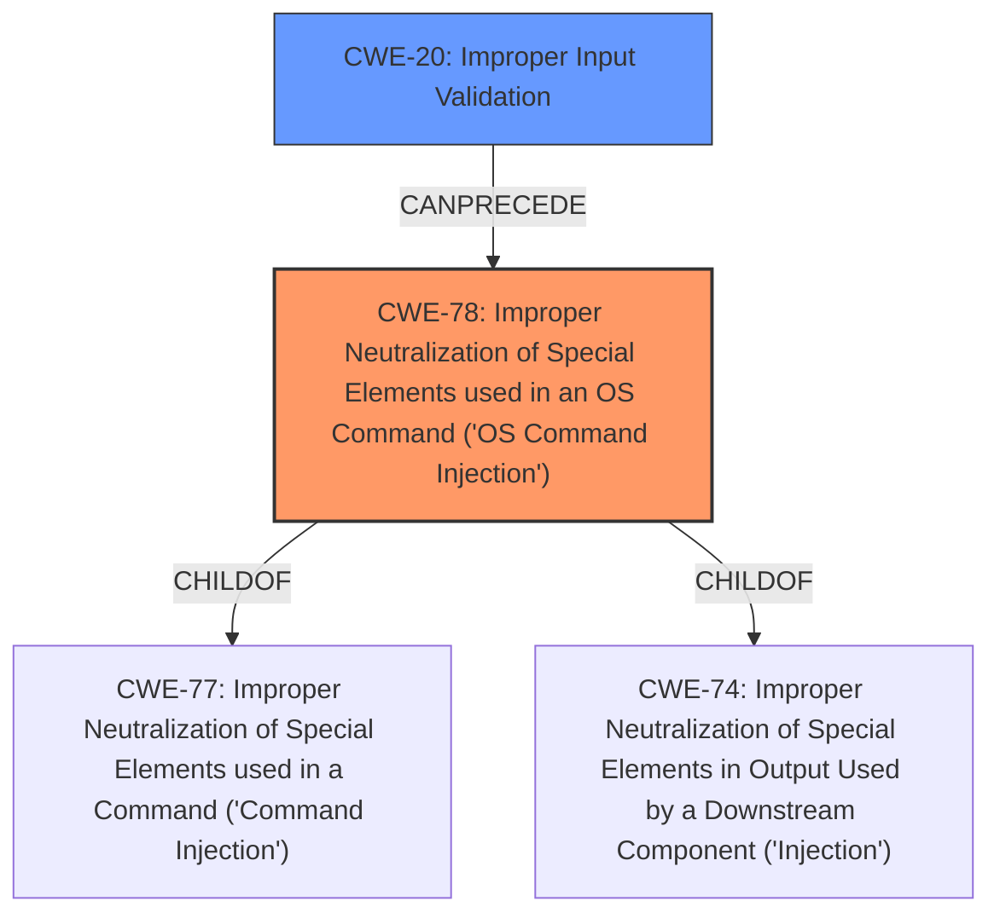

# Analysis for CVE-2021-1314

# Summary
| CWE ID    | CWE Name                                                                    | Confidence | CWE Abstraction Level | CWE Vulnerability Mapping Label | CWE-Vulnerability Mapping Notes |
| --------- | --------------------------------------------------------------------------- | ---------- | --------------------- | ------------------------------- | ------------------------------- |
| CWE-78    | Improper Neutralization of Special Elements used in an OS Command ('OS Command Injection') | 1.0        | Base                  | Primary CWE                   | Allowed                       |
| CWE-20    | Improper Input Validation                                                     | 0.7        | Class                  | Secondary Candidate             | Discouraged                    |

## Evidence and Confidence

*   **Confidence Score:** 0.9
*   **Evidence Strength:** HIGH

## Relationship Analysis
The primary relationship impacting the decision is the parent-child relationship where CWE-78 (OS Command Injection) is a child of CWE-77 (Command Injection) and CWE-74 (Improper Neutralization). Additionally, CWE-78 can follow CWE-20 (Improper Input Validation), creating a chain where **improper input validation** leads to OS command injection. Since the vulnerability involves injecting OS commands, CWE-78 is more specific than its parents. CWE-20 is considered due to the **improper validation of user-supplied input** being the root cause.

## Vulnerability Chain
The vulnerability chain begins with **improper validation of user-supplied input** (CWE-20), leading to the ability to inject and execute arbitrary OS commands (CWE-78) with root privileges.
  - Root Cause: CWE-20 (**improper validation of user-supplied input**)
  - Weakness: CWE-78 (Improper Neutralization of Special Elements used in an OS Command)
  - Impact: Arbitrary code execution as root

## Summary of Analysis
Initially, CWE-787 (Out-of-bounds Write) was considered due to its high ranking in similar CVE descriptions. However, the vulnerability description and the CVE reference summary clearly indicate that the root cause is **improper validation of user-supplied input**, which allows an attacker to inject and execute arbitrary OS commands. Therefore, CWE-78 (Improper Neutralization of Special Elements used in an OS Command) is the most appropriate primary CWE.

The selection of CWE-78 is strongly supported by the following evidence:

*   Vulnerability Description: "These vulnerabilities are due to **improper validation of user-supplied input** in the web-based management interface. An attacker could exploit these vulnerabilities by sending crafted HTTP requests to a targeted device. A successful exploit could allow the attacker to execute arbitrary code as the root user on the underlying operating system."
*   CVE Reference Links Content Summary: "Root Cause: **Improper validation of user-supplied input** within the web-based management interface of the affected Cisco Small Business RV Series Routers. Weaknesses/Vulnerabilities: Command injection vulnerability. Impact of Exploitation: An attacker can execute arbitrary code with root privileges on the underlying operating system of the affected device. Attack Vectors: An attacker sends crafted HTTP requests to a targeted device's web-based management interface."

The relationship graph clearly shows that CWE-78 is the result of **improper input validation** and leads to command execution. This chain is a key factor in selecting CWE-78 as the primary weakness.

CWE-20 is considered as a secondary weakness because the **improper validation of user-supplied input** is a direct cause that enables the command injection. However, CWE-20 is a broad class, and the actual vulnerability is more specific, involving the injection of OS commands. Given the MITRE mapping guidance discouraging the use of CWE-20, it is only included as a secondary candidate.

The selected CWEs are at the optimal level of specificity because they accurately represent the root cause and the type of vulnerability. CWE-78 is a Base level CWE, which is preferred. The evidence is strong and directly supports the classification.