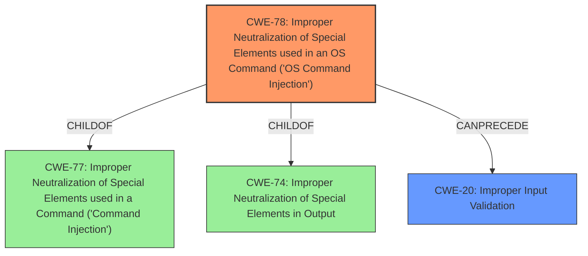

# Enhanced Analysis for CVE-2021-1315

# Summary
| CWE ID   | CWE Name                                                                                    | Confidence | CWE Abstraction Level | CWE Vulnerability Mapping Label | CWE-Vulnerability Mapping Notes |
| :--------- | :------------------------------------------------------------------------------------------ | :--------- | :---------------------- | :------------------------------ | :------------------------------ |
| CWE-78     | Improper Neutralization of Special Elements used in an OS Command ('OS Command Injection') | 1          | Base                    | Primary CWE                     | Allowed                       |
| CWE-20     | Improper Input Validation                                                                 | 0.7        | Class                   | Secondary Candidate             | Discouraged                    |

## Evidence and Confidence

*   **Confidence Score:** 0.85
*   **Evidence Strength:** HIGH

## Relationship Analysis
The primary CWE is CWE-78, which is a base-level CWE describing **improper neutralization of special elements used in OS Command Injection**. It is a child of CWE-77 (Improper Neutralization of Special Elements used in a Command) and CWE-74 (Improper Neutralization of Special Elements in Output). The vulnerability involves injecting OS commands due to **improper validation of user-supplied input**, which aligns with CWE-78's description. CWE-20 (Improper Input Validation) is a class-level CWE and is considered a secondary candidate as it is a broader category.



## Vulnerability Chain
The vulnerability chain starts with **improper validation of user-supplied input** (CWE-20), which allows an attacker to inject arbitrary commands. These injected commands are then executed with root privileges due to the **improper neutralization of special elements used in an OS command** (CWE-78), leading to remote code execution.
- CWE-20: Improper Input Validation (Root Cause)
- CWE-78: Improper Neutralization of Special Elements used in an OS Command ('OS Command Injection')
- Impact: Remote Code Execution as Root

## Summary of Analysis
The initial analysis identified the **improper validation of user-supplied input** as a key factor. The **CVE Reference Links Content Summary** confirms that the root cause of the vulnerability is indeed the **improper validation of user-supplied input**, which allows for command injection.

CWE-78 (Improper Neutralization of Special Elements used in an OS Command) is selected as the primary CWE because the vulnerability allows an attacker to inject arbitrary OS commands due to **improper neutralization of special elements** in the input. The vulnerability description explicitly states that the attacker can "inject arbitrary commands that are executed with root privileges," which directly aligns with the characteristics of CWE-78.

CWE-20 (Improper Input Validation) is considered a secondary CWE because it represents the broader issue of input validation. While the **improper validation of user-supplied input** is the root cause, CWE-78 more specifically describes the resulting OS command injection.

The evidence supports the selection of CWE-78 as the primary CWE at the base level of abstraction, as it accurately reflects the technical details of the vulnerability. CWE-20 is a related weakness that can be present in such a vulnerability.

Relevant CWE Information:
# Enhanced Context (25 CWEs)
The following CWEs were identified as potentially relevant to this vulnerability:

## CWE-78: Improper Neutralization of Special Elements used in an OS Command ('OS Command Injection')
**Abstraction**: Base
**Similarity Score**: 5.03
**Source**: graph

**Description**:
CWE-78: Improper Neutralization of Special Elements used in an OS Command ('OS Command Injection')

**Mapping Guidance**:
- Usage: Allowed
- Rationale: This CWE entry is at the Base level of abstraction, which is a preferred level of abstraction for mapping to the root causes of vulnerabilities.

**Relationships**:
- CANFOLLOW -> CWE-184
- CANALSOBE -> CWE-88
- CHILDOF -> CWE-77
- CHILDOF -> CWE-77
- CHILDOF -> CWE-74

## CWE-20: Improper Input Validation
**Abstraction:** Class
**Status:** Stable

### Description
The product receives input or data, but it does
        not validate or incorrectly validates that the input has the
        properties that are required to process the data safely and
        correctly.

### Mapping Guidance
**Usage:** Discouraged
**Rationale:** CWE-20 is commonly misused in low-information vulnerability reports when lower-level CWEs could be used instead, or when more details about the vulnerability are available [REF-1287]. It is not useful for trend analysis. It is also a level-1 Class (i.e., a child of a Pillar).
**Comments:** Consider lower-level children such as Improper Use of Validation Framework (CWE-1173) or improper validation involving specific types or properties of input such as Specified Quantity (CWE-1284); Specified Index, Position, or Offset (CWE-1285); Syntactic Correctness (CWE-1286); Specified Type (CWE-1287); Consistency within Input (CWE-1288); or Unsafe Equivalence (CWE-1289).


## CWE Relationship Analysis

Current CWEs represent these abstraction levels: .


### Vulnerability Chain Analysis

**Chain starting from CWE-1286:**
- 1286 (Improper Validation of Syntactic Correctness of Input) - ROOT


**Chain starting from CWE-1287:**
- 1287 (Improper Validation of Specified Type of Input) - ROOT


### CWE Relationship Diagram

```mermaid
graph TD
    classDef primary fill:#f96,stroke:#333,stroke-width:2px
    classDef secondary fill:#69f,stroke:#333
    classDef tertiary fill:#9e9,stroke:#333
```