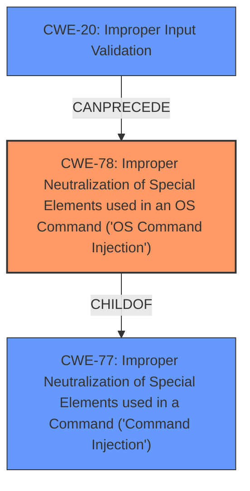

# Analysis for CVE-2021-1318

# Summary
| CWE ID | CWE Name | Confidence | CWE Abstraction Level | CWE Vulnerability Mapping Label | CWE-Vulnerability Mapping Notes |
|---|---|---|---|---|---|
| CWE-78 | Improper Neutralization of Special Elements used in an OS Command ('OS Command Injection') | 1.0 | Base | Allowed | Primary CWE |
| CWE-20 | Improper Input Validation | 0.7 | Class | Discouraged | Secondary Candidate |

## Evidence and Confidence

*   **Confidence Score:** 0.9
*   **Evidence Strength:** HIGH

## Relationship Analysis
The primary relationship influencing the CWE selection is the hierarchical relationship between CWE-77 (Improper Neutralization of Special Elements used in a Command ('Command Injection')) and its child CWE-78 (Improper Neutralization of Special Elements used in an OS Command ('OS Command Injection')). Since the vulnerability specifically involves OS commands, CWE-78 is the more specific and appropriate choice.

CWE-20 (Improper Input Validation) can precede CWE-78, indicating that **improper input validation** is often a root cause of command injection vulnerabilities.

## Vulnerability Chain
The vulnerability chain starts with the **improper validation of user-supplied input** (potentially CWE-20). This leads to the ability to inject arbitrary OS commands (CWE-78), which are then executed with root privileges, resulting in complete system compromise.

## Summary of Analysis
The initial analysis, based on the provided evidence, strongly points to CWE-78 as the primary weakness. The vulnerability description explicitly states that the **improper validation of user-supplied input** in the web-based management interface allows an attacker to inject arbitrary commands that are executed with root privileges. The "CVE Reference Links Content Summary" confirms this, stating: "The vulnerabilities are due to **improper validation of user-supplied input** in the web-based management interface," and "Successful exploitation could allow the attacker to execute arbitrary code as the root user on the underlying operating system, leading to complete system compromise."

The relationship graph highlights that CWE-78 is a child of CWE-77, making it a more specific choice when the command injection involves OS commands. The "Vulnerability Description Key Phrases" also support this, emphasizing the impact of "execute arbitrary commands with root privileges."

CWE-78 is selected because the vulnerability specifically allows for the injection of OS commands, which aligns with the CWE's description. The evidence provided is compelling and directly supports this classification. The selection is at the optimal level of specificity (Base) as it accurately represents the weakness without being overly generic.

CWE-20 was considered as a secondary CWE because the root cause is **improper validation of user-supplied input**. However, since the primary impact is OS command injection, CWE-78 takes precedence.

Relevant CWE Information:

# Enhanced Context (25 CWEs)

## CWE-20: Improper Input Validation
**Abstraction:** Class
**Similarity Score**: 0.767
**Source**: sparse

**Description**:
The product receives input or data, but it does
        not validate or incorrectly validates that the input has the
        properties that are required to process the data safely and
        correctly.

**Mapping Guidance**:
- Usage: Discouraged
- Rationale: CWE-20 is commonly misused in low-information vulnerability reports when lower-level CWEs could be used instead, or when more details about the vulnerability are available [REF-1287]. It is not useful for trend analysis. It is also a level-1 Class (i.e., a child of a Pillar).
**Comments:** Consider lower-level children such as Improper Use of Validation Framework (CWE-1173) or improper validation involving specific types or properties of input such as Specified Quantity (CWE-1284); Specified Index, Position, or Offset (CWE-1285); Syntactic Correctness (CWE-1286); Specified Type (CWE-1287); Consistency within Input (CWE-1288); or Unsafe Equivalence (CWE-1289).
**Reasons:**
- Frequent Misuse
**Suggested Alternatives:**
- CWE-1284: Specified Quantity
- CWE-1285: Specified Index, Position, or Offset
- CWE-1286: Syntactic Correctness
- CWE-1287: Specified Type
- CWE-1288: Consistency within Input
- CWE-1289: Unsafe Equivalence
- CWE-116: Improper Encoding or Escaping of Output

CWE-20 was considered but not selected as the primary CWE because it's a general class and the vulnerability has a more specific weakness: OS Command Injection. The mapping guidance discourages using CWE-20 when more specific CWEs are available.

## CWE-78: Improper Neutralization of Special Elements used in an OS Command ('OS Command Injection')
**Abstraction:** Base
**Similarity Score**: 0.671
**Source**: sparse

**Description**:
The product constructs all or part of an OS command using externally-influenced input from an upstream component, but it does not neutralize or incorrectly neutralizes special elements that could modify the intended OS command when it is sent to a downstream component.

**Mapping Guidance**:
- Usage: Allowed
- Rationale: This CWE entry is at the Base level of abstraction, which is a preferred level of abstraction for mapping to the root causes of vulnerabilities.
**Comments:** Carefully read both the name and description to ensure that this mapping is an appropriate fit. Do not try to 'force' a mapping to a lower-level Base/Variant simply to comply with this preferred level of abstraction.
**Reasons:**
- Acceptable-Use

This CWE was selected as the primary CWE because it directly addresses the vulnerability where **improper neutralization** allows the injection of OS commands.