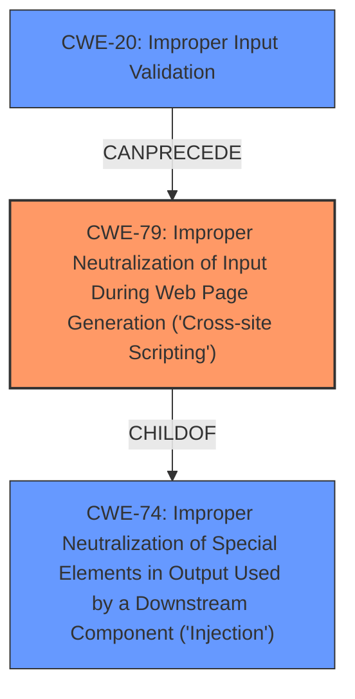

# Analysis for CVE-2021-1351

# Summary

| CWE ID | CWE Name | Confidence | CWE Abstraction Level | CWE Vulnerability Mapping Label | CWE-Vulnerability Mapping Notes |
|---|---|---|---|---|---|
| CWE-79 | Improper Neutralization of Input During Web Page Generation ('Cross-site Scripting') | 1.0 | Base | Allowed | Primary CWE |
| CWE-20 | Improper Input Validation | 0.7 | Class | Discouraged | Secondary Candidate |

## Evidence and Confidence

*   **Confidence Score:** 0.9
*   **Evidence Strength:** HIGH

## Relationship Analysis
The primary CWE is CWE-79, which is the **weakness** itself: **cross-site scripting**. CWE-79 is a Base level CWE. CWE-79 is a child of CWE-74. CWE-20 is a Class level CWE that can precede CWE-79. CWE-20 is a general case of **insufficient input validation** and is the root cause of the **cross-site scripting weakness**.

## Vulnerability Chain
The vulnerability chain starts with **insufficient input validation** (CWE-20) which leads to **cross-site scripting** (CWE-79).

## Summary of Analysis
The vulnerability description clearly states the presence of a **cross-site scripting** (XSS) vulnerability in Cisco Webex Meetings due to **insufficient input validation**.

The evidence for CWE-79 is strong:
*   Vulnerability Description Key Phrases: "**weakness:** **cross-site scripting**" and "**impact:** execute arbitrary script code and access sensitive browser information"
*   CVE Reference Links Content Summary: "**Weaknesses/vulnerabilities present:** - Cross-Site Scripting (XSS) vulnerability"

The evidence for CWE-20 is also strong:
*   Vulnerability Description Key Phrases: "**rootcause:** **insufficient input validation**"
*   CVE Reference Links Content Summary: "Root cause of vulnerability: - **Insufficient validation** of user-supplied input by the web-based interface of Cisco Webex Meetings."

CWE-79 is the most appropriate primary CWE because the description explicitly mentions **cross-site scripting**.
CWE-20 could be considered a secondary CWE because the description indicates **insufficient input validation** as a root cause. However, CWE-20 is a Class level CWE and is discouraged.

The selected CWEs are at the optimal level of specificity, with CWE-79 being a Base level CWE and CWE-20 being a Class level CWE.

Relevant CWE Information:

# Enhanced Context (25 CWEs)

## CWE-80: Improper Neutralization of Script-Related HTML Tags in a Web Page (Basic XSS)
This CWE was considered because of the high score and because it is a child of CWE-79. However, there is no evidence to suggest the type of **cross-site scripting** so this CWE is not selected.

## CWE-20: Improper Input Validation
This CWE was considered due to the **insufficient input validation** root cause and because it can precede CWE-79. While relevant, it is a high-level Class and the vulnerability is primarily due to the resultant **cross-site scripting**, so it is a secondary consideration at best.

## CWE-138: Improper Neutralization of Special Elements
This CWE was considered because it related to neutralization and is a parent of CWE-79. However, it is a Class level CWE and there is no direct evidence to support this.

## CWE-113: Improper Neutralization of CRLF Sequences in HTTP Headers ('HTTP Request/Response Splitting')
This CWE was considered due to the high retriever score but is not relevant because the vulnerability is a **cross-site scripting** vulnerability and not an HTTP Request/Response Splitting vulnerability.

## CWE-1385: Missing Origin Validation in WebSockets
This CWE was considered due to the high retriever score but is not relevant because the vulnerability is a **cross-site scripting** vulnerability and not a WebSocket vulnerability.