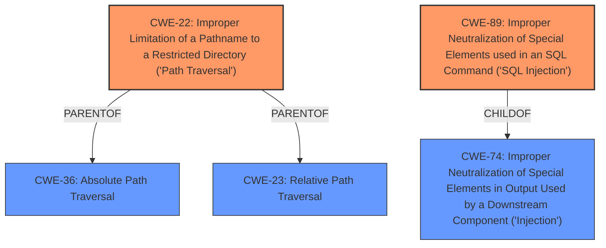

# Enhanced Analysis for CVE-2021-1355

# Summary
| CWE ID | CWE Name | Confidence | CWE Abstraction Level | CWE Vulnerability Mapping Label | CWE-Vulnerability Mapping Notes |
|---|---|---|---|---|---|
| CWE-22 | Improper Limitation of a Pathname to a Restricted Directory ('Path Traversal') | 1.0 | Base | Primary | Allowed |
| CWE-89 | Improper Neutralization of Special Elements used in an SQL Command ('SQL Injection') | 1.0 | Base | Primary | Allowed |

## Evidence and Confidence

*   **Confidence Score:** 1.0
*   **Evidence Strength:** HIGH

## Relationship Analysis
The primary CWEs selected are CWE-22 and CWE-89, both of which are base-level CWEs. CWE-22 has parent-child relationships with CWE-36 and CWE-23, offering potential alternative classifications, but CWE-22 is the most specific. CWE-89 is a child of CWE-74, but CWE-89 more accurately describes the SQL Injection vulnerability. The chain relationship CANFOLLOW connects CWE-22 to CWE-73 and CWE-89 to CWE-456, suggesting potential follow-on vulnerabilities but these are not evident in the description.



## Vulnerability Chain
The vulnerability chain involves:
1.  **Root Cause:** **Improper input validation** (not explicitly mapped, but implied by the **path traversal** and **SQL injection**).
2.  **Weakness 1:** **Path traversal** due to **improper limitation of pathname** leading to access of restricted directories (CWE-22).
3.  **Weakness 2:** **SQL injection** due to **improper neutralization of special elements** in SQL commands (CWE-89).
4.  **Impact:** Potential for unauthorized access and data manipulation on the affected systems.

## Summary of Analysis
The initial analysis identified two distinct vulnerabilities: **path traversal attacks** and **SQL injection attacks**. The evidence from the "**Vulnerability Description**" section clearly indicates these two weaknesses, stating that the vulnerabilities "could allow an attacker to conduct **path traversal attacks** and **SQL injection attacks** on an affected system."

The retriever results strongly suggest CWE-22 for the **path traversal** vulnerability and CWE-89 for the **SQL injection** vulnerability. Both CWEs are at the Base level of abstraction, which aligns with the recommendation to choose the lowest level of abstraction that accurately represents the weakness.

CWE-22 (Improper Limitation of a Pathname to a Restricted Directory ('Path Traversal')) is directly applicable because the vulnerability description specifically mentions **path traversal attacks**, indicating that an attacker can manipulate pathnames to access restricted directories.

CWE-89 (Improper Neutralization of Special Elements used in an SQL Command ('SQL Injection')) is applicable because the description explicitly mentions **SQL injection attacks**, meaning an attacker can inject malicious SQL code due to **improper neutralization**.

The graph relationships confirm that these are distinct weaknesses, and the chosen CWEs are at the appropriate level of specificity. CWE-20 (Improper Input Validation) was considered as a potential high-level cause, but the evidence supports the more specific CWE-22 and CWE-89.

The final selection of CWE-22 and CWE-89 is based on the direct evidence of the **path traversal** and **SQL injection** vulnerabilities, the retriever results, and the CWE specifications. These choices are at the optimal level of specificity and accurately represent the weaknesses.

Relevant CWE Information:
- **CWE-22**: Improper Limitation of a Pathname to a Restricted Directory ('Path Traversal') - The product uses external input to construct a pathname, but it does not properly neutralize special elements, allowing the pathname to resolve outside the restricted directory.
- **CWE-89**: Improper Neutralization of Special Elements used in an SQL Command ('SQL Injection') - The product constructs an SQL command using external input, but it does not neutralize special elements, allowing modification of the intended SQL command.


## CWE Relationship Analysis

Current CWEs represent these abstraction levels: .


### Vulnerability Chain Analysis

**Chain starting from CWE-36:**
- 36 (Absolute Path Traversal) - ROOT


**Chain starting from CWE-73:**
- 73 (External Control of File Name or Path) - ROOT


### CWE Relationship Diagram

```mermaid
graph TD
    classDef primary fill:#f96,stroke:#333,stroke-width:2px
    classDef secondary fill:#69f,stroke:#333
    classDef tertiary fill:#9e9,stroke:#333
```