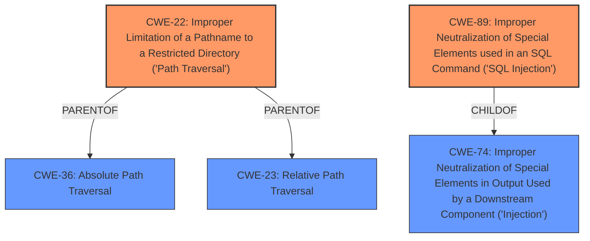

# Analysis for CVE-2021-1355

# Summary
| CWE ID | CWE Name | Confidence | CWE Abstraction Level | CWE Vulnerability Mapping Label | CWE-Vulnerability Mapping Notes |
|---|---|---|---|---|---|
| CWE-22 | Improper Limitation of a Pathname to a Restricted Directory ('Path Traversal') | 1.0 | Base | Primary | Allowed |
| CWE-89 | Improper Neutralization of Special Elements used in an SQL Command ('SQL Injection') | 1.0 | Base | Primary | Allowed |

## Evidence and Confidence

*   **Confidence Score:** 1.0
*   **Evidence Strength:** HIGH

## Relationship Analysis
The primary CWEs selected are CWE-22 and CWE-89, both of which are base-level CWEs. CWE-22 has parent-child relationships with CWE-36 and CWE-23, offering potential alternative classifications, but CWE-22 is the most specific. CWE-89 is a child of CWE-74, but CWE-89 more accurately describes the SQL Injection vulnerability. The chain relationship CANFOLLOW connects CWE-22 to CWE-73 and CWE-89 to CWE-456, suggesting potential follow-on vulnerabilities but these are not evident in the description.

## Vulnerability Chain
The vulnerability chain involves:
1.  **Root Cause:** **Improper input validation** (not explicitly mapped, but implied by the **path traversal** and **SQL injection**).
2.  **Weakness 1:** **Path traversal** due to **improper limitation of pathname** leading to access of restricted directories (CWE-22).
3.  **Weakness 2:** **SQL injection** due to **improper neutralization of special elements** in SQL commands (CWE-89).
4.  **Impact:** Potential for unauthorized access and data manipulation on the affected systems.

## Summary of Analysis
The initial analysis identified two distinct vulnerabilities: **path traversal attacks** and **SQL injection attacks**. The evidence from the "**Vulnerability Description**" section clearly indicates these two weaknesses, stating that the vulnerabilities "could allow an attacker to conduct **path traversal attacks** and **SQL injection attacks** on an affected system."

The retriever results strongly suggest CWE-22 for the **path traversal** vulnerability and CWE-89 for the **SQL injection** vulnerability. Both CWEs are at the Base level of abstraction, which aligns with the recommendation to choose the lowest level of abstraction that accurately represents the weakness.

CWE-22 (Improper Limitation of a Pathname to a Restricted Directory ('Path Traversal')) is directly applicable because the vulnerability description specifically mentions **path traversal attacks**, indicating that an attacker can manipulate pathnames to access restricted directories.

CWE-89 (Improper Neutralization of Special Elements used in an SQL Command ('SQL Injection')) is applicable because the description explicitly mentions **SQL injection attacks**, meaning an attacker can inject malicious SQL code due to **improper neutralization**.

The graph relationships confirm that these are distinct weaknesses, and the chosen CWEs are at the appropriate level of specificity. CWE-20 (Improper Input Validation) was considered as a potential high-level cause, but the evidence supports the more specific CWE-22 and CWE-89.

The final selection of CWE-22 and CWE-89 is based on the direct evidence of the **path traversal** and **SQL injection** vulnerabilities, the retriever results, and the CWE specifications. These choices are at the optimal level of specificity and accurately represent the weaknesses.

Relevant CWE Information:
- **CWE-22**: Improper Limitation of a Pathname to a Restricted Directory ('Path Traversal') - The product uses external input to construct a pathname, but it does not properly neutralize special elements, allowing the pathname to resolve outside the restricted directory.
- **CWE-89**: Improper Neutralization of Special Elements used in an SQL Command ('SQL Injection') - The product constructs an SQL command using external input, but it does not neutralize special elements, allowing modification of the intended SQL command.

# Enhanced Query for CVE-2021-1355

# Vulnerability Description

    Multiple vulnerabilities in Cisco Unified Communications Manager IM &amp Presence Service (Unified CM IM&ampP) could allow an attacker to conduct **path traversal attacks** and **SQL injection attacks** on an affected system. One of the SQL injection vulnerabilities that affects Unified CM IM&ampP also affects Cisco Unified Communications Manager (Unified CM) and Cisco Unified Communications Manager Session Management Edition (Unified CM SME) and could allow an attacker to conduct **SQL injection attacks** on an affected system. For more information about these vulnerabilities, see the Details section of this advisory.

    # Keyphrase-Specific CWE Analysis
    This vulnerability contains multiple keyphrases that may map to different CWEs. 
    Please analyze each keyphrase separately and determine the most appropriate CWE(s) for each.

    ## WEAKNESS: 'path traversal attacks'

Relevant CWEs for this WEAKNESS:

### 1. CWE-538: Insertion of Sensitive Information into Externally-Accessible File or Directory (Score: 621.83)

The product places sensitive information into files or directories that are accessible to actors who are allowed to have access to the files, but not to the sensitive information....

### 2. CWE-248: Uncaught Exception (Score: 565.05)

An exception is thrown from a function, but it is not caught....

### 3. CWE-20: Improper Input Validation (Score: 550.69)

The product receives input or data, but it does
        not validate or incorrectly validates that the input has the
        properties that are required to process the data safely and
        correctly....

### 4. CWE-532: Insertion of Sensitive Information into Log File (Score: 493.81)

The product writes sensitive information to a log file....

### 5. CWE-23: Relative Path Traversal (Score: 487.35)

The product uses external input to construct a pathname that should be within a restricted directory, but it does not properly neutralize sequences such as ".." that can resolve to a location that is outside of that directory....

## WEAKNESS: 'SQL injection attacks'

Relevant CWEs for this WEAKNESS:

### 1. CWE-538: Insertion of Sensitive Information into Externally-Accessible File or Directory (Score: 621.83)

The product places sensitive information into files or directories that are accessible to actors who are allowed to have access to the files, but not to the sensitive information....

### 2. CWE-248: Uncaught Exception (Score: 565.05)

An exception is thrown from a function, but it is not caught....

### 3. CWE-20: Improper Input Validation (Score: 550.69)

The product receives input or data, but it does
        not validate or incorrectly validates that the input has the
        properties that are required to process the data safely and
        correctly....

### 4. CWE-532: Insertion of Sensitive Information into Log File (Score: 493.81)

The product writes sensitive information to a log file....

### 5. CWE-89: Improper Neutralization of Special Elements used in an SQL Command ('SQL Injection') (Score: 464.85)

The product constructs all or part of an SQL command using externally-influenced input from an upstream component, but it does not neutralize or incorrectly neutralizes special elements that could modify the intended SQL command when it is sent to a downstream component. Without sufficient removal o...

## IMPACT: 'conduct SQL injection attacks'

Relevant CWEs for this IMPACT:

### 1. CWE-538: Insertion of Sensitive Information into Externally-Accessible File or Directory (Score: 621.83)

The product places sensitive information into files or directories that are accessible to actors who are allowed to have access to the files, but not to the sensitive information....

### 2. CWE-248: Uncaught Exception (Score: 565.05)

An exception is thrown from a function, but it is not caught....

### 3. CWE-20: Improper Input Validation (Score: 550.69)

The product receives input or data, but it does
        not validate or incorrectly validates that the input has the
        properties that are required to process the data safely and
        correctly....

### 4. CWE-532: Insertion of Sensitive Information into Log File (Score: 493.81)

The product writes sensitive information to a log file....

### 5. CWE-89: Improper Neutralization of Special Elements used in an SQL Command ('SQL Injection') (Score: 464.85)

The product constructs all or part of an SQL command using externally-influenced input from an upstream component, but it does not neutralize or incorrectly neutralizes special elements that could modify the intended SQL command when it is sent to a downstream component. Without sufficient removal o...

## ATTACKER: 'attacker'

Relevant CWEs for this ATTACKER:

### 1. CWE-538: Insertion of Sensitive Information into Externally-Accessible File or Directory (Score: 621.83)

The product places sensitive information into files or directories that are accessible to actors who are allowed to have access to the files, but not to the sensitive information....

### 2. CWE-248: Uncaught Exception (Score: 565.05)

An exception is thrown from a function, but it is not caught....

### 3. CWE-20: Improper Input Validation (Score: 550.69)

The product receives input or data, but it does
        not validate or incorrectly validates that the input has the
        properties that are required to process the data safely and
        correctly....

### 4. CWE-532: Insertion of Sensitive Information into Log File (Score: 493.81)

The product writes sensitive information to a log file....

### 5. CWE-94: Improper Control of Generation of Code ('Code Injection') (Score: 159.71)

The product constructs all or part of a code segment using externally-influenced input from an upstream component, but it does not neutralize or incorrectly neutralizes special elements that could modify the syntax or behavior of the intended code segment....

## PRODUCT: 'Cisco Unified Communications Manager IM & Presence Service'

Relevant CWEs for this PRODUCT:

### 1. CWE-538: Insertion of Sensitive Information into Externally-Accessible File or Directory (Score: 621.83)

The product places sensitive information into files or directories that are accessible to actors who are allowed to have access to the files, but not to the sensitive information....

### 2. CWE-248: Uncaught Exception (Score: 565.05)

An exception is thrown from a function, but it is not caught....

### 3. CWE-20: Improper Input Validation (Score: 550.69)

The product receives input or data, but it does
        not validate or incorrectly validates that the input has the
        properties that are required to process the data safely and
        correctly....

### 4. CWE-532: Insertion of Sensitive Information into Log File (Score: 493.81)

The product writes sensitive information to a log file....

### 5. CWE-94: Improper Control of Generation of Code ('Code Injection') (Score: 159.71)

The product constructs all or part of a code segment using externally-influenced input from an upstream component, but it does not neutralize or incorrectly neutralizes special elements that could modify the syntax or behavior of the intended code segment....

## PRODUCT: 'Cisco Unified Communications Manager'

Relevant CWEs for this PRODUCT:

### 1. CWE-538: Insertion of Sensitive Information into Externally-Accessible File or Directory (Score: 621.83)

The product places sensitive information into files or directories that are accessible to actors who are allowed to have access to the files, but not to the sensitive information....

### 2. CWE-248: Uncaught Exception (Score: 565.05)

An exception is thrown from a function, but it is not caught....

### 3. CWE-20: Improper Input Validation (Score: 550.69)

The product receives input or data, but it does
        not validate or incorrectly validates that the input has the
        properties that are required to process the data safely and
        correctly....

### 4. CWE-532: Insertion of Sensitive Information into Log File (Score: 493.81)

The product writes sensitive information to a log file....

### 5. CWE-94: Improper Control of Generation of Code ('Code Injection') (Score: 159.71)

The product constructs all or part of a code segment using externally-influenced input from an upstream component, but it does not neutralize or incorrectly neutralizes special elements that could modify the syntax or behavior of the intended code segment....

## PRODUCT: 'Cisco Unified Communications Manager Session Management Edition'

Relevant CWEs for this PRODUCT:

### 1. CWE-538: Insertion of Sensitive Information into Externally-Accessible File or Directory (Score: 621.83)

The product places sensitive information into files or directories that are accessible to actors who are allowed to have access to the files, but not to the sensitive information....

### 2. CWE-248: Uncaught Exception (Score: 565.05)

An exception is thrown from a function, but it is not caught....

### 3. CWE-20: Improper Input Validation (Score: 550.69)

The product receives input or data, but it does
        not validate or incorrectly validates that the input has the
        properties that are required to process the data safely and
        correctly....

### 4. CWE-532: Insertion of Sensitive Information into Log File (Score: 493.81)

The product writes sensitive information to a log file....

### 5. CWE-94: Improper Control of Generation of Code ('Code Injection') (Score: 159.71)

The product constructs all or part of a code segment using externally-influenced input from an upstream component, but it does not neutralize or incorrectly neutralizes special elements that could modify the syntax or behavior of the intended code segment....

    # Analysis Instructions
    1. For each keyphrase, identify the most appropriate CWE(s) that represent the weakness.
    2. Consider how the different keyphrases might relate to each other in the vulnerability chain.
    3. Provide a final determination of primary CWE(s) and any secondary CWEs.
    4. Format your response using the standard analysis template.

    Please analyze how these different weaknesses interact and provide a comprehensive CWE classification.
    