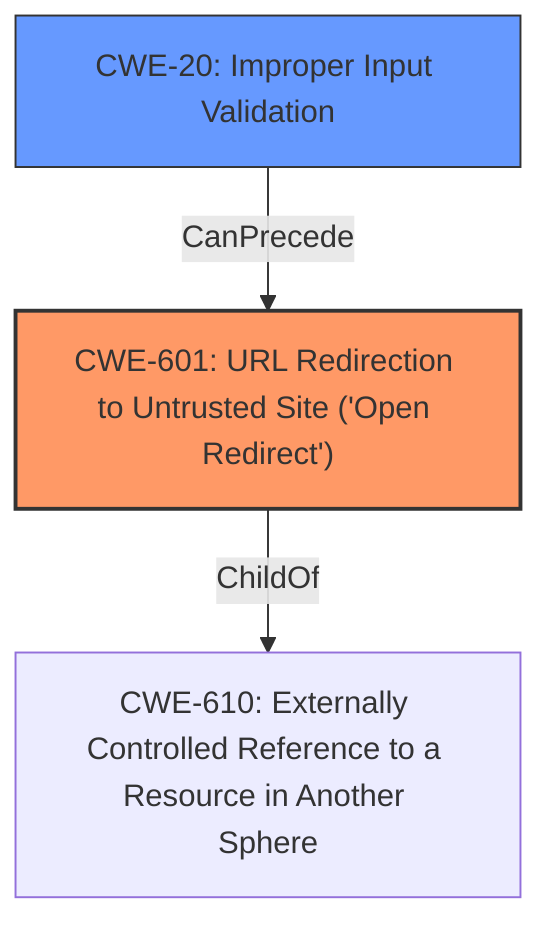

# Enhanced Analysis for CVE-2021-1358

# Summary
| CWE ID | CWE Name | Confidence | CWE Abstraction Level | CWE Vulnerability Mapping Label | CWE-Vulnerability Mapping Notes |
|---|---|---|---|---|---|
| CWE-601 | URL Redirection to Untrusted Site ('Open Redirect') | 1.0 | Base | Allowed | Primary CWE |
| CWE-20 | Improper Input Validation | 0.7 | Class | Discouraged | Secondary CWE |

## Evidence and Confidence

*   **Confidence Score:** 0.9
*   **Evidence Strength:** HIGH

## Relationship Analysis
The primary relationship that influenced the CWE selection was the parent-child relationship. CWE-601 is a specific type of vulnerability where a URL parameter is used to redirect a user to an untrusted site. This vulnerability stems from **improper input validation** (CWE-20), a broader class of weaknesses. While CWE-20 is a contributing factor, CWE-601 provides a more precise description of the vulnerability.



## Vulnerability Chain
The chain of events for this vulnerability is as follows:
1.  **Improper Input Validation** (CWE-20): The application **fails to properly validate** the URL parameter in the HTTP request.
2.  **Open Redirect** (CWE-601): Due to the lack of validation, an attacker can craft a malicious URL that redirects the user to an untrusted site.
3.  **Phishing Attack**: The user is redirected to a malicious site, potentially leading to credential theft or malware download.

In this case, CWE-20 is the root cause, and CWE-601 is the direct result of this **improper input validation**.

## Summary of Analysis
The initial analysis focused on identifying the root cause and the specific type of vulnerability. The vulnerability description and CVE reference links clearly point to **improper input validation** as the root cause. However, the impact and the nature of the vulnerability align perfectly with CWE-601, which describes "URL Redirection to Untrusted Site ('Open Redirect')."

The evidence from the vulnerability description states: "This vulnerability is due to **improper input validation** of the URL parameters in an HTTP request that is sent to an affected system. An attacker could exploit this vulnerability by persuading a user of the interface to click a crafted link. A successful exploit could allow the attacker to cause the interface to redirect the user to a specific, malicious URL."

The CVE Reference Links Content Summary confirms this: "The vulnerability is caused by **improper input validation** of URL parameters within HTTP requests sent to the Cisco Finesse web-based management interface...**Open Redirect:** The core vulnerability is an open redirect, specifically CWE-601. This allows an attacker to redirect a user to an arbitrary web page."

While CWE-20 (Improper Input Validation) is a contributing factor, it is a high-level class. CWE-601 is a more specific base-level CWE that accurately describes the vulnerability.

CWE-79 (Improper Neutralization of Input During Web Page Generation ('Cross-site Scripting')) was considered but not selected because the vulnerability is not directly related to the generation of a web page with unneutralized input. Instead, it's about redirecting the user to a different site altogether.

CWE-113 (Improper Neutralization of CRLF Sequences in HTTP Headers ('HTTP Request/Response Splitting')) was also considered, but it focuses on the injection of CRLF sequences into HTTP headers, which is not the primary issue in this case.

CWE-601 is at the optimal level of specificity because it directly addresses the open redirect vulnerability. The mapping guidance for CWE-601 indicates that it is at the Base level of abstraction, which is a preferred level for mapping.

Relevant CWE Information:
# Enhanced Context (25 CWEs)
The following CWEs were identified as potentially relevant to this vulnerability:

## CWE-74: Improper Neutralization of Special Elements in Output Used by a Downstream Component ('Injection')
**Abstraction Level**: Class
**Similarity Score**: 0.77
**Source**: dense

**Description**:
The product constructs all or part of a command, data structure, or record using externally-influenced input from an upstream component, but it does not neutralize or incorrectly neutralizes special elements that could modify how it is parsed or interpreted when it is sent to a downstream component.

**Mapping Guidance**:
- Usage: Discouraged
- Rationale: CWE-74 is high-level and often misused when lower-level weaknesses are more appropriate.


## CWE-41: Improper Resolution of Path Equivalence
**Abstraction Level**: Base
**Similarity Score**: 0.77
**Source**: dense

**Description**:
The product is vulnerable to file system contents disclosure through path equivalence. Path equivalence involves the use of special characters in file and directory names. The associated manipulations are intended to generate multiple names for the same object.

**Mapping Guidance**:
- Usage: Allowed
- Rationale: This CWE entry is at the Base level of abstraction, which is a preferred level of abstraction for mapping to the root causes of vulnerabilities.


## CWE-184: Incomplete List of Disallowed Inputs
**Abstraction Level**: Base
**Similarity Score**: 0.76
**Source**: dense

**Description**:
The product implements a protection mechanism that relies on a list of inputs (or properties of inputs) that are not allowed by policy or otherwise require other action to neutralize before additional processing takes place, but the list is incomplete.

**Mapping Guidance**:
- Usage: Allowed
- Rationale: This CWE entry is at the Base level of abstraction, which is a preferred level of abstraction for mapping to the root causes of vulnerabilities.


## CWE-807: Reliance on Untrusted Inputs in a Security Decision
**Abstraction Level**: Base
**Similarity Score**: 0.76
**Source**: dense

**Description**:
The product uses a protection mechanism that relies on the existence or values of an input, but the input can be modified by an untrusted actor in a way that bypasses the protection mechanism.

**Mapping Guidance**:
- Usage: Allowed
- Rationale: This CWE entry is at the Base level of abstraction, which is a preferred level of abstraction for mapping to the root causes of vulnerabilities.


## CWE-138: Improper Neutralization of Special Elements
**Abstraction Level**: Class
**Similarity Score**: 0.76
**Source**: dense

**Description**:
The product receives input from an upstream component, but it does not neutralize or incorrectly neutralizes special elements that could be interpreted as control elements or syntactic markers when they are sent to a downstream component.

**Mapping Guidance**:
- Usage: Discouraged
- Rationale: This CWE entry is a level-1 Class (i.e., a child of a Pillar). It might have lower-level children that would be more appropriate


## CWE-1289: Improper Validation of Unsafe Equivalence in Input
**Abstraction Level**: Base
**Similarity Score**: 0.76
**Source**: dense

**Description**:
The product receives an input value that is used as a resource identifier or other type of reference, but it does not validate or incorrectly validates that the input is equivalent to a potentially-unsafe value.

**Mapping Guidance**:
- Usage: Allowed
- Rationale: This CWE entry is at the Base level of abstraction, which is a preferred level of abstraction for mapping to the root causes of vulnerabilities.


## CWE-113: Improper Neutralization of CRLF Sequences in HTTP Headers ('HTTP Request/Response Splitting')
**Abstraction Level**: Variant
**Similarity Score**: 0.75
**Source**: dense

**Description**:
The product receives data from an HTTP agent/component (e.g., web server, proxy, browser, etc.), but it does not neutralize or incorrectly neutralizes CR and LF characters before the data is included in outgoing HTTP headers.

**Mapping Guidance**:
- Usage: Allowed
- Rationale: This CWE entry is at the Variant level of abstraction, which is a preferred level of abstraction for mapping to the root causes of vulnerabilities.


## CWE-23: Relative Path Traversal
**Abstraction Level**: Base
**Similarity Score**: 0.75
**Source**: dense

**Description**:
The product uses external input to construct a pathname that should be within a restricted directory, but it does not properly neutralize sequences such as ".." that can resolve to a location that is outside of that directory.

**Mapping Guidance**:
- Usage: Allowed
- Rationale: This CWE entry is at the Base level of abstraction, which is a preferred level of abstraction for mapping to the root causes of vulnerabilities.


## CWE-73: External Control of File Name or Path
**Abstraction Level**: Base
**Similarity Score**:


## CWE Relationship Analysis

Current CWEs represent these abstraction levels: .


### Vulnerability Chain Analysis

**Chain starting from CWE-113:**
- 113 (Improper Neutralization of CRLF Sequences in HTTP Headers ('HTTP Request/Response Splitting')) - ROOT


**Chain starting from CWE-79:**
- 79 (Improper Neutralization of Input During Web Page Generation ('Cross-site Scripting')) - ROOT


### CWE Relationship Diagram

```mermaid
graph TD
    classDef primary fill:#f96,stroke:#333,stroke-width:2px
    classDef secondary fill:#69f,stroke:#333
    classDef tertiary fill:#9e9,stroke:#333
```