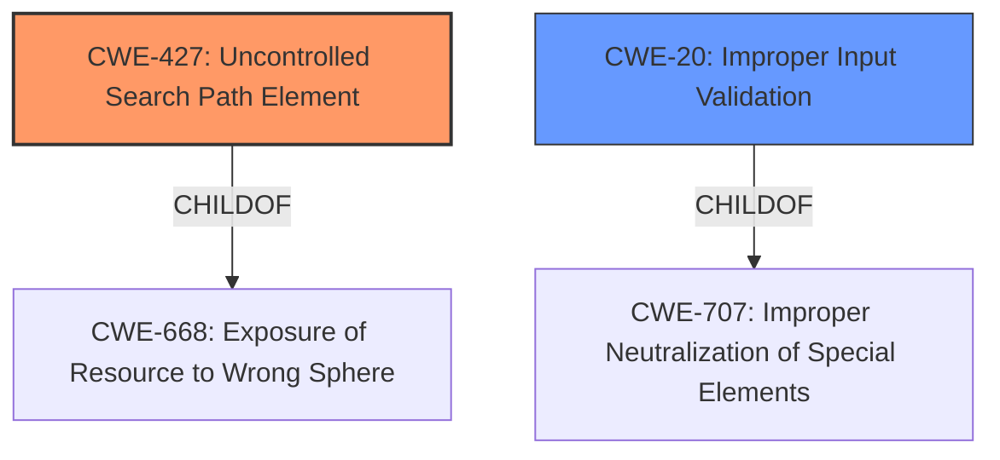

# Analysis for CVE-2021-1366

# Summary
| CWE ID  | CWE Name                                                | Confidence | CWE Abstraction Level | CWE Vulnerability Mapping Label | CWE-Vulnerability Mapping Notes |
| :------- | :------------------------------------------------------ | :--------- | :-------------------- | :------------------------------ | :------------------------------ |
| CWE-427 | Uncontrolled Search Path Element                        | 0.9        | Base                  | Primary                         | Allowed                       |
| CWE-20  | Improper Input Validation                               | 0.6        | Class                 | Secondary                       | Discouraged                    |

## Evidence and Confidence

*   **Confidence Score:** 0.8
*   **Evidence Strength:** HIGH

## Relationship Analysis
The primary relationship influencing the decision is the hierarchical structure with CWE-427 as a base CWE. While CWE-20 appears as a parent in some contexts, the specificity of CWE-427 regarding uncontrolled search paths makes it a more fitting base level classification. The choice of CWE-427 is also driven by its direct alignment with the **insufficient validation of resources loaded at runtime**, a root cause directly identified in the vulnerability description.

## Vulnerability Chain
The vulnerability chain starts with **insufficient validation of resources loaded at runtime** by the application, leading to a **DLL hijacking** vulnerability, and ultimately resulting in arbitrary code execution with SYSTEM privileges.
  - Root Cause: Insufficient validation of resources loaded at runtime (CWE-427)
  - Weakness: DLL hijacking (CWE-427)
  - Impact: Arbitrary code execution with SYSTEM privileges

## Summary of Analysis
The initial analysis pointed towards **insufficient validation of resources loaded at runtime** leading to **DLL hijacking** which leads to arbitrary code execution. The retriever results highlighted CWE-427 (Uncontrolled Search Path Element) as a strong candidate.

The vulnerability description states that the vulnerability is due to **insufficient validation of resources** that are loaded by the application at run time which enables a **DLL hijacking** attack. The exploit allows an attacker to execute arbitrary code on the affected machine with SYSTEM privileges.

CWE-427's description aligns well: "The product uses a fixed or controlled search path to find resources, but one or more locations in that path can be under the control of unintended actors." The **root cause** is the **insufficient validation** that enables the attacker to control the search path by placing a malicious DLL in a location where it will be loaded by the application.

CWE-20 (Improper Input Validation) was considered as a secondary CWE since the root cause involves validation. However, CWE-20 is a broad class, and the more specific CWE-427 better captures the nature of the vulnerability. CWE-20 is also discouraged.

The decision to prioritize CWE-427 is based on its direct relevance to the **root cause** and the specific mechanism of **DLL hijacking** via an uncontrolled search path element. This provides a more accurate and actionable classification of the vulnerability.

Relevant CWE Information:

# Enhanced Context (25 CWEs)
The following CWEs were identified as potentially relevant to this vulnerability:

## CWE-1289: Improper Validation of Unsafe Equivalence in Input
**Abstraction Level**: Base
**Similarity Score**: 0.78

## CWE-345: Insufficient Verification of Data Authenticity
**Abstraction Level**: Class
**Similarity Score**: 0.77

## CWE-807: Reliance on Untrusted Inputs in a Security Decision
**Abstraction Level**: Base
**Similarity Score**: 0.76

## CWE-274: Improper Handling of Insufficient Privileges
**Abstraction Level**: Base
**Similarity Score**: 0.76

## CWE-138: Improper Neutralization of Special Elements
**Abstraction Level**: Class
**Similarity Score**: 0.76

## CWE-668: Exposure of Resource to Wrong Sphere
**Abstraction Level**: Class
**Similarity Score**: 0.76

## CWE-280: Improper Handling of Insufficient Permissions or Privileges
**Abstraction Level**: Base
**Similarity Score**: 0.76

## CWE-653: Improper Isolation or Compartmentalization
**Abstraction Level**: Class
**Similarity Score**: 0.76

## CWE-184: Incomplete List of Disallowed Inputs
**Abstraction Level**: Base
**Similarity Score**: 0.75

## CWE-41: Improper Resolution of Path Equivalence
**Abstraction Level**: Base
**Similarity Score**: 0.75

## CWE-427: Uncontrolled Search Path Element
**Abstraction Level**: Base
**Similarity Score**: 8335.95

**Description**:
The product uses a fixed or controlled search path to find resources, but one or more locations in that path can be under the control of unintended actors.

**Mapping Guidance**:
- Usage: Allowed
- Rationale: This CWE entry is at the Base level of abstraction, which is a preferred level of abstraction for mapping to the root causes of vulnerabilities.

## CWE-367: Time-of-check Time-of-use (TOCTOU) Race Condition
**Abstraction Level**: Base
**Similarity Score**: 7447.19

## CWE-1284: Improper Validation of Specified Quantity in Input
**Abstraction Level**: Base
**Similarity Score**: 7101.75

## CWE-22: Improper Limitation of a Pathname to a Restricted Directory ('Path Traversal')
**Abstraction Level**: Base
**Similarity Score**: 7087.19

## CWE-59: Improper Link Resolution Before File Access ('Link Following')
**Abstraction Level**: Base
**Similarity Score**: 7044.43

## CWE-22: Improper Limitation of a Pathname to a Restricted Directory ('Path Traversal')
**Abstraction Level**: base
**Similarity Score**: 4.33

## CWE-73: External Control of File Name or Path
**Abstraction Level**: base
**Similarity Score**: 4.33

## CWE-770: Allocation of Resources Without Limits or Throttling
**Abstraction Level**: base
**Similarity Score**: 4.33

## CWE-190: Integer Overflow or Wraparound
**Abstraction Level**: base
**Similarity Score**: 4.33

## CWE-1284: Improper Validation of Specified Quantity in Input
**Abstraction Level**: base
**Similarity Score**: 4.33

## CWE-822: Untrusted Pointer Dereference
**Abstraction Level**: base
**Similarity Score**: 4.33

## CWE-789: Memory Allocation with Excessive Size Value
**Abstraction Level**: variant
**Similarity Score**: 3.88

## CWE-781: Improper Address Validation in IOCTL with METHOD_NEITHER I/O Control Code
**Abstraction Level**: variant
**Similarity Score**: 3.88

## CWE-426: Untrusted Search Path
**Abstraction Level**: base
**Similarity Score**: 3.64

## CWE-915: Improperly Controlled Modification of Dynamically-Determined Object Attributes
**Abstraction Level**: base
**Similarity Score**: 3.64