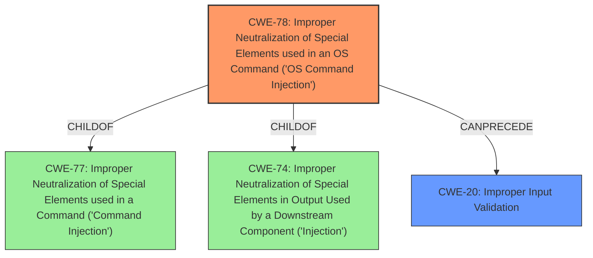

# Analysis Report for CVE-2021-1382

# Vulnerability Analysis Report: CVE-2021-1382

## Description


## Analysis (with Relationship Data)

# Summary
| CWE ID | CWE Name | Confidence | CWE Abstraction Level | CWE Vulnerability Mapping Label | CWE-Vulnerability Mapping Notes |
|---|---|---|---|---|---|
| CWE-78 | Improper Neutralization of Special Elements used in an OS Command ('OS Command Injection') | 0.9 | Base | Primary CWE | Allowed |
| CWE-20 | Improper Input Validation | 0.7 | Class | Secondary Candidate | Discouraged |

## Evidence and Confidence

*   **Confidence Score:** 0.8
*   **Evidence Strength:** HIGH

## Relationship Analysis
The primary weakness, CWE-78, is a Base-level CWE that falls under the Class-level CWE-74 (Improper Neutralization of Special Elements in Output Used by a Downstream Component ('Injection')) and CWE-77 (Improper Neutralization of Special Elements used in a Command ('Command Injection')). CWE-78 directly addresses the **improper neutralization** of special elements in an OS command, aligning with the vulnerability's root cause. The secondary weakness, CWE-20, is a Class-level CWE representing **improper input validation**. While the vulnerability description mentions **insufficient input validation**, CWE-20 is too general. Therefore, CWE-78 is a better fit due to its specificity.



## Vulnerability Chain
The vulnerability chain starts with **insufficient input validation** in the CLI commands, leading to the ability to inject arbitrary commands. The final impact is the execution of these commands with root privileges on the underlying operating system.

## Summary of Analysis
The analysis indicates that the primary cause of the vulnerability is the **insufficient input validation** on CLI commands, enabling command injection. This is evidenced by the vulnerability description stating that an attacker could "inject arbitrary commands to be executed with root privileges" due to **insufficient input validation**. The retriever results also support this, with CWE-78 having a high relevance score. While **insufficient input validation** is present and relevant, it is more accurately described as a command injection issue.

The evidence from the **Vulnerability Description Key Phrases** clearly indicates **insufficient input validation** as a **rootcause**. The **CVE Reference Links Content Summary** also confirms this with the same root cause and impact described.

The selection of CWE-78 is based on the specific nature of the vulnerability: the ability to inject OS commands due to **insufficient input validation**. CWE-20, while relevant, is a more general weakness. CWE-78 is at the optimal level of specificity because it precisely describes the type of injection occurring.

Relevant CWE Information:

# Enhanced Context (25 CWEs)
The following CWEs were identified as potentially relevant to this vulnerability:

## CWE-41: Improper Resolution of Path Equivalence
**Abstraction Level**: Base
**Similarity Score**: 0.81

## CWE-184: Incomplete List of Disallowed Inputs
**Abstraction Level**: Base
**Similarity Score**: 0.80

## CWE-23: Relative Path Traversal
**Abstraction Level**: Base
**Similarity Score**: 0.80

## CWE-138: Improper Neutralization of Special Elements
**Abstraction Level**: Class
**Similarity Score**: 0.80

## CWE-74: Improper Neutralization of Special Elements in Output Used by a Downstream Component ('Injection')
**Abstraction Level**: Class
**Similarity Score**: 0.80

## CWE-755: Improper Handling of Exceptional Conditions
**Abstraction Level**: Class
**Similarity Score**: 0.79

## CWE-668: Exposure of Resource to Wrong Sphere
**Abstraction Level**: Class
**Similarity Score**: 0.79

## CWE-59: Improper Link Resolution Before File Access ('Link Following')
**Abstraction Level**: Base
**Similarity Score**: 0.79

## CWE-923: Improper Restriction of Communication Channel to Intended Endpoints
**Abstraction Level**: Class
**Similarity Score**: 0.79

## CWE-73: External Control of File Name or Path
**Abstraction Level**: Base
**Similarity Score**: 0.79

## CWE-22: Improper Limitation of a Pathname to a Restricted Directory ('Path Traversal')
**Abstraction Level**: Base
**Similarity Score**: 18125.27

## CWE-20: Improper Input Validation
**Abstraction Level**: Class
**Similarity Score**: 16677.66

## CWE-347: Improper Verification of Cryptographic Signature
**Abstraction Level**: Base
**Similarity Score**: 16552.37

## CWE-1284: Improper Validation of Specified Quantity in Input
**Abstraction Level**: Base
**Similarity Score**: 16216.93

## CWE-863: Incorrect Authorization
**Abstraction Level**: Class
**Similarity Score**: 15695.54

## CWE-78: Improper Neutralization of Special Elements used in an OS Command ('OS Command Injection')
**Abstraction Level**: base
**Similarity Score**: 5.03

## CWE-98: Improper Control of Filename for Include/Require Statement in PHP Program ('PHP Remote File Inclusion')
**Abstraction Level**: variant
**Similarity Score**: 4.53

## CWE-434: Unrestricted Upload of File with Dangerous Type
**Abstraction Level**: base
**Similarity Score**: 4.33

## CWE-79: Improper Neutralization of Input During Web Page Generation ('Cross-site Scripting')
**Abstraction Level**: base
**Similarity Score**: 4.33

## CWE-94: Improper Control of Generation of Code ('Code Injection')
**Abstraction Level**: base
**Similarity Score**: 4.33

## CWE-22: Improper Limitation of a Pathname to a Restricted Directory ('Path Traversal')
**Abstraction Level**: base
**Similarity Score**: 4.33

## CWE-770: Allocation of Resources Without Limits or Throttling
**Abstraction Level**: base
**Similarity Score**: 4.33

## CWE-190: Integer Overflow or Wraparound
**Abstraction Level**: base
**Similarity Score**: 4.33

## CWE-125: Out-of-bounds Read
**Abstraction Level**: base
**Similarity Score**: 3.89

## CWE-88: Improper Neutralization of Argument Delimiters in a Command ('Argument Injection')
**Abstraction Level**: base
**Similarity Score**: 3.64

CWEs considered but not used:

*   **CWE-20 (Improper Input Validation):** Although the vulnerability description mentions **insufficient input validation**, CWE-20 is a high-level class. CWE-78 provides a more specific description of the vulnerability.
*   **CWE-269 (Improper Privilege Management):** The impact is command execution with root privileges, but the root cause isn't directly related to privilege management. The focus is on the lack of proper neutralization of special elements.
*   **CWE-25 (Path Traversal: '/../filedir'):** This CWE is not relevant because the vulnerability does not involve path traversal.
*   **CWE-250 (Execution with Unnecessary Privileges):** While the commands are executed with root privileges, this is the impact, not the root cause. The root cause is the **improper neutralization** of special elements.
*   **CWE-280 (Improper Handling of Insufficient Permissions or Privileges):** This is not relevant as the issue is not related to handling insufficient privileges.
*   **CWE-184 (Incomplete List of Disallowed Inputs):** The vulnerability description doesn't suggest an incomplete list of disallowed inputs, but rather a general lack of input validation.
*   **CWE-119 (Improper Restriction of Operations within the Bounds of a Memory Buffer):** This CWE is not relevant because the vulnerability does not involve memory buffer issues.
*   **CWE-94 (Improper Control of Generation of Code ('Code Injection')):** This CWE is not relevant as the vulnerability does not involve code injection.
*   **CWE-22 (Improper Limitation of a Pathname to a Restricted Directory ('Path Traversal')):** Path traversal is not


## CWE Relationship Analysis

Current CWEs represent these abstraction levels: .


### Vulnerability Chain Analysis

**Chain starting from CWE-434:**
- 434 (Unrestricted Upload of File with Dangerous Type) - ROOT


**Chain starting from CWE-94:**
- 94 (Improper Control of Generation of Code ('Code Injection')) - ROOT


### CWE Relationship Diagram

```mermaid
graph TD
    classDef primary fill:#f96,stroke:#333,stroke-width:2px
    classDef secondary fill:#69f,stroke:#333
    classDef tertiary fill:#9e9,stroke:#333
```


*Report generated on 2025-04-01 22:55:14*
