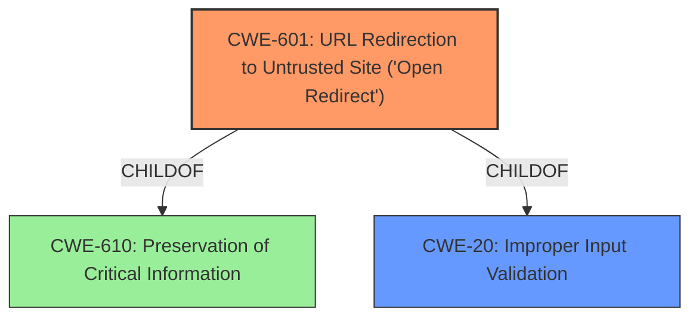

# Analysis Report for CVE-2021-1397

# Vulnerability Analysis Report: CVE-2021-1397

## Description


## Analysis (with Relationship Data)

# Summary
| CWE ID  | CWE Name                                                                           | Confidence | CWE Abstraction Level | CWE Vulnerability Mapping Label | CWE-Vulnerability Mapping Notes |
| :-------- | :--------------------------------------------------------------------------------- | :---------- | :---------------------- | :------------------------------ | :------------------------------ |
| CWE-601 | URL Redirection to Untrusted Site ('Open Redirect')                                | 1          | Base                   | Primary CWE                    | Allowed                      |
| CWE-20  | Improper Input Validation                                                                  | 0.7         | Class                   | Secondary Candidate                    | Discouraged                  |

## Evidence and Confidence

*   **Confidence Score:** 0.9
*   **Evidence Strength:** HIGH

## Relationship Analysis
The primary CWE is CWE-601, which is a Base level CWE and a child of CWE-610, indicating a specific type of input leading to redirection. CWE-20 is a Class-level CWE and a parent to CWE-601. While the description mentions **improper input validation**, the resulting impact is an open redirect which is best captured by CWE-601.



## Vulnerability Chain
The vulnerability chain starts with **improper input validation** (CWE-20), leading to a URL redirection to an untrusted site (CWE-601). The attacker crafts a malicious link, persuades a user to click it, and the user is redirected to a malicious website.

## Summary of Analysis
The initial assessment identified CWE-601 as the primary candidate due to the open redirect impact. The vulnerability description and the CVE Reference Links Content Summary both highlight the open redirect nature of the flaw. The **root cause** is **improper input validation**, which could be mapped to CWE-20, but it is a high-level Class. The more specific CWE-601 at the Base level is a better fit to the **impact** of the vulnerability.

The evidence from the "CVE Reference Links Content Summary" states that "The vulnerability is due to **improper input validation** of the parameters in an HTTP request" and "An attacker could redirect a user to a malicious website. This is an open redirect attack".

CWE-601 is at the Base level of abstraction, which is preferred. The mapping guidance for CWE-601 states, "This CWE entry is at the Base level of abstraction, which is a preferred level of abstraction for mapping to the root causes of vulnerabilities."

CWE-20 is a Class and the mapping guidance states "CWE-20 is commonly misused in low-information vulnerability reports when lower-level CWEs could be used instead, or when more details about the vulnerability are available".

I considered other CWEs such as CWE-79 (Improper Neutralization of Input During Web Page Generation ('Cross-site Scripting')) and CWE-74 (Improper Neutralization of Special Elements in Output Used by a Downstream Component ('Injection')), but they are not as relevant as CWE-601 because the vulnerability does not involve injecting script into a web page or injecting special elements into a downstream component. The core issue is the redirection to an untrusted site due to **improper input validation**.

**CWE Selection Justification:**

*   **CWE-601:** The vulnerability allows an attacker to redirect a user to an arbitrary, untrusted website. This aligns directly with the description of CWE-601, "The web application accepts a user-controlled input that specifies a link to an external site, and uses that link in a redirect." The impact and nature of the vulnerability are a clear match for this CWE.
*   **CWE-20:** The **improper input validation** is the **root cause** of the open redirect. While CWE-20 is a valid contributing factor, it is less specific than CWE-601, which directly describes the open redirect issue.

Relevant CWE Information:

# Enhanced Context (25 CWEs)

## CWE-807: Reliance on Untrusted Inputs in a Security Decision
**Abstraction Level**: Base
**Similarity Score**: 0.78
**Source**: dense

**Description**:
The product uses a protection mechanism that relies on the existence or values of an input, but the input can be modified by an untrusted actor in a way that bypasses the protection mechanism.
**Rationale for Not Using:** Although the vulnerability involves reliance on untrusted input, the core issue is the resulting open redirect, making CWE-601 a more direct and appropriate classification.

## CWE-1289: Improper Validation of Unsafe Equivalence in Input
**Abstraction Level**: Base
**Similarity Score**: 0.78
**Source**: dense

**Description**:
The product receives an input value that is used as a resource identifier or other type of reference, but it does not validate or incorrectly validates that the input is equivalent to a potentially-unsafe value.
**Rationale for Not Using:** While this CWE relates to **improper validation**, it is not as accurate as CWE-601 that directly describes the open redirect.

## CWE-74: Improper Neutralization of Special Elements in Output Used by a Downstream Component ('Injection')
**Abstraction Level**: Class
**Similarity Score**: 0.77
**Source**: dense

**Description**:
The product constructs all or part of a command, data structure, or record using externally-influenced input from an upstream component, but it does not neutralize or incorrectly neutralizes special elements that could modify how it is parsed or interpreted when it is sent to a downstream component.
**Rationale for Not Using:** This CWE is too general. The vulnerability doesn't involve injecting special elements, but rather redirecting to a different site.

## CWE-80: Improper Neutralization of Script-Related HTML Tags in a Web Page (Basic XSS)
**Abstraction Level**: Variant
**Similarity Score**: 0.77
**Source**: dense

**Description**:
The product receives input from an upstream component, but it does not neutralize or incorrectly neutralizes special characters such as "<", ">", and "&" that could be interpreted as web-scripting elements when they are sent to a downstream component that processes web pages.
**Rationale for Not Using:** This CWE is related to Cross-Site Scripting (XSS), which is not the case here. The vulnerability involves redirection, not script injection.

## CWE-184: Incomplete List of Disallowed Inputs
**Abstraction Level**: Base
**Similarity Score**: 0.76
**Source**: dense

**Description**:
The product implements a protection mechanism that relies on a list of inputs (or properties of inputs) that are not allowed by policy or otherwise require other action to neutralize before additional processing takes place, but the list is incomplete.
**Rationale for Not Using:** While this could be related to **improper input validation**, it doesn't accurately describe the open redirect vulnerability.

## CWE-472: External Control of Assumed-Immutable Web Parameter
**Abstraction Level**: Base
**Similarity Score**: 0.75
**Source**: dense

**Description**:
The web application does not sufficiently verify inputs that are assumed to be immutable but are actually externally controllable, such as hidden form fields.
**Rationale for Not Using:** This is not a case of controlling immutable web parameters.

## CWE-138: Improper Neutralization of Special Elements
**Abstraction Level**: Class
**Similarity Score**: 0.75
**Source**: dense

**Description**:
The product receives input from an upstream component, but it does not neutralize or incorrectly neutralizes special elements that could be interpreted as control elements or syntactic markers when they are sent to a downstream component.
**Rationale for Not Using:** Too general. The vulnerability doesn't involve special element neutralization in a downstream component.

## CWE-799: Improper Control of Interaction Frequency
**Abstraction Level**: Class
**Similarity Score**: 0.75
**Source**: dense

**Description**:
The product does not properly limit the number or frequency of interactions that it has with an actor, such as the number of incoming requests.
**Rationale for Not Using:** Not relevant.

## CWE-41: Improper Resolution of Path Equivalence
**Abstraction Level**: Base
**Similarity Score**: 0.75
**Source**: dense

**Description**:
The product is vulnerable to file system contents disclosure through path equivalence. Path equivalence involves the use of special characters in file and directory names. The associated manipulations are intended to generate multiple names for the same object.
**Rationale for Not Using:** Not relevant.

## CWE-183: Permissive List of Allowed Inputs
**Abstraction Level**: Base
**Similarity Score**: 0


## CWE Relationship Analysis

Current CWEs represent these abstraction levels: .


### Vulnerability Chain Analysis

**Chain starting from CWE-79:**
- 79 (Improper Neutralization of Input During Web Page Generation ('Cross-site Scripting')) - ROOT


**Chain starting from CWE-80:**
- 80 (Improper Neutralization of Script-Related HTML Tags in a Web Page (Basic XSS)) - ROOT


### CWE Relationship Diagram

```mermaid
graph TD
    classDef primary fill:#f96,stroke:#333,stroke-width:2px
    classDef secondary fill:#69f,stroke:#333
    classDef tertiary fill:#9e9,stroke:#333
```


*Report generated on 2025-04-01 20:41:06*
