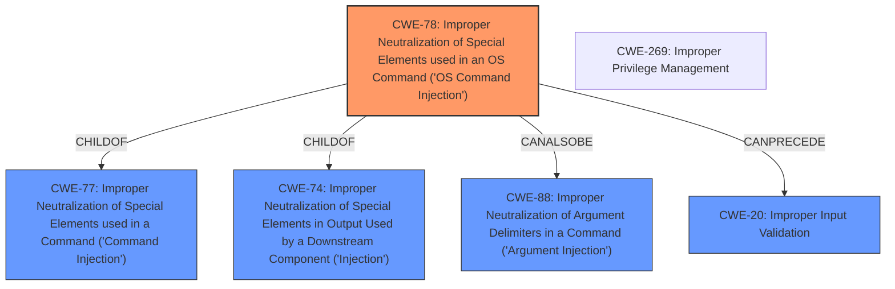

# Analysis for CVE-2021-1400

# Summary
| CWE ID | CWE Name | Confidence | CWE Abstraction Level | CWE Vulnerability Mapping Label | CWE-Vulnerability Mapping Notes |
|---|---|---|---|---|---|
| CWE-78 | Improper Neutralization of Special Elements used in an OS Command ('OS Command Injection') | 0.9 | Base | Allowed | Primary CWE |
| CWE-20 | Improper Input Validation | 0.7 | Class | Discouraged | Secondary Candidate |
| CWE-269 | Improper Privilege Management | 0.6 | Base | Not Listed | Secondary Candidate |

## Evidence and Confidence

*   **Confidence Score:** 0.8
*   **Evidence Strength:** HIGH

## Relationship Analysis
The primary CWE is CWE-78, which is a Base level CWE. CWE-78 is a child of CWE-77 (Improper Neutralization of Special Elements used in a Command) and CWE-74 (Improper Neutralization of Special Elements in Output Used by a Downstream Component ('Injection')). It can also be related to CWE-88 (Improper Neutralization of Argument Delimiters in a Command ('Argument Injection')). The vulnerability description indicates that the attacker can inject arbitrary commands, which aligns with CWE-78. CWE-20 is a Class level CWE, and while input validation is related, CWE-78 is a more specific description of the **root cause**.

## Vulnerability Chain
The vulnerability chain starts with **insufficient input validation**, potentially leading to OS command injection. The **lack of proper input validation** allows an authenticated attacker to inject arbitrary commands, which can then be executed on the affected device.
1.  **Root Cause:** Insufficient Input Validation
2.  **Weakness:** OS Command Injection
3.  **Impact:** Sensitive information disclosure, arbitrary command execution

## Summary of Analysis
The initial assessment strongly suggested CWE-78 (Improper Neutralization of Special Elements used in an OS Command ('OS Command Injection')) as the primary CWE, aligning with the vulnerability's ability to inject arbitrary commands. The retriever results also highlighted CWE-78 as a strong candidate with a high dense score.
The evidence from the CVE Reference Links Content Summary explicitly states: "This vulnerability is due to **insufficient input validation**. An attacker could exploit this vulnerability by sending a crafted HTTP request to the web-based management interface of an affected device. A successful exploit could allow the attacker to impersonate another user, including an administrative user, on the device."
The vulnerability description key phrases also support this assessment: "obtain sensitive information and inject arbitrary commands."
The relationship analysis further reinforced this choice, as CWE-78 is a base-level CWE that directly addresses the injection of OS commands.
CWE-20 (Improper Input Validation) was considered, but it is a more general weakness. While **insufficient input validation** is the root cause, the specific result is OS command injection. Therefore, CWE-78 is more appropriate.
CWE-269 (Improper Privilege Management) was also considered, but the vulnerability description primarily focuses on the ability to inject commands, not necessarily on privilege management issues. While privilege escalation could be a consequence of the command injection, it is not the primary weakness.
Therefore, the selected CWEs are at the optimal level of specificity, with CWE-78 representing the primary weakness and CWE-20 as a contributing factor related to the **insufficient input validation**.
The final decision is primarily based on the direct evidence of command injection and supported by the weakness's base-level abstraction and clear relationship to the vulnerability description.
CWE-22, CWE-23, CWE-434, CWE-98, CWE-73, CWE-79, CWE-119, CWE-125, CWE-184, CWE-190, CWE-274, CWE-305, CWE-426, CWE-653, CWE-668, CWE-691, CWE-770, CWE-807 and CWE-88 were considered but ultimately not chosen because they did not accurately reflect the core issue of command injection or were too high-level.