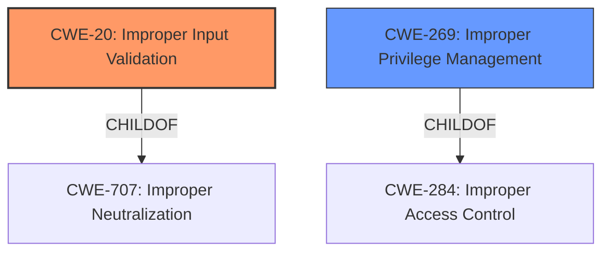

# Raw Analyzer Response for CVE-2021-1417

# Summary
| CWE ID | CWE Name | Confidence | CWE Abstraction Level | CWE Vulnerability Mapping Label | CWE-Vulnerability Mapping Notes |
|---|---|---|---|---|---|
| CWE-20 | Improper Input Validation | 0.7 | Class | Primary | Discouraged |
| CWE-269 | Improper Privilege Management | 0.5 | Class | Secondary | Discouraged |

## Evidence and Confidence

*   **Confidence Score:** 0.6
*   **Evidence Strength:** MEDIUM

## Relationship Analysis
The primary CWE, CWE-20 [Improper Input Validation], is a Class-level CWE and is discouraged by MITRE due to its common misuse in low-information vulnerability reports. It is a child of CWE-707 [Improper Neutralization] and can precede CWE-22 [Improper Limitation of a Pathname to a Restricted Directory ('Path Traversal')], CWE-41 [Improper Resolution of Path Equivalence], CWE-74 [Improper Neutralization of Special Elements used in an Output Command ('Injection')], CWE-119 [Improper Restriction of Operations within the Bounds of a Memory Buffer], and CWE-770 [Allocation of Resources Without Limits or Throttling].

CWE-269 [Improper Privilege Management] is a Class-level CWE and is also discouraged by MITRE due to its common misuse. It is a child of CWE-284 [Improper Access Control].

## Vulnerability Chain
The vulnerability chain starts with **improper input validation** (CWE-20) which can then lead to elevated privileges (CWE-269) and subsequently to impacts like arbitrary program execution, sensitive information access, protected network traffic interception, or DoS.

## Summary of Analysis
The initial assessment identified CWE-20 [Improper Input Validation] as the primary CWE based on the "CVE Reference Links Content Summary" section, which states: "This vulnerability is due to **improper validation of message content**" and  "weaknesses": ["**Improper Input Validation**"]. The retriever results also listed CWE-20 as the top combined result. However, CWE-20 is a class-level CWE and is discouraged by MITRE.

The vulnerability description also mentions that the attacker could "execute arbitrary programs on the underlying operating system with elevated privileges". Thus, CWE-269 [Improper Privilege Management] was considered as a secondary CWE. The retriever results listed CWE-269 as the sixth combined result. However, CWE-269 is a class-level CWE and is also discouraged by MITRE.

Given the limited information available and the high-level nature of the vulnerability description, selecting more specific Base or Variant CWEs is not possible. Therefore, the assessment relies on the provided evidence, acknowledging its limitations, and chooses the best possible options.

Relevant CWE Information:

# Enhanced Context (25 CWEs)

## CWE-20: Improper Input Validation
**Abstraction:** Class
**Similarity Score**: 0.140
**Source**: sparse

**Description**:
The product receives input or data, but it does
        not validate or incorrectly validates that the input has the
        properties that are required to process the data safely and
        correctly.

**Mapping Guidance**:
- Usage: Discouraged

## CWE-269: Improper Privilege Management
**Abstraction:** Class
**Similarity Score**: 0.591
**Source**: dense

**Description**:
The product does not properly assign, modify, track, or check privileges for an actor, creating an unintended sphere of control for that actor.

**Mapping Guidance**:
- Usage: Discouraged