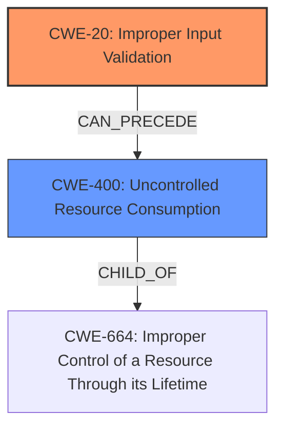

# Analysis for CVE-2021-1431

# Summary
| CWE ID | CWE Name | Confidence | CWE Abstraction Level | CWE Vulnerability Mapping Label | CWE-Vulnerability Mapping Notes |
|---|---|---|---|---|---|
| CWE-20 | Improper Input Validation | 0.8 | Class | Primary | Discouraged |
| CWE-400 | Uncontrolled Resource Consumption | 0.6 | Class | Secondary | Discouraged |

## Evidence and Confidence

*   **Confidence Score:** 0.7
*   **Evidence Strength:** MEDIUM

## Relationship Analysis
The primary CWE selected is CWE-20, which is a Class-level CWE. Although it's discouraged to map to Class-level CWEs directly, the evidence points to **insufficient handling of malformed packets**, which directly relates to improper input validation. CWE-20 has child CWEs that might be more specific, however, none of the given CWEs are suitable.
CWE-400 is also a Class-level CWE and related since the impact is a denial of service (DoS). The **insufficient handling of malformed packets** could lead to uncontrolled resource consumption.

## Vulnerability Chain
The vulnerability chain starts with the **insufficient handling of malformed packets** (CWE-20), which leads to a denial of service (DoS) condition. This could be because the malformed packets cause excessive resource consumption (CWE-400), ultimately leading to the device reloading.

## Summary of Analysis
The initial assessment considered the **insufficient handling of malformed packets** as a primary cause, leading to CWE-20. The resulting denial-of-service condition suggests a secondary weakness in resource management (CWE-400).

The selection of CWE-20 is based on the evidence: "This vulnerability is due to **insufficient handling of malformed packets**." The CVE Reference Links Content Summary reinforces this: "Insufficient handling of malformed packets in the vDaemon process of Cisco IOS XE SD-WAN Software."

The graph relationships highlight how improper input validation (CWE-20) can precede uncontrolled resource consumption (CWE-400).

The selected CWEs are at the appropriate level of specificity, given the available information. While more specific variants of CWE-20 might exist, the current evidence does not support mapping to those variants.

Relevant CWE Information:

# Enhanced Context (25 CWEs)

## CWE-404: Improper Resource Shutdown or Release
**Abstraction Level**: Class
**Similarity Score**: 0.78
**Source**: dense
Not selected because this CWE is about releasing resources but the vulnerability is about how malformed packets cause the device to reload.

## CWE-664: Improper Control of a Resource Through its Lifetime
**Abstraction Level**: Pillar
**Similarity Score**: 0.76
**Source**: dense
Not selected because it is too high level.

## CWE-410: Insufficient Resource Pool
**Abstraction Level**: Base
**Similarity Score**: 0.76
**Source**: dense
Considered but not selected. While an insufficient resource pool could lead to a denial of service, the root cause is the **insufficient handling of malformed packets** rather than an inherent limitation in the resource pool size.

## CWE-667: Improper Locking
**Abstraction Level**: Class
**Similarity Score**: 0.76
**Source**: dense
Not selected because the vulnerability description makes no mention of locking issues.

## CWE-226: Sensitive Information in Resource Not Removed Before Reuse
**Abstraction Level**: Base
**Similarity Score**: 0.76
**Source**: dense
Not selected because this vulnerability is not related to sensitive information.

## CWE-405: Asymmetric Resource Consumption (Amplification)
**Abstraction Level**: Class
**Similarity Score**: 0.76
**Source**: dense
Not selected because the vulnerability doesn't specifically indicate asymmetric resource consumption.

## CWE-799: Improper Control of Interaction Frequency
**Abstraction Level**: Class
**Similarity Score**: 0.75
**Source**: dense
Not selected because the vulnerability isn't necessarily about the *frequency* of interactions, but rather the *content* of the packets.

## CWE-1325: Improperly Controlled Sequential Memory Allocation
**Abstraction Level**: Base
**Similarity Score**: 0.74
**Source**: dense
Not selected because this CWE is about memory allocation issues.

## CWE-789: Memory Allocation with Excessive Size Value
**Abstraction Level**: Variant
**Similarity Score**: 0.74
**Source**: dense
Not selected because this CWE is about memory allocation issues.

## CWE-772: Missing Release of Resource after Effective Lifetime
**Abstraction Level**: Base
**Similarity Score**: 0.74
**Source**: dense
Not selected because it involves missing release of resources.

## CWE-190: Integer Overflow or Wraparound
**Abstraction Level**: Base
**Similarity Score**: 8995.24
**Source**: sparse
Not selected. The vulnerability is about **insufficient handling of malformed packets**, not integer overflows.

## CWE-1284: Improper Validation of Specified Quantity in Input
**Abstraction Level**: Base
**Similarity Score**: 8604.84
**Source**: sparse
Not selected because the vulnerability description doesn't specify that the quantity is the main problem.

## CWE-119: Improper Restriction of Operations within the Bounds of a Memory Buffer
**Abstraction Level**: Class
**Similarity Score**: 8547.41
**Source**: sparse
Not selected. Although memory corruption might occur as a result of the malformed packets, the root cause is the **insufficient handling of malformed packets**.

## CWE-770: Allocation of Resources Without Limits or Throttling
**Abstraction Level**: Base
**Similarity Score**: 8491.70
**Source**: sparse
Not selected because it is about allocation of resources without limits.

## CWE-789: Memory Allocation with Excessive Size Value
**Abstraction Level**: Variant
**Similarity Score**: 8470.41
**Source**: sparse
Not selected because it is about excessive memory allocation size.

## CWE-22: Improper Limitation of a Pathname to a Restricted Directory ('Path Traversal')
**Abstraction Level**: base
**Similarity Score**: 4.33
**Source**: graph
Not selected because it involves path traversal.

## CWE-770: Allocation of Resources Without Limits or Throttling
**Abstraction Level**: base
**Similarity Score**: 4.33
**Source**: graph
Not selected because it is about allocation of resources without limits.

## CWE-73: External Control of File Name or Path
**Abstraction Level**: base
**Similarity Score**: 4.33
**Source**: graph
Not selected because it involves file names and paths.

## CWE-190: Integer Overflow or Wraparound
**Abstraction Level**: base
**Similarity Score**: 4.33
**Source**: graph
Not selected because it is about integer overflows.

## CWE-1284: Improper Validation of Specified Quantity in Input
**Abstraction Level**: base
**Similarity Score**: 4.33
**Source**: graph
Not selected because it is about validation of input quantity.

## CWE-681: Incorrect Conversion between Numeric Types
**Abstraction Level**: base
**Similarity Score**: 4.33
**Source**: graph
Not selected because it is about incorrect conversions of numeric types.

## CWE-78: Improper Neutralization of Special Elements used in an OS Command ('OS Command Injection')
**Abstraction Level**: base
**Similarity Score**: 4.31
**Source**: graph
Not selected. The vulnerability is not related to OS command injection.

## CWE-125: Out-of-bounds Read
**Abstraction Level**: base
**Similarity Score**: 3.89
**Source**: graph
Not selected. The vulnerability is not related to out-of-bounds read.

## CWE-787: Out-of-bounds Write
**Abstraction Level**: base
**Similarity Score**: 3.89
**Source**: graph
Not selected. The vulnerability is not related to out-of-bounds write.

## CWE-129: Improper Validation of Array Index
**Abstraction Level**: variant
**Similarity Score**: 3.88
**Source**: graph
Not selected. While improper validation of array indices could lead to a DoS, the root cause is more general: **insufficient handling of malformed packets**.