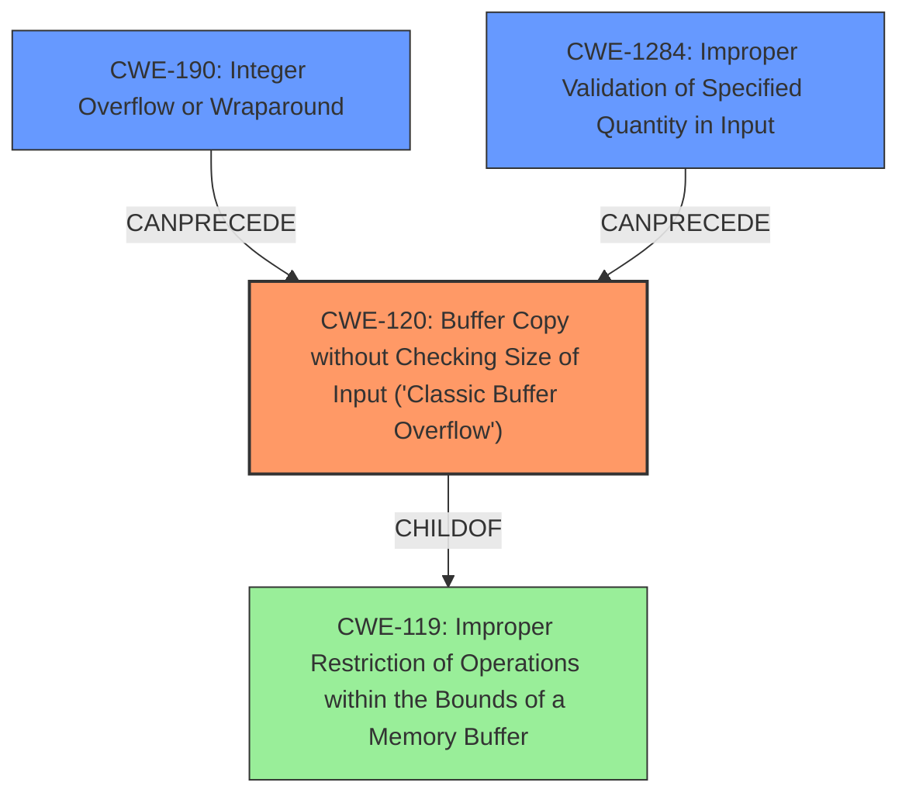

# Analysis Report for CVE-2021-1433

# Vulnerability Analysis Report: CVE-2021-1433

## Description


## Analysis (with Relationship Data)

# Summary
| CWE ID | CWE Name | Confidence | CWE Abstraction Level | CWE Vulnerability Mapping Label | CWE-Vulnerability Mapping Notes |
|---|---|---|---|---|---|
| CWE-120 | Buffer Copy without Checking Size of Input ('Classic Buffer Overflow') | 0.9 | Base | Allowed-with-Review | Primary CWE: The vulnerability involves a buffer overflow due to insufficient bounds checking when processing traffic. |
| CWE-190 | Integer Overflow or Wraparound | 0.5 | Base | Allowed | Secondary CWE: Integer overflow could potentially contribute to memory corruption or incorrect buffer size calculations, although evidence is lacking. |
| CWE-1284 | Improper Validation of Specified Quantity in Input | 0.5 | Base | Allowed | Secondary CWE: The vulnerability is due to insufficient bounds checking which is a form of input validation on the size of the input. |
| CWE-119 | Improper Restriction of Operations within the Bounds of a Memory Buffer | 0.3 | Class | Discouraged | Secondary CWE: Considered but represents a higher-level abstraction. |

## Evidence and Confidence

*   **Confidence Score:** 0.7
*   **Evidence Strength:** MEDIUM

## Relationship Analysis
The primary CWE, CWE-120, relates to buffer overflows caused by copying data without proper size validation. CWE-119 is a more general class that encompasses buffer overflows, but CWE-120 is more specific. CWE-190 and CWE-1284 could potentially precede CWE-120 if an integer overflow leads to incorrect buffer size calculation or improper input validation allows an excessively large size.



## Vulnerability Chain
The vulnerability chain starts with **insufficient bounds checking** (root cause), leading to a **buffer overflow** (weakness), and potentially resulting in arbitrary command execution or denial of service (impact).

## Summary of Analysis
Initially, the description points towards a **buffer overflow** due to **insufficient bounds checking**. The evidence from the "CVE Reference Links Content Summary" confirms that the root cause is "**insufficient bounds checking** when the device processes traffic," the weakness is a "**Buffer Overflow** Vulnerability due to **insufficient bounds checking**," and the impact includes "arbitrary commands as the root user" or a "denial of service (DoS) condition."

The primary selection of CWE-120 is based on the classic buffer overflow scenario described where data is copied without checking input size. Secondary CWEs like CWE-190 and CWE-1284 are considered due to the possibility of integer overflows contributing to the incorrect size calculations or validation, but this is speculative based on the provided information. CWE-119 is not selected as the primary because it is a more general case.

The final decision prioritizes CWE-120 due to its direct relevance to the vulnerability description of "**buffer overflow**" due to "**insufficient bounds checking**." The selection is at the Base level of abstraction, which is the preferred level.

Relevant CWE Information:

# Enhanced Context (25 CWEs)
The following CWEs were identified as potentially relevant to this vulnerability:

## CWE-405: Asymmetric Resource Consumption (Amplification)
**Abstraction Level**: Class
**Similarity Score**: 0.78
**Source**: dense

**Description**:
The product does not properly control situations in which an adversary can cause the product to consume or produce excessive resources without requiring the adversary to invest equivalent work or otherwise prove authorization, i.e., the adversary's influence is "asymmetric."

**Mapping Guidance**:
- Usage: Allowed-with-Review
- Rationale: This CWE entry is a Class and might have Base-level children that would be more appropriate

*Not Selected: Not directly related to buffer overflow, resource consumption is the result.*

## CWE-799: Improper Control of Interaction Frequency
**Abstraction Level**: Class
**Similarity Score**: 0.77
**Source**: dense

**Description**:
The product does not properly limit the number or frequency of interactions that it has with an actor, such as the number of incoming requests.

**Mapping Guidance**:
- Usage: Allowed-with-Review
- Rationale: This CWE entry is a Class and might have Base-level children that would be more appropriate

*Not Selected: Not directly related to buffer overflow.*

## CWE-404: Improper Resource Shutdown or Release
**Abstraction Level**: Class
**Similarity Score**: 0.76
**Source**: dense

**Description**:
The product does not release or incorrectly releases a resource before it is made available for re-use.

**Mapping Guidance**:
- Usage: Allowed-with-Review
- Rationale: This CWE entry is a Class and might have Base-level children that would be more appropriate

*Not Selected: Not directly related to buffer overflow.*

## CWE-664: Improper Control of a Resource Through its Lifetime
**Abstraction Level**: Pillar
**Similarity Score**: 0.76
**Source**: dense

**Description**:
The product does not maintain or incorrectly maintains control over a resource throughout its lifetime of creation, use, and release.

**Mapping Guidance**:
- Usage: Discouraged
- Rationale: This CWE entry is high-level when lower-level children are available.

*Not Selected: Too general.*

## CWE-789: Memory Allocation with Excessive Size Value
**Abstraction Level**: Variant
**Similarity Score**: 0.76
**Source**: dense

**Description**:
The product allocates memory based on an untrusted, large size value, but it does not ensure that the size is within expected limits, allowing arbitrary amounts of memory to be allocated.

**Mapping Guidance**:
- Usage: Allowed
- Rationale: This CWE entry is at the Variant level of abstraction, which is a preferred level of abstraction for mapping to the root causes of vulnerabilities.

*Not Selected: No evidence to support excessive memory allocation.*

## CWE-119: Improper Restriction of Operations within the Bounds of a Memory Buffer
**Abstraction Level**: Class
**Similarity Score**: 0.75
**Source**: dense

**Description**:
The product performs operations on a memory buffer, but it reads from or writes to a memory location outside the buffer's intended boundary. This may result in read or write operations on unexpected memory locations that could be linked to other variables, data structures, or internal program data.

**Mapping Guidance**:
- Usage: Discouraged
- Rationale: CWE-119 is commonly misused in low-information vulnerability reports when lower-level CWEs could be used instead, or when more details about the vulnerability are available.

*Not Selected: Too general, CWE-120 is more specific.*

## CWE-1325: Improperly Controlled Sequential Memory Allocation
**Abstraction Level**: Base
**Similarity Score**: 0.75
**Source**: dense

**Description**:
The product manages a group of objects or resources and performs a separate memory allocation for each object, but it does not properly limit the total amount of memory that is consumed by all of the combined objects.

**Mapping Guidance**:
- Usage: Allowed
- Rationale: This CWE entry is at the Base level of abstraction, which is a preferred level of abstraction for mapping to the root causes of vulnerabilities.

*Not Selected: No evidence to support improper sequential memory allocation.*

## CWE-191: Integer Underflow (Wrap or Wraparound)
**Abstraction Level**: Base
**Similarity Score**: 0.75
**Source**: dense

**Description**:
The product subtracts one value from another, such that the result is less than the minimum allowable integer value, which produces a value that is not equal to the correct result.

**Mapping Guidance**:
- Usage: Allowed
- Rationale: This CWE entry is at the Base level of abstraction, which is a preferred level of abstraction for mapping to the root causes of vulnerabilities.

*Not Selected: Not directly related to buffer overflow.*

## CWE-226: Sensitive Information in Resource Not Removed Before Reuse
**Abstraction Level**: Base
**Similarity Score**: 0.75
**Source**: dense

**Description**:
The product releases a resource such as memory or a file so that it can be made available for reuse, but it does not clear or "zeroize" the information contained in the resource before the product performs a


## CWE Relationship Analysis

Current CWEs represent these abstraction levels: .


### Vulnerability Chain Analysis

**Chain starting from CWE-664:**
- 664 (Improper Control of a Resource Through its Lifetime) - ROOT


**Chain starting from CWE-404:**
- 404 (Improper Resource Shutdown or Release) - ROOT


### CWE Relationship Diagram

```mermaid
graph TD
    classDef primary fill:#f96,stroke:#333,stroke-width:2px
    classDef secondary fill:#69f,stroke:#333
    classDef tertiary fill:#9e9,stroke:#333
```


*Report generated on 2025-04-02 04:20:13*
