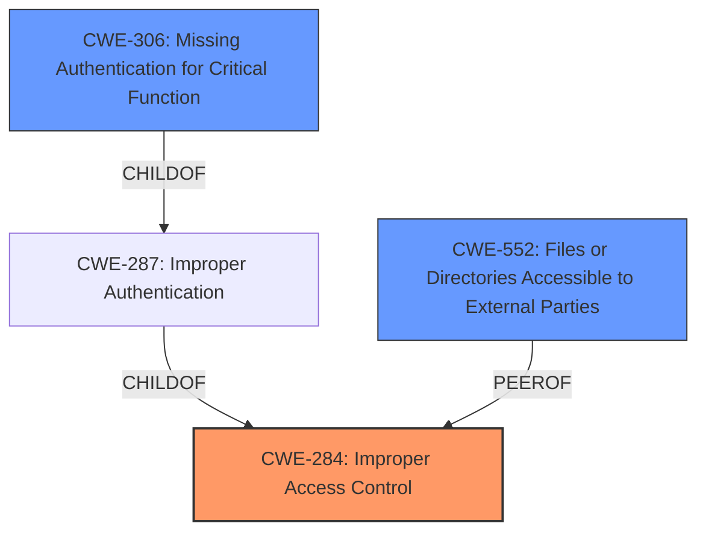

# Raw Analyzer Response for CVE-2021-1437

# Summary
| CWE ID | CWE Name | Confidence | CWE Abstraction Level | CWE Vulnerability Mapping Label | CWE-Vulnerability Mapping Notes |
|---|---|---|---|---|---|
| CWE-284 | Improper Access Control | 0.9 | Pillar | Primary | Discouraged |
| CWE-552 | Files or Directories Accessible to External Parties | 0.7 | Base | Secondary | Allowed |
| CWE-306 | Missing Authentication for Critical Function | 0.6 | Base | Secondary | Allowed |

## Evidence and Confidence

*   **Confidence Score:** 0.8
*   **Evidence Strength:** HIGH

## Relationship Analysis
The primary CWE selected is CWE-284, Improper Access Control, which is a Pillar-level CWE. While broad, it accurately reflects the **unrestricted TFTP configuration** at the root of the vulnerability.
CWE-552, Files or Directories Accessible to External Parties, and CWE-306, Missing Authentication for Critical Function, are considered as they refine the access control problem.
CWE-306 is a child of CWE-287, Improper Authentication, which in turn is a child of CWE-284. This hierarchical relationship shows the progression from a general access control issue to the specific lack of authentication.
CWE-552 is a base level CWE and is closely related to CWE-284 in that an access control problem often leads to resources being exposed to the wrong actor.

## Vulnerability Chain
The vulnerability chain starts with an **unrestricted TFTP configuration**. This leads to improper access control, specifically, unauthorized access to files on the access point. The chain is:

1.  **Unrestricted TFTP configuration (CWE-Unknown):** The root cause is the configuration that allows unrestricted access.
2.  **Improper Access Control (CWE-284):** Due to the unrestricted configuration, access control is not properly enforced.
3.  **Files or Directories Accessible to External Parties (CWE-552):** The lack of access control leads to sensitive files being accessible to unauthorized parties.
4.  **Exposure of Sensitive Information (CWE-200):** The attacker can download files, leading to exposure of sensitive information.

## Summary of Analysis
The initial assessment points to CWE-284 as the primary weakness due to the **unrestricted Trivial File Transfer Protocol (TFTP) configuration**. The "CVE Reference Links Content Summary" section confirms this, stating, "The vulnerability is due to an unrestricted Trivial File Transfer Protocol (TFTP) configuration."

The vulnerability description clearly states the impact: "A successful exploit could allow the attacker to download any file from the filesystem of the affected access point (AP)." This aligns with the description of CWE-552, Files or Directories Accessible to External Parties.

CWE-306, Missing Authentication for Critical Function, is also relevant because the TFTP service lacks authentication, allowing unauthenticated access.

CWE-284 is a discouraged CWE due to its high level of abstraction. However, in this case, the root cause is a general access control issue arising from the misconfiguration of the TFTP service. While more specific CWEs like CWE-306 (Missing Authentication) and CWE-552 (Files Accessible to External Parties) capture aspects of the vulnerability, the overarching problem is the lack of access control on the TFTP service.

The relationships between the CWEs, particularly the parent-child relationship between CWE-284 and CWE-306, and the peer relationship of CWE-552, support the selection of CWE-284 as the primary weakness, with CWE-306 and CWE-552 providing additional context.

The selected CWEs are at the optimal level of specificity because they address the root cause (unrestricted access), the mechanism (TFTP), and the impact (file download). The choice of CWE-284 is deliberate, acknowledging its high-level nature, but justified by the broad access control issue at the core of the vulnerability.
Relevant CWE Information:
*   **CWE-284: Improper Access Control**
    *   The product does not restrict or incorrectly restricts access to a resource from an unauthorized actor.
    *   The unrestricted TFTP configuration directly corresponds to a failure in restricting access.
*   **CWE-552: Files or Directories Accessible to External Parties**
    *   The product makes files or directories accessible to unauthorized actors, even though they should not be.
    *   The successful exploit allows an attacker to download any file, directly exposing files to unauthorized access.
*   **CWE-306: Missing Authentication for Critical Function**
    *   The product does not perform any authentication for functionality that requires a provable user identity.
    *   The TFTP service lacks authentication, allowing any remote attacker to make requests.

CWE-22, Improper Limitation of a Pathname to a Restricted Directory ('Path Traversal'), was considered but not used because the vulnerability does not involve path manipulation. The attacker downloads files directly without needing to traverse directories.

CWE-200, Exposure of Sensitive Information to an Unauthorized Actor, was considered, but the primary weakness is the access control issue that leads to the exposure. Therefore, it is more accurate to focus on the access control weaknesses.