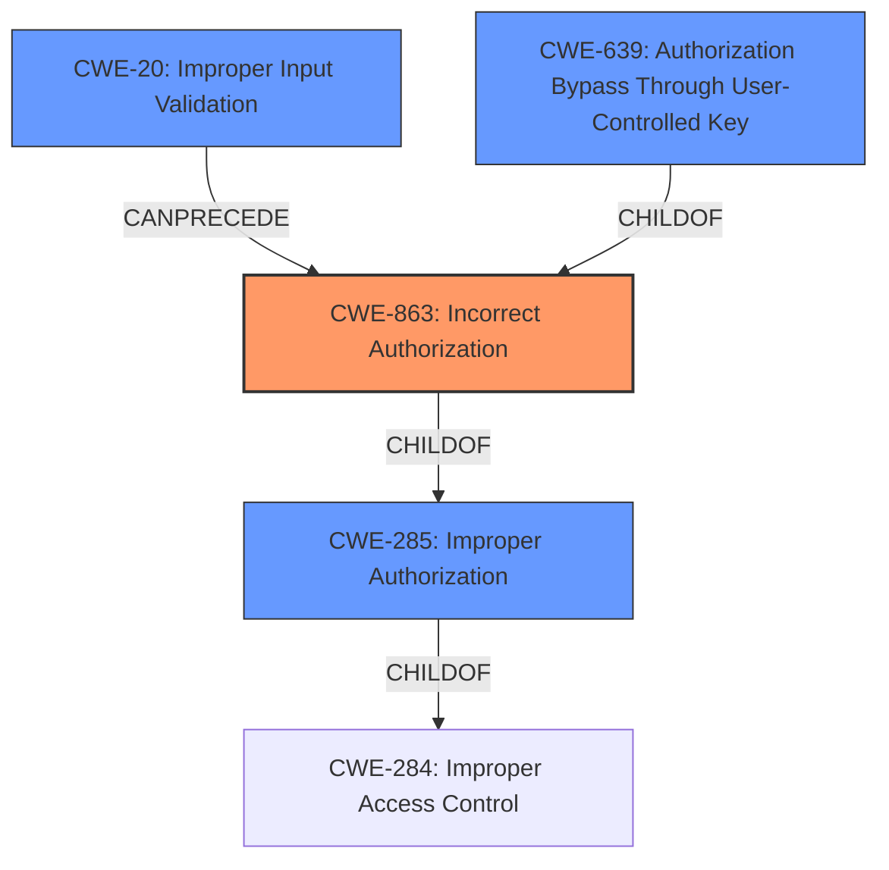

# Analysis for CVE-2021-1438

# Summary
| CWE ID    | CWE Name                                                                                   | Confidence | CWE Abstraction Level | CWE Vulnerability Mapping Label | CWE-Vulnerability Mapping Notes |
| :--------- | :----------------------------------------------------------------------------------------- | :---------- | :---------------------- | :------------------------------ | :------------------------------ |
| CWE-863     | Incorrect Authorization                                                                      | 0.95       | Class                   | Primary                         | Allowed-with-Review             |
| CWE-20      | Improper Input Validation                                                                   | 0.70       | Class                   | Secondary                         | Discouraged                     |
| CWE-639 | Authorization Bypass Through User-Controlled Key | 0.60       | Base                  | Secondary                         | Allowed             |

## Evidence and Confidence

*   **Confidence Score:** 0.85
*   **Evidence Strength:** HIGH

## Relationship Analysis
The primary relationship influencing the CWE selection is the parent-child relationship between CWE-284 (Improper Access Control), CWE-285 (Improper Authorization), and CWE-863 (Incorrect Authorization). CWE-863 is a child of CWE-285, which in turn is a child of CWE-284. While CWE-284 is too abstract, CWE-863 provides a more specific classification than CWE-285 by focusing on the incorrect performance of an authorization check. CWE-20 (Improper Input Validation) can precede authorization issues. CWE-639 is a more specific Base CWE of Authorization Bypass.

## Vulnerability Chain
The vulnerability chain starts with **improper input validation**, potentially leading to **incorrect authorization**, which ultimately allows an attacker to read arbitrary files.

## Summary of Analysis
The initial assessment identified **improper input validation and authorization** as the root cause.

The final conclusion is that CWE-863 (Incorrect Authorization) is the most appropriate primary CWE because the vulnerability lies in the incorrect performance of authorization checks within the CLI command processing. The system is performing authorization checks, but they are flawed, allowing unauthorized access. CWE-20 (Improper Input Validation) is a secondary CWE since the **improper input validation** is a contributing factor. CWE-639 (Authorization Bypass Through User-Controlled Key) is another good secondary candidate since the attacker is using a specific set of commands within the CLI which the user has control of to bypass authorization.

The selection is based on the vulnerability description stating, "The vulnerability is due to **improper input validation and authorization** of specific commands that a user can execute within the CLI." The CVE Reference Links Content Summary reinforces this by stating, "**Improper Input Validation:** The system fails to properly validate the input provided through the CLI, allowing for the execution of commands that should be restricted" and "**Insufficient Authorization:** The system does not adequately check the user's privileges before executing commands, allowing an authenticated local user to bypass intended access restrictions."

The selected CWEs are at the optimal level of specificity. CWE-863 is a Class-level CWE, which is more specific than the Pillar-level CWE-284 (Improper Access Control) but broader than a Base or Variant CWE. This level of abstraction is appropriate given the information provided. CWE-20 (Improper Input Validation) and CWE-639 (Authorization Bypass Through User-Controlled Key) are also appropriate secondary concerns.

Relevant CWE Information:

# Enhanced Context (25 CWEs)
The following CWEs were identified as potentially relevant to this vulnerability:

## CWE-807: Reliance on Untrusted Inputs in a Security Decision
**Abstraction Level**: Base
**Similarity Score**: 0.76
**Source**: dense

**Description**:
The product uses a protection mechanism that relies on the existence or values of an input, but the input can be modified by an untrusted actor in a way that bypasses the protection mechanism.

**Mapping Guidance**:
- Usage: Allowed
- Rationale: This CWE entry is at the Base level of abstraction, which is a preferred level of abstraction for mapping to the root causes of vulnerabilities.

## CWE-1289: Improper Validation of Unsafe Equivalence in Input
**Abstraction Level**: Base
**Similarity Score**: 0.76
**Source**: dense

**Description**:
The product receives an input value that is used as a resource identifier or other type of reference, but it does not validate or incorrectly validates that the input is equivalent to a potentially-unsafe value.

**Mapping Guidance**:
- Usage: Allowed
- Rationale: This CWE entry is at the Base level of abstraction, which is a preferred level of abstraction for mapping to the root causes of vulnerabilities.

## CWE-183: Permissive List of Allowed Inputs
**Abstraction Level**: Base
**Similarity Score**: 0.75
**Source**: dense

**Description**:
The product implements a protection mechanism that relies on a list of inputs (or properties of inputs) that are explicitly allowed by policy because the inputs are assumed to be safe, but the list is too permissive - that is, it allows an input that is unsafe, leading to resultant weaknesses.

**Mapping Guidance**:
- Usage: Allowed
- Rationale: This CWE entry is at the Base level of abstraction, which is a preferred level of abstraction for mapping to the root causes of vulnerabilities.

## CWE-668: Exposure of Resource to Wrong Sphere
**Abstraction Level**: Class
**Similarity Score**: 0.75
**Source**: dense

**Description**:
The product exposes a resource to the wrong control sphere, providing unintended actors with inappropriate access to the resource.

**Mapping Guidance**:
- Usage: Discouraged
- Rationale: CWE-668 is high-level and is often misused as a catch-all when lower-level CWE IDs might be applicable. It is sometimes used for low-information vulnerability reports [REF-1287]. It is a level-1 Class (i.e., a child of a Pillar). It is not useful for trend analysis.

## CWE-184: Incomplete List of Disallowed Inputs
**Abstraction Level**: Base
**Similarity Score**: 0.75
**Source**: dense

**Description**:
The product implements a protection mechanism that relies on a list of inputs (or properties of inputs) that are not allowed by policy or otherwise require other action to neutralize before additional processing takes place, but the list is incomplete.

**Mapping Guidance**:
- Usage: Allowed
- Rationale: This CWE entry is at the Base level of abstraction, which is a preferred level of abstraction for mapping to the root causes of vulnerabilities.

## CWE-274: Improper Handling of Insufficient Privileges
**Abstraction Level**: Base
**Similarity Score**: 0.75
**Source**: dense

**Description**:
The product does not handle or incorrectly handles when it has insufficient privileges to perform an operation, leading to resultant weaknesses.

**Mapping Guidance**:
- Usage: Discouraged
- Rationale: This CWE entry could be deprecated in a future version of CWE.

## CWE-653: Improper Isolation or Compartmentalization
**Abstraction Level**: Class
**Similarity Score**: 0.75
**Source**: dense

**Description**:
The product does not properly compartmentalize or isolate functionality, processes, or resources that require different privilege levels, rights, or permissions.

**Mapping Guidance**:
- Usage: Allowed
- Rationale: This CWE entry is at the Base level of abstraction, which is a preferred level of abstraction for mapping to the root causes of vulnerabilities.

## CWE-41: Improper Resolution of Path Equivalence
**Abstraction Level**: Base
**Similarity Score**: 0.74
**Source**: dense

**Description**:
The product is vulnerable to file system contents disclosure through path equivalence. Path equivalence involves the use of special characters in file and directory names. The associated manipulations are intended to generate multiple names for the same object.

**Mapping Guidance**:
- Usage: Allowed
- Rationale: This CWE entry is at the Base level of abstraction, which is a preferred level of abstraction for mapping to the root causes of vulnerabilities.

## CWE-1220: Insufficient Granularity of Access Control
**Abstraction Level**: Base
**Similarity Score**: 0.74
**Source**: dense

**Description**:
The product implements access controls via a policy or other