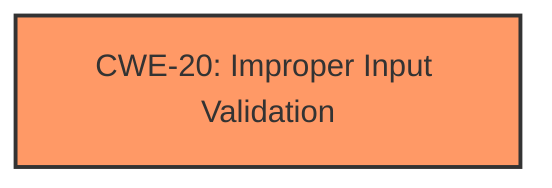

# Raw Analyzer Response for CVE-2021-1450

# Summary
| CWE ID | CWE Name | Confidence | CWE Abstraction Level | CWE Vulnerability Mapping Label | CWE-Vulnerability Mapping Notes |
|---|---|---|---|---|---|
| CWE-20 | Improper Input Validation | 0.9 | Class | Discouraged | Consider lower-level children |

## Evidence and Confidence

*   **Confidence Score:** 0.9
*   **Evidence Strength:** HIGH

## Relationship Analysis
The primary CWE is CWE-20, which is a Class-level weakness. The retriever results suggested several Base and Variant level CWEs, including CWE-427, CWE-1284, CWE-770, and CWE-789, but none of them fit the vulnerability description as directly as CWE-20. CWE-20 is a general case of **improper input validation**, and the vulnerability is specifically due to **insufficient validation of user-supplied input**. While some of the suggested CWEs such as CWE-1284 (Improper Validation of Specified Quantity in Input) could be applicable if more details were known, the provided description doesn't specify the type of input that lacks validation, making CWE-20 the most appropriate choice given the available information.

## Vulnerability Chain
The vulnerability chain is as follows:
1.  **Root Cause:** **Insufficient input validation** (CWE-20) of user-supplied input in the IPC channel.
2.  **Attack Vector:** Sending crafted IPC messages to the AnyConnect process.
3.  **Impact:** Denial of Service (DoS) condition on the affected device by stopping the AnyConnect process.

## Summary of Analysis
The initial assessment focused on identifying the root cause of the vulnerability. The vulnerability description explicitly states that the vulnerability is due to **insufficient validation of user-supplied input**. The CVE Reference Links Content Summary confirms this by stating, "The vulnerability is due to insufficient validation of user-supplied input."

The retriever results suggested several candidate CWEs, including CWE-427, CWE-1284, CWE-770, and CWE-789. However, these CWEs are more specific and require more detailed information about the type of input being validated and the resource being affected. Since the vulnerability description only mentions "user-supplied input" without specifying its nature, CWE-20, which is a more general case of **improper input validation**, is the most appropriate choice.

The graph relationships were considered, but since the vulnerability description lacks specific details about the type of input being validated, it was difficult to map to a more specific CWE. Therefore, CWE-20 was selected as the primary CWE at its current level of specificity.

The final decision is based on the available evidence and the principle of selecting the most specific CWE that accurately represents the vulnerability. While CWE-20 is a Class-level CWE and is discouraged for direct mapping, it is the most appropriate choice given the limited information available in the vulnerability description.

Relevant CWE Information:

# Enhanced Context (25 CWEs)
The following CWEs were identified as potentially relevant to this vulnerability:

## CWE-404: Improper Resource Shutdown or Release
**Abstraction Level**: Class
**Similarity Score**: 0.77
**Source**: dense

**Description**:
The product does not release or incorrectly releases a resource before it is made available for re-use.

**Mapping Guidance**:
- Usage: Allowed-with-Review
- Rationale: This CWE entry is a Class and might have Base-level children that would be more appropriate

*Not Selected:* This CWE relates to resource management issues, which is not the primary issue described in the vulnerability. The vulnerability focuses on input validation.

## CWE-664: Improper Control of a Resource Through its Lifetime
**Abstraction Level**: Pillar
**Similarity Score**: 0.76
**Source**: dense

**Description**:
The product does not maintain or incorrectly maintains control over a resource throughout its lifetime of creation, use, and release.

**Mapping Guidance**:
- Usage: Discouraged
- Rationale: This CWE entry is high-level when lower-level children are available.

*Not Selected:* This CWE is too high-level and relates to resource management, which is not the core issue of the vulnerability.

## CWE-405: Asymmetric Resource Consumption (Amplification)
**Abstraction Level**: Class
**Similarity Score**: 0.75
**Source**: dense

**Description**:
The product does not properly control situations in which an adversary can cause the product to consume or produce excessive resources without requiring the adversary to invest equivalent work or otherwise prove authorization, i.e., the adversary's influence is "asymmetric."

**Mapping Guidance**:
- Usage: Allowed-with-Review
- Rationale: This CWE entry is a Class and might have Base-level children that would be more appropriate

*Not Selected:* This CWE relates to resource consumption, which is a consequence of the vulnerability, not the root cause. The primary issue is **insufficient input validation**.

## CWE-226: Sensitive Information in Resource Not Removed Before Reuse
**Abstraction Level**: Base
**Similarity Score**: 0.75
**Source**: dense

**Description**:
The product releases a resource such as memory or a file so that it can be made available for reuse, but it does not clear or "zeroize" the information contained in the resource before the product performs a critical state transition or makes the resource available for reuse by other entities.

**Mapping Guidance**:
- Usage: Allowed
- Rationale: This CWE entry is at the Base level of abstraction, which is a preferred level of abstraction for mapping to the root causes of vulnerabilities.

*Not Selected:* This CWE is related to sensitive information handling and resource reuse, which is not the focus of the provided vulnerability.

## CWE-754: Improper Check for Unusual or Exceptional Conditions
**Abstraction Level**: Class
**Similarity Score**: 0.74
**Source**: dense

**Description**:
The product does not check or incorrectly checks for unusual or exceptional conditions that are not expected to occur frequently during day to day operation of the product.

**Mapping Guidance**:
- Usage: Allowed-with-Review
- Rationale: This CWE entry is a Class and might have Base-level children that would be more appropriate

*Not Selected:* This CWE relates to exceptional conditions, which is not the primary issue. The vulnerability is about **insufficient input validation**.

## CWE-703: Improper Check or Handling of Exceptional Conditions
**Abstraction Level**: Pillar
**Similarity Score**: 0.74
**Source**: dense

**Description**:
The product does not properly anticipate or handle exceptional conditions that rarely occur during normal operation of the product.

**Mapping Guidance**:
- Usage: Discouraged
- Rationale: This CWE entry is extremely high-level, a Pillar.

*Not Selected:* This CWE is too high-level and deals with exceptional conditions, not **input validation**.

## CWE-1289: Improper Validation of Unsafe Equivalence in Input
**Abstraction Level**: Base
**Similarity Score**: 0.74
**Source**: dense

**Description**:
The product receives an input value that is used as a resource identifier or other type of reference, but it does not validate or incorrectly validates that the input is equivalent to a potentially-unsafe value.

**Mapping Guidance**:
- Usage: Allowed
- Rationale: This CWE entry is at the Base level of abstraction, which is a preferred level of abstraction for mapping to the root causes of vulnerabilities.

*Not Selected:* This CWE is more specific, dealing with unsafe equivalence. The vulnerability description doesn't provide enough information to determine if this CWE is applicable.

## CWE-1325: Improperly Controlled Sequential Memory Allocation
**Abstraction Level**: Base
**Similarity Score**: 0.74
**Source**: dense

**Description**:
The product manages a group of objects or resources and performs a separate memory allocation for each object, but it does not properly limit the total amount of memory that is consumed by all of the combined objects.

**Mapping Guidance**:
- Usage: Allowed
- Rationale: This CWE entry is at the Base level of abstraction, which is a preferred level of abstraction for mapping to the root causes of vulnerabilities.

*Not Selected:* This CWE is specific to memory allocation issues and is not relevant to the provided vulnerability.

## CWE-667: Improper Locking
**Abstraction Level**: Class
**Similarity Score**: 0.74
**Source**: dense

**Description**:
The product does not properly acquire or release a lock on a resource, leading to unexpected resource state changes and behaviors.

**Mapping Guidance**:
- Usage: Allowed-with-Review
- Rationale: This CWE entry is a Class and might have Base-level children that would be more appropriate

*Not Selected:* This CWE relates to locking mechanisms, which are not mentioned in the vulnerability description.

## CWE-789: Memory Allocation with Excessive Size Value
**Abstraction Level**: Variant
**Similarity Score**: 0.74
**Source**: dense

**Description**:
The product allocates memory based on an untrusted,