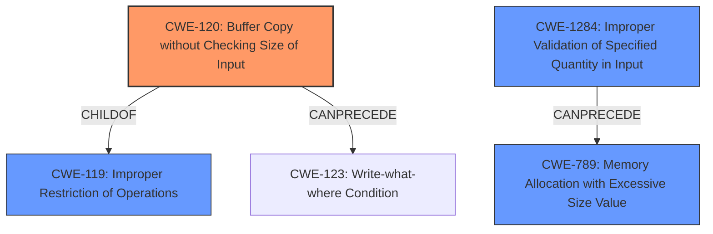

# Analysis for CVE-2021-1451

# Summary
| CWE ID  | CWE Name  | Confidence | CWE Abstraction Level | CWE Vulnerability Mapping Label | CWE-Vulnerability Mapping Notes |
|---|---|---|---|---|---|
| CWE-120 | Buffer Copy without Checking Size of Input ('Classic Buffer Overflow') | 0.9 | Base | Allowed-with-Review | Primary CWE |
| CWE-1284 | Improper Validation of Specified Quantity in Input | 0.7 | Base | Allowed | Secondary Candidate |

## Evidence and Confidence

*   **Confidence Score:** 0.8
*   **Evidence Strength:** HIGH

## Relationship Analysis
The primary CWE is CWE-120, which is a base-level CWE related to buffer overflows. It is a child of CWE-119 (Improper Restriction of Operations within the Bounds of a Memory Buffer), a more general class-level CWE. CWE-1284 (Improper Validation of Specified Quantity in Input) can precede CWE-789 (Memory Allocation with Excessive Size Value), a potential impact of a buffer overflow.

## Vulnerability Chain
The vulnerability chain starts with **incorrect boundary checks** leading to a **buffer overflow**. This can then lead to a denial-of-service or arbitrary code execution.

## Summary of Analysis
The vulnerability description highlights an **incorrect boundary check** as the root cause, which leads to a **buffer overflow** condition. This condition allows an attacker to potentially trigger a DoS or execute arbitrary code.

The primary CWE selected is CWE-120 (Buffer Copy without Checking Size of Input ('Classic Buffer Overflow')). This CWE accurately captures the essence of the vulnerability, where a buffer copy operation occurs without proper size validation, leading to a buffer overflow. The evidence supporting this decision comes directly from the vulnerability description: "When the crafted packet is processed, a **buffer overflow** condition may occur" and "The vulnerability is due to **incorrect boundary checks** of certain values in Easy VSS protocol packets."

CWE-119 (Improper Restriction of Operations within the Bounds of a Memory Buffer) was considered but not selected as the primary CWE because it is a more general class. While the vulnerability does involve writing outside the bounds of a memory buffer, CWE-120 provides a more specific description of the weakness as a buffer copy without checking size. The mapping guidance for CWE-119 also suggests considering more specific child CWEs.

CWE-1284 (Improper Validation of Specified Quantity in Input) was considered as a secondary CWE because the **incorrect boundary checks** can be interpreted as a failure to validate the size of the input. If the quantity is not properly validated, then attackers can specify malicious quantities to cause excessive resource allocation, trigger unexpected failures, enable buffer overflows, etc.

The selection of CWE-120 as the primary CWE is based on the evidence that a classic buffer overflow occurs due to the lack of size checking during a buffer copy operation. This is supported by the vulnerability description and the CVE Reference Links Content Summary.

Relevant CWE Information:

## Enhanced Context (25 CWEs)
The following CWEs were identified as potentially relevant to this vulnerability:

### CWE-120: Buffer Copy without Checking Size of Input ('Classic Buffer Overflow')
**CWE-120** Buffer Copy without Checking Size of Input ('Classic Buffer Overflow') is selected as the primary CWE because the vulnerability description specifically mentions a **buffer overflow** condition that occurs due to the **incorrect boundary checks**. The description of CWE-120 states, "The product copies an input buffer to an output buffer without verifying that the size of the input buffer is less than the size of the output buffer, leading to a buffer overflow." This aligns perfectly with the described vulnerability.

### CWE-1284: Improper Validation of Specified Quantity in Input
**CWE-1284** Improper Validation of Specified Quantity in Input is selected as a secondary CWE since the **incorrect boundary checks** also means the size or length of input is not validated. The description of CWE-1284 states, "The product receives input that is expected to specify a quantity (such as size or length), but it does not validate or incorrectly validates that the quantity has the required properties."