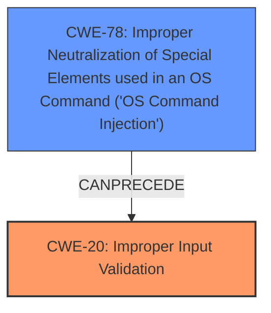

# Analysis for CVE-2021-1459

# Summary
| CWE ID | CWE Name | Confidence | CWE Abstraction Level | CWE Vulnerability Mapping Label | CWE-Vulnerability Mapping Notes |
|---|---|---|---|---|---|
| CWE-20 | Improper Input Validation | 0.9 | Class | Primary | Discouraged |
| CWE-78 | Improper Neutralization of Special Elements used in an OS Command ('OS Command Injection') | 0.7 | Base | Secondary | Allowed |

## Evidence and Confidence

*   **Confidence Score:** 0.8
*   **Evidence Strength:** HIGH

## Relationship Analysis
The primary CWE is CWE-20, which is a Class level CWE. It has several children that could be more specific, but the description lacks enough detail to pinpoint the exact type of **improper validation**. CWE-78 is a possible consequence of **improper input validation** if the user-supplied input is used in an OS command.

## Vulnerability Chain
The vulnerability chain starts with **improper input validation** (CWE-20). If this **improper validation** leads to the ability to inject commands, then OS Command Injection (CWE-78) occurs, which can lead to arbitrary code execution.

## Summary of Analysis
The initial assessment identified **improper validation of user-supplied input** as the root cause, pointing towards CWE-20. The analysis was based on the following evidence from the vulnerability description: "The vulnerability is due to **improper validation of user-supplied input** in the web-based management interface". Also, the CVE Reference Links Content Summary stated, "The vulnerability is due to **improper validation of user-supplied input** within the web-based management interface of the affected Cisco Small Business RV Series Routers."

CWE-20 is a Class-level CWE and the guidance discourages its use. However, it is the most appropriate given the limited information.

I also included CWE-78 because the vulnerability leads to arbitrary code execution, which suggests that the **improperly validated input** is used in an OS command.

Relevant CWE Information:

# Enhanced Context (25 CWEs)

## CWE-20: Improper Input Validation
**Abstraction:** Class
**Status:** Stable

### Description
The product receives input or data, but it does
        not validate or incorrectly validates that the input has the
        properties that are required to process the data safely and
        correctly.

### Extended Description

Input validation is a frequently-used technique for checking potentially dangerous inputs in order to ensure that the inputs are safe for processing within the code, or when communicating with other components. When software does not validate input properly, an attacker is able to craft the input in a form that is not expected by the rest of the application. This will lead to parts of the system receiving unintended input, which may result in altered control flow, arbitrary control of a resource, or arbitrary code execution.

### Mapping Guidance
**Usage:** Discouraged
**Rationale:** CWE-20 is commonly misused in low-information vulnerability reports when lower-level CWEs could be used instead, or when more details about the vulnerability are available [REF-1287]. It is not useful for trend analysis. It is also a level-1 Class (i.e., a child of a Pillar).

## CWE-78: Improper Neutralization of Special Elements used in an OS Command ('OS Command Injection')
**Abstraction:** Base
**Status:** Stable

### Description
The product constructs all or part of an OS command using externally-influenced input from an upstream component, but it does not neutralize or incorrectly neutralizes special elements that could modify the intended OS command when it is sent to a downstream component.

### Extended Description

This weakness can lead to a vulnerability in environments in which the attacker does not have direct access to the operating system, such as in web applications. Alternately, if the weakness occurs in a privileged program, it could allow the attacker to specify commands that normally would not be accessible, or to call alternate commands with privileges that the attacker does not have. The problem is exacerbated if the compromised process does not follow the principle of least privilege, because the attacker-controlled commands may run with special system privileges that increases the amount of damage.

### Mapping Guidance
**Usage:** Allowed
**Rationale:** This CWE entry is at the Base level of abstraction, which is a preferred level of abstraction for mapping to the root causes of vulnerabilities.