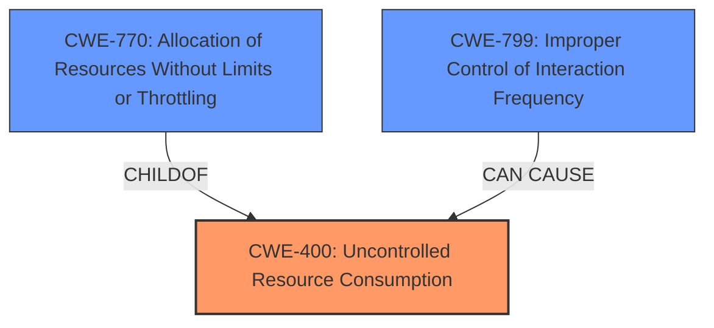

# Analysis for CVE-2021-1460

# Summary
| CWE ID | CWE Name | Confidence | CWE Abstraction Level | CWE Vulnerability Mapping Label | CWE-Vulnerability Mapping Notes |
|---|---|---|---|---|---|
| CWE-400 | Uncontrolled Resource Consumption | 0.9 | Class | Primary | Discouraged |
| CWE-799 | Improper Control of Interaction Frequency | 0.7 | Class | Secondary | Allowed-with-Review |
| CWE-770 | Allocation of Resources Without Limits or Throttling | 0.6 | Base | Secondary | Allowed |

## Evidence and Confidence

*   **Confidence Score:** 0.8
*   **Evidence Strength:** HIGH

## Relationship Analysis
The primary relationship considered was the hierarchical structure, specifically how CWE-400 **Uncontrolled Resource Consumption** is a Class-level CWE, and CWE-770 **Allocation of Resources Without Limits or Throttling** is a Base-level CWE and a child of CWE-400. The analysis also considered CWE-799 **Improper Control of Interaction Frequency** as a potential contributing factor to the resource consumption issue.

## Vulnerability Chain
The vulnerability chain starts with **insufficient error handling** leading to a state where a high rate of crafted TCP traffic can cause the IOx web server to stop processing requests, ultimately resulting in a denial of service.

`Insufficient Error Handling` -> `Uncontrolled Resource Consumption (CWE-400)` -> `Denial of Service`

## Summary of Analysis
Initially, the analysis focused on the **insufficient error handling** as the root cause, but the evidence suggests that the **insufficient error handling** leads to **uncontrolled resource consumption**, which then causes the denial of service. The primary CWE selected is CWE-400 **Uncontrolled Resource Consumption**, as the vulnerability allows an attacker to exhaust resources on the affected device. Although CWE-400 is discouraged, it is the best fit given the provided information. The Cisco advisory also categorized the vulnerability as CWE-400.
The selection of CWE-400 is based on the "Vulnerability Description Key Phrases" which indicates the "impact" as "denial of service (DoS)". The "CVE Reference Links Content Summary" also states that the "primary weakness is the lack of proper error handling when processing network packets" and that the "successful exploitation leads to a denial-of-service (DoS) condition." The advisory itself maps the vulnerability to CWE-400.

CWE-799 **Improper Control of Interaction Frequency** was also considered. The vulnerability description mentions a "high and sustained rate of crafted TCP traffic," which aligns with the description of CWE-799. However, the root cause is still the resource consumption, and the improper control of interaction frequency is a contributing factor.

CWE-770 **Allocation of Resources Without Limits or Throttling** was also considered because it is a child of CWE-400, and it is more specific. The description explicitly mentions that the product "allocates a reusable resource or group of resources on behalf of an actor without imposing any restrictions on the size or number of resources that can be allocated." While this aligns with the vulnerability, there isn't specific evidence to confirm that the root cause is due to an allocation of resources without limits, instead of other factors like holding on to resources too long. Therefore, CWE-400 remains the better choice.

Relevant CWE Information:

# Enhanced Context (25 CWEs)

## CWE-404: Improper Resource Shutdown or Release
**Abstraction Level**: Class
**Similarity Score**: 0.77
**Source**: dense

**Description**:
The product does not release or incorrectly releases a resource before it is made available for re-use.

**Mapping Guidance**:
- Usage: Allowed-with-Review
- Rationale: This CWE entry is a Class and might have Base-level children that would be more appropriate

*   Not Selected: The vulnerability description does not specifically state that resources are not being released properly. Instead, it says that the error handling is **insufficient**, which is leading to **uncontrolled resource consumption**.

## CWE-617: Reachable Assertion
**Abstraction Level**: Base
**Similarity Score**: 0.77
**Source**: dense

**Description**:
The product contains an assert() or similar statement that can be triggered by an attacker, which leads to an application exit or other behavior that is more severe than necessary.

**Mapping Guidance**:
- Usage: Allowed
- Rationale: This CWE entry is at the Base level of abstraction, which is a preferred level of abstraction for mapping to the root causes of vulnerabilities.

*   Not Selected: This CWE doesn't fit the vulnerability description. The vulnerability isn't caused by a triggered assertion.

## CWE-664: Improper Control of a Resource Through its Lifetime
**Abstraction Level**: Pillar
**Similarity Score**: 0.76
**Source**: dense

**Description**:
The product does not maintain or incorrectly maintains control over a resource throughout its lifetime of creation, use, and release.

**Mapping Guidance**:
- Usage: Discouraged
- Rationale: This CWE entry is high-level when lower-level children are available.

*   Not Selected: This CWE is too high-level.

## CWE-226: Sensitive Information in Resource Not Removed Before Reuse
**Abstraction Level**: Base
**Similarity Score**: 0.75
**Source**: dense

**Description**:
The product releases a resource such as memory or a file so that it can be made available for reuse, but it does not clear or "zeroize" the information contained in the resource before the product performs a critical state transition or makes the resource available for reuse by other entities.

**Mapping Guidance**:
- Usage: Allowed
- Rationale: This CWE entry is at the Base level of abstraction, which is a preferred level of abstraction for mapping to the root causes of vulnerabilities.

*   Not Selected: This vulnerability is about denial of service.

## CWE-799: Improper Control of Interaction Frequency
**Abstraction Level**: Class
**Similarity Score**: 0.75
**Source**: dense

**Description**:
The product does not properly limit the number or frequency of interactions that it has with an actor, such as the number of incoming requests.

**Mapping Guidance**:
- Usage: Allowed-with-Review
- Rationale: This CWE entry is a Class and might have Base-level children that would be more appropriate

*   Selected: The vulnerability involves a high and sustained rate of crafted TCP traffic, which aligns with the description of CWE-799. However, the root cause is still resource consumption.

## CWE-405: Asymmetric Resource Consumption (Amplification)
**Abstraction Level**: Class
**Similarity Score**: 0.75
**Source**: dense

**Description**:
The product does not properly control situations in which an adversary can cause the product to consume or produce excessive resources without requiring the adversary to invest equivalent work or otherwise prove authorization, i.e., the adversary's influence is "asymmetric."

**Mapping Guidance**:
- Usage: Allowed-with-Review
- Rationale: This CWE entry is a Class and might have Base-level children that would be more appropriate

*   Not Selected: While there's an element of amplification (attacker sends crafted TCP packets leading to disproportionate resource consumption), the core issue is still uncontrolled resource consumption, making CWE-400 a better fit.

## CWE-1289: Improper Validation of Unsafe Equivalence in Input
**Abstraction Level**: Base
**Similarity Score**: 0.75
**Source**: dense

**Description**:
The product receives an input value that is used as a resource identifier or other type of reference, but it does not validate or incorrectly validates that the input is equivalent to a potentially-unsafe value.

**Mapping Guidance**:
- Usage: Allowed
- Rationale: This CWE entry is at the Base level of abstraction, which is a preferred level of abstraction for mapping to the root causes of vulnerabilities.

*   Not Selected: This vulnerability is about denial of service.

## CWE-754: Improper Check for Unusual or Exceptional Conditions
**Abstraction Level**: Class
**Similarity Score**: 0.74
**Source**: dense

**Description**:
The product does not check or incorrectly checks for unusual or exceptional conditions that are not expected to occur frequently during day to day operation of the product.

**Mapping Guidance**:
- Usage: Allowed-with-Review
- Rationale: This CWE entry is a Class and might have Base-level children that would be more appropriate

*   Not Selected: The **insufficient error handling** is a broader issue than just not checking for unusual conditions.

## CWE-