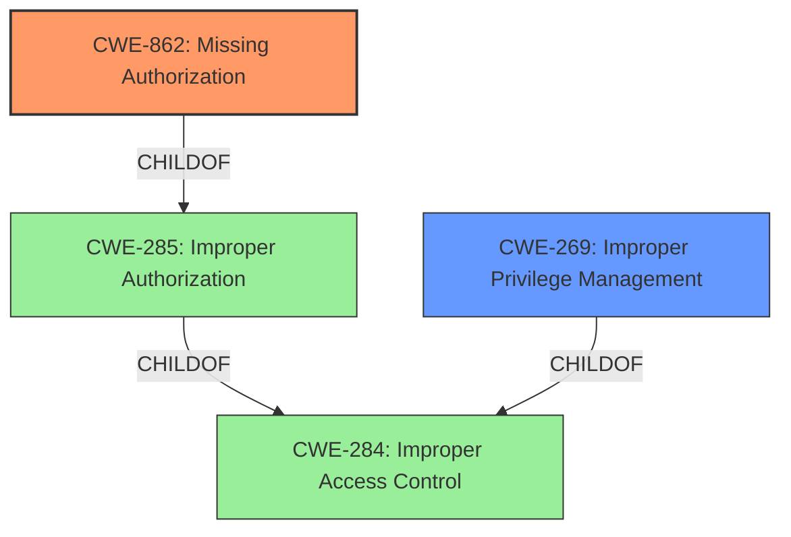

# Analysis for CVE-2021-1468

# Summary
| CWE ID  | CWE Name                                                                    | Confidence | CWE Abstraction Level | CWE Vulnerability Mapping Label | CWE-Vulnerability Mapping Notes |
| :-------- | :-------------------------------------------------------------------------- | :---------- | :----------------------- | :------------------------------ | :------------------------------ |
| CWE-862 | Missing Authorization | 0.80      | Base                     | Primary                     | Allowed-with-Review                   |
| CWE-269 | Improper Privilege Management                                                                 | 0.40      | Class                     | Secondary                    | Discouraged                    |

## Evidence and Confidence

*   **Confidence Score:** 0.80
*   **Evidence Strength:** MEDIUM

## Relationship Analysis
The primary relationship influencing my decision is the hierarchical relationship between CWE-284 (Improper Access Control), CWE-285 (Improper Authorization), and CWE-862 (Missing Authorization). CWE-862 is a more specific child of CWE-285, which is in turn a child of CWE-284. Given the evidence points to a **missing** authorization check, CWE-862 is the most appropriate and specific choice. CWE-269 is a sibling Class of CWE-285, but the evidence doesn't clearly point to improper *management* of privileges, but rather a lack of the authorization check itself.



## Vulnerability Chain
The chain of events for this vulnerability starts with the **missing** authorization check (CWE-862), which allows an attacker to perform actions or access resources they shouldn't be able to. This can then lead to the impact of arbitrary code execution, access to sensitive information, escalated privileges, and unauthorized access.

## Summary of Analysis
The initial assessment focused on the **missing** authorization and the potential impacts. The evidence from the CVE Reference Links Content Summary explicitly states "Improper authentication checks on user-supplied input to an application messaging service" and "Insufficient authentication checks". This strongly suggests a **missing** authorization check, leading to the selection of CWE-862.

The graph relationships reinforced the idea that a more specific CWE was preferable. While CWE-284 and CWE-285 are related, they are too general. CWE-862 directly addresses the **missing** authorization aspect.

The final decision is based on the available evidence and the principle of selecting the most specific CWE. CWE-862 is the most accurate and detailed representation of the vulnerability based on the provided information.

Relevant CWE Information:

# Enhanced Context (25 CWEs)
The following CWEs were identified as potentially relevant to this vulnerability:

## CWE-807: Reliance on Untrusted Inputs in a Security Decision
**Abstraction Level**: Base
**Similarity Score**: 0.79
**Source**: dense

## CWE-1289: Improper Validation of Unsafe Equivalence in Input
**Abstraction Level**: Base
**Similarity Score**: 0.78
**Source**: dense

## CWE-303: Incorrect Implementation of Authentication Algorithm
**Abstraction Level**: Base
**Similarity Score**: 0.78
**Source**: dense

## CWE-668: Exposure of Resource to Wrong Sphere
**Abstraction Level**: Class
**Similarity Score**: 0.77
**Source**: dense

## CWE-274: Improper Handling of Insufficient Privileges
**Abstraction Level**: Base
**Similarity Score**: 0.77
**Source**: dense

## CWE-653: Improper Isolation or Compartmentalization
**Abstraction Level**: Class
**Similarity Score**: 0.76
**Source**: dense

## CWE-184: Incomplete List of Disallowed Inputs
**Abstraction Level**: Base
**Similarity Score**: 0.76
**Source**: dense

## CWE-41: Improper Resolution of Path Equivalence
**Abstraction Level**: Base
**Similarity Score**: 0.76
**Source**: dense

## CWE-345: Insufficient Verification of Data Authenticity
**Abstraction Level**: Class
**Similarity Score**: 0.76
**Source**: dense

## CWE-799: Improper Control of Interaction Frequency
**Abstraction Level**: Class
**Similarity Score**: 0.76
**Source**: dense

## CWE-863: Incorrect Authorization
**Abstraction Level**: Class
**Similarity Score**: 7223.19
**Source**: sparse

## CWE-22: Improper Limitation of a Pathname to a Restricted Directory ('Path Traversal')
**Abstraction Level**: Base
**Similarity Score**: 7178.40
**Source**: sparse

## CWE-285: Improper Authorization
**Abstraction Level**: Class
**Similarity Score**: 7094.27
**Source**: sparse

## CWE-639: Authorization Bypass Through User-Controlled Key
**Abstraction Level**: Base
**Similarity Score**: 7082.24
**Source**: sparse

## CWE-59: Improper Link Resolution Before File Access ('Link Following')
**Abstraction Level**: Base
**Similarity Score**: 7056.38
**Source**: sparse

## CWE-1257: Improper Access Control Applied to Mirrored or Aliased Memory Regions
**Abstraction Level**: base
**Similarity Score**: 4.33
**Source**: graph

## CWE-73: External Control of File Name or Path
**Abstraction Level**: base
**Similarity Score**: 4.33
**Source**: graph

## CWE-770: Allocation of Resources Without Limits or Throttling
**Abstraction Level**: base
**Similarity Score**: 4.33
**Source**: graph

## CWE-22: Improper Limitation of a Pathname to a Restricted Directory ('Path Traversal')
**Abstraction Level**: base
**Similarity Score**: 4.33
**Source**: graph

## CWE-190: Integer Overflow or Wraparound
**Abstraction Level**: base
**Similarity Score**: 4.33
**Source**: graph

## CWE-386: Symbolic Name not Mapping to Correct Object
**Abstraction Level**: base
**Similarity Score**: 4.21
**Source**: graph

## CWE-125: Out-of-bounds Read
**Abstraction Level**: base
**Similarity Score**: 3.89
**Source**: graph

## CWE-266: Incorrect Privilege Assignment
**Abstraction Level**: base
**Similarity Score**: 3.64
**Source**: graph

## CWE-843: Access of Resource Using Incompatible Type ('Type Confusion')
**Abstraction Level**: base
**Similarity Score**: 3.44
**Source**: graph

## CWE-1284: Improper Validation of Specified Quantity in Input
**Abstraction Level**: base
**Similarity Score**: 3.42
**Source**: graph

## Vulnerability Description
Multiple vulnerabilities in Cisco SD-WAN vManage Software could allow an unauthenticated, remote attacker to execute arbitrary code or gain access to sensitive information, or allow an authenticated, local attacker to gain escalated privileges or gain unauthorized access to the application. For more information about these vulnerabilities, see the Details section of this advisory.

### Vulnerability Description Key Phrases
- **impact:** execute arbitrary code and gain access to sensitive information and gain escalated privileges and gain unauthorized access to the application
- **attacker:** unauthenticated remote attacker and authenticated local attacker
- **product:** Cisco SD-WAN vManage Software

### CWE for similar CVE Descriptions
### Primary CWE Match
CWE-862

#### Top CWEs
- CWE-862 (Count: 18)
- CWE-400 (Count: 6)
- CWE-78 (Count: 6)

## CVE Reference Links Content Summary
```
{
  "CVE-2021-1468": {
    "Root cause": "Improper authentication checks on user-supplied input to an application messaging service.",
    "Weaknesses": [
      "Insufficient authentication checks"
    ],
    "Impact": "An unauthenticated remote attacker can send unauthorized messages, call privileged actions, and create new administrative level user accounts.",
     "Attack vectors": [
      "Sending crafted input to the application messaging service."
    ],
    "Required attacker capabilities": "Unauthenticated remote access to the messaging service."
  }
}
```

## Retriever Results

### Top Combined Results