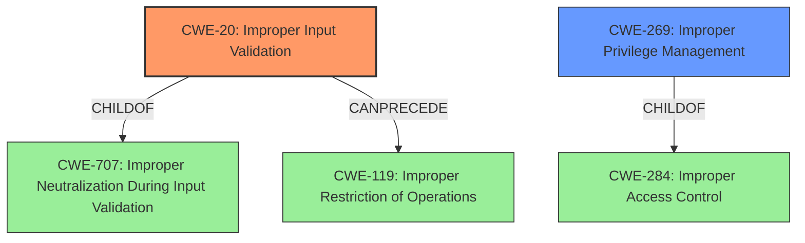

# Raw Analyzer Response for CVE-2021-1469

# Summary

| CWE ID | CWE Name | Confidence | CWE Abstraction Level | CWE Vulnerability Mapping Label | CWE-Vulnerability Mapping Notes |
|---|---|---|---|---|---|
| CWE-20 | Improper Input Validation | 0.7 | Class | Discouraged | The vulnerability involves **improper validation of message content**, suggesting a failure to adequately scrutinize input. |
| CWE-269 | Improper Privilege Management | 0.6 | Class | Discouraged | The impact includes arbitrary program execution with elevated privileges, indicating a potential **privilege management** issue. |

## Evidence and Confidence

*   **Confidence Score:** 0.65
*   **Evidence Strength:** MEDIUM

## Relationship Analysis
The analysis considers the following relationships:
  - CWE-20 (Improper Input Validation) is a class-level CWE and a child of CWE-707 (Improper Neutralization During Input Validation). It's often a precursor to other vulnerabilities.
  - CWE-269 (Improper Privilege Management) is a class-level CWE and a child of CWE-284 (Improper Access Control). Its presence suggests that privilege-related flaws contribute to the vulnerability.
  - CWE-20 can precede CWE-119 (Improper Restriction of Operations within the Bounds of a Memory Buffer), CWE-770 (Allocation of Resources Without Limits or Throttling), and other issues involving resource management and memory safety.

## Vulnerability Chain
The vulnerability chain appears to start with **improper input validation** (CWE-20), which then leads to arbitrary program execution with elevated privileges, indicating a **privilege management** issue (CWE-269). Other weaknesses may exist, such as buffer overflows due to the improper input validation.

## Summary of Analysis
The initial analysis considered both **improper input validation** and **improper privilege management** as key elements of the vulnerability. The analysis is primarily based on the "CVE Reference Links Content Summary," which indicates **improper validation of message content** as a root cause and describes the impact as arbitrary program execution with elevated privileges.

The graph relationships show that **improper input validation** can precede other issues like buffer overflows, and **improper privilege management** is related to access control problems.

The final decision is to include both CWE-20 and CWE-269 because they represent distinct aspects of the vulnerability. CWE-20 addresses the root cause of **improper validation of message content**, and CWE-269 addresses the consequence of arbitrary program execution with elevated privileges. Although both are class-level CWEs and thus discouraged, the evidence is not strong enough to support moving to more specific CWEs.

Relevant CWE Information:

# Enhanced Context (25 CWEs)

## CWE-404: Improper Resource Shutdown or Release
**Abstraction Level**: Class
**Similarity Score**: 0.77
**Source**: dense

**Description**:
The product does not release or incorrectly releases a resource before it is made available for re-use.

**Mapping Guidance**:
- Usage: Allowed-with-Review
- Rationale: This CWE entry is a Class and might have Base-level children that would be more appropriate

## CWE-226: Sensitive Information in Resource Not Removed Before Reuse
**Abstraction Level**: Base
**Similarity Score**: 0.77
**Source**: dense

**Description**:
The product releases a resource such as memory or a file so that it can be made available for reuse, but it does not clear or "zeroize" the information contained in the resource before the product performs a critical state transition or makes the resource available for reuse by other entities.

**Mapping Guidance**:
- Usage: Allowed
- Rationale: This CWE entry is at the Base level of abstraction, which is a preferred level of abstraction for mapping to the root causes of vulnerabilities.

## CWE-59: Improper Link Resolution Before File Access ('Link Following')
**Abstraction Level**: Base
**Similarity Score**: 0.76
**Source**: dense

**Description**:
The product attempts to access a file based on the filename, but it does not properly prevent that filename from identifying a link or shortcut that resolves to an unintended resource.

**Mapping Guidance**:
- Usage: Allowed
- Rationale: This CWE entry is at the Base level of abstraction, which is a preferred level of abstraction for mapping to the root causes of vulnerabilities.

## CWE-667: Improper Locking
**Abstraction Level**: Class
**Similarity Score**: 0.76
**Source**: dense

**Description**:
The product does not properly acquire or release a lock on a resource, leading to unexpected resource state changes and behaviors.

**Mapping Guidance**:
- Usage: Allowed-with-Review
- Rationale: This CWE entry is a Class and might have Base-level children that would be more appropriate

## CWE-41: Improper Resolution of Path Equivalence
**Abstraction Level**: Base
**Similarity Score**: 0.76
**Source**: dense

**Description**:
The product is vulnerable to file system contents disclosure through path equivalence. Path equivalence involves the use of special characters in file and directory names. The associated manipulations are intended to generate multiple names for the same object.

**Mapping Guidance**:
- Usage: Allowed
- Rationale: This CWE entry is at the Base level of abstraction, which is a preferred level of abstraction for mapping to the root causes of vulnerabilities.

## CWE-1289: Improper Validation of Unsafe Equivalence in Input
**Abstraction Level**: Base
**Similarity Score**: 0.75
**Source**: dense

**Description**:
The product receives an input value that is used as a resource identifier or other type of reference, but it does not validate or incorrectly validates that the input is equivalent to a potentially-unsafe value.

**Mapping Guidance**:
- Usage: Allowed
- Rationale: This CWE entry is at the Base level of abstraction, which is a preferred level of abstraction for mapping to the root causes of vulnerabilities.

## CWE-23: Relative Path Traversal
**Abstraction Level**: Base
**Similarity Score**: 0.75
**Source**: dense

**Description**:
The product uses external input to construct a pathname that should be within a restricted directory, but it does not properly neutralize sequences such as ".." that can resolve to a location that is outside of that directory.

**Mapping Guidance**:
- Usage: Allowed
- Rationale: This CWE entry is at the Base level of abstraction, which is a preferred level of abstraction for mapping to the root causes of vulnerabilities.

## CWE-212: Improper Removal of Sensitive Information Before Storage or Transfer
**Abstraction Level**: Base
**Similarity Score**: 0.75
**Source**: dense

**Description**:
The product stores, transfers, or shares a resource that contains sensitive information, but it does not properly remove that information before the product makes the resource available to unauthorized actors.

**Mapping Guidance**:
- Usage: Allowed
- Rationale: This CWE entry is at the Base level of abstraction, which is a preferred level of abstraction for mapping to the root causes of vulnerabilities.

## CWE-703: Improper Check or Handling of Exceptional Conditions
**Abstraction Level**: Pillar
**Similarity Score**: 0.75
**Source**: dense

**Description**:
The product does not properly anticipate or handle exceptional conditions that rarely occur during normal operation of the product.

**Mapping Guidance**:
- Usage: Discouraged
- Rationale: This CWE entry is extremely high-level, a Pillar.

## CWE-665: Improper Initialization
**Abstraction Level**: Class
**Similarity Score**: 0.75
**Source**: dense

**Description**:
The product does not initialize or incorrectly initializes a resource, which might leave the resource in an unexpected state when it is accessed or used.

**Mapping Guidance**:
- Usage: Discouraged
- Rationale: This CWE entry is a level-1 Class (i.e., a child of a Pillar). It might have lower-level children that would be more appropriate

## CWE-22: Improper Limitation of a Pathname to a Restricted Directory ('Path Traversal')
**Abstraction Level**: Base
**Similarity Score**: 7753.43
**Source**: sparse

**Description**:
The product uses external input to construct a pathname that is intended to identify a file or