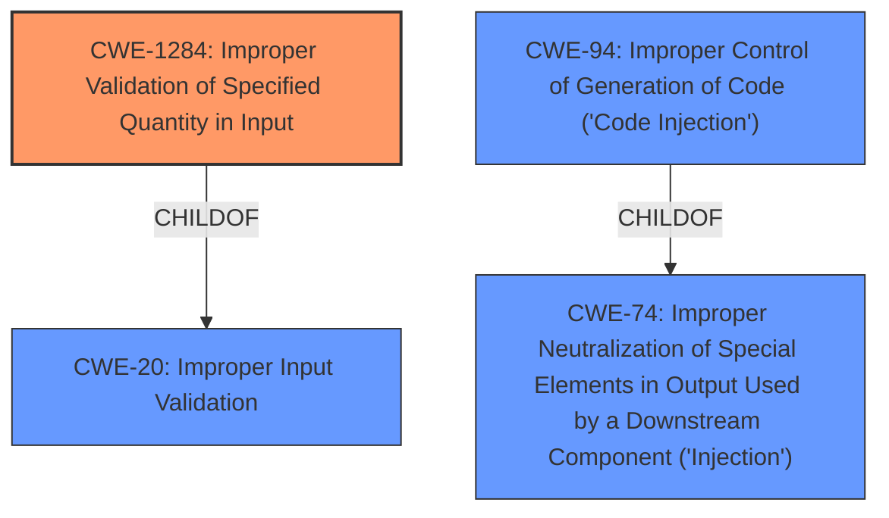

# Enhanced Analysis for CVE-2021-1502

# Summary
| CWE ID  | CWE Name                                                                     | Confidence | CWE Abstraction Level | CWE Vulnerability Mapping Label | CWE-Vulnerability Mapping Notes |
| ------- | ---------------------------------------------------------------------------- | ---------- | --------------------- | ------------------------------- | ----------------------------- |
| CWE-1284 | Improper Validation of Specified Quantity in Input                         | 0.75       | Base                  | Primary CWE                     | Allowed                       |
| CWE-20  | Improper Input Validation                                                    | 0.50       | Class                 | Secondary Candidate             | Discouraged                   |
| CWE-94  | Improper Control of Generation of Code ('Code Injection') | 0.4        | Base                 | Secondary Candidate             | Allowed-with-Review                   |

## Evidence and Confidence

*   **Confidence Score:** 0.70
*   **Evidence Strength:** MEDIUM

## Relationship Analysis
The primary relationship that impacted my decision was the child-of relationship between CWE-1284 and CWE-20, where CWE-1284 is a more specific case of improper input validation. I also considered the parent relationship between CWE-94 and CWE-74, noting that code injection often stems from broader injection issues. The hierarchy helped me choose the most accurate and detailed representation of the vulnerability.



## Vulnerability Chain
The vulnerability chain starts with **insufficient validation** (CWE-1284) of values within Webex recording files. This leads to the potential for an attacker to inject malicious code (CWE-94) by crafting ARF or WRF files. The final impact is the execution of arbitrary code on the affected system.

## Summary of Analysis
Initially, the **insufficient validation** (**ROOTCAUSE**) pointed towards CWE-20 [CWE-20: Improper Input Validation]. However, the retriever results and the vulnerability description's focus on file formats led me to consider CWE-1284 [CWE-1284: Improper Validation of Specified Quantity in Input] as a more specific match. The vulnerability description states, "The vulnerability is due to **insufficient validation** of values within Webex recording files formatted as either Advanced Recording Format (ARF) or Webex Recording Format (WRF)." The reference links further confirmed this by stating, "The vulnerability is due to **insufficient validation** of values within Webex recording files formatted as either Advanced Recording Format (ARF) or Webex Recording Format (WRF)." This indicates that the quantity or format of the input is not being properly checked.

CWE-94 [CWE-94: Improper Control of Generation of Code ('Code Injection')] was considered because the ultimate impact is arbitrary code execution, suggesting the possibility of code injection. While the initial weakness is in validation, the attack vector involves crafting malicious files that, when parsed, could lead to code execution.

My final decision favors CWE-1284 [CWE-1284: Improper Validation of Specified Quantity in Input] as the primary CWE because it directly addresses the **ROOTCAUSE** of the vulnerability: the **insufficient validation** of file format values. CWE-20 [CWE-20: Improper Input Validation] serves as a broader classification, while CWE-94 [CWE-94: Improper Control of Generation of Code ('Code Injection')] highlights the potential for code injection as a consequence of this validation failure.

Relevant CWE Information:

# Enhanced Context (25 CWEs)
The following CWEs were identified as potentially relevant to this vulnerability:

## CWE-653: Improper Isolation or Compartmentalization
**Abstraction Level**: Class
**Similarity Score**: 0.77
**Source**: dense

**Description**:
The product does not properly compartmentalize or isolate functionality, processes, or resources that require different privilege levels, rights, or permissions.

**Mapping Guidance**:
- Usage: Allowed
- Rationale: This CWE entry is at the Base level of abstraction, which is a preferred level of abstraction for mapping to the root causes of vulnerabilities.

## CWE-1289: Improper Validation of Unsafe Equivalence in Input
**Abstraction Level**: Base
**Similarity Score**: 0.77
**Source**: dense

**Description**:
The product receives an input value that is used as a resource identifier or other type of reference, but it does not validate or incorrectly validates that the input is equivalent to a potentially-unsafe value.

**Mapping Guidance**:
- Usage: Allowed
- Rationale: This CWE entry is at the Base level of abstraction, which is a preferred level of abstraction for mapping to the root causes of vulnerabilities.

## CWE-274: Improper Handling of Insufficient Privileges
**Abstraction Level**: Base
**Similarity Score**: 0.77
**Source**: dense

**Description**:
The product does not handle or incorrectly handles when it has insufficient privileges to perform an operation, leading to resultant weaknesses.

**Mapping Guidance**:
- Usage: Discouraged
- Rationale: This CWE entry could be deprecated in a future version of CWE.

## CWE-807: Reliance on Untrusted Inputs in a Security Decision
**Abstraction Level**: Base
**Similarity Score**: 0.76
**Source**: dense

**Description**:
The product uses a protection mechanism that relies on the existence or values of an input, but the input can be modified by an untrusted actor in a way that bypasses the protection mechanism.

**Mapping Guidance**:
- Usage: Allowed
- Rationale: This CWE entry is at the Base level of abstraction, which is a preferred level of abstraction for mapping to the root causes of vulnerabilities.

## CWE-184: Incomplete List of Disallowed Inputs
**Abstraction Level**: Base
**Similarity Score**: 0.76
**Source**: dense

**Description**:
The product implements a protection mechanism that relies on a list of inputs (or properties of inputs) that are not allowed by policy or otherwise require other action to neutralize before additional processing takes place, but the list is incomplete.

**Mapping Guidance**:
- Usage: Allowed
- Rationale: This CWE entry is at the Base level of abstraction, which is a preferred level of abstraction for mapping to the root causes of vulnerabilities.

## CWE-691: Insufficient Control Flow Management
**Abstraction Level**: Pillar
**Similarity Score**: 0.76
**Source**: dense

**Description**:
The code does not sufficiently manage its control flow during execution, creating conditions in which the control flow can be modified in unexpected ways.

**Mapping Guidance**:
- Usage: Discouraged
- Rationale: This CWE entry is extremely high-level, a Pillar. However, classification research is limited for weaknesses of this type, so there can be gaps or organizational difficulties within CWE that force use of this weakness, even at such a high level of abstraction.

## CWE-280: Improper Handling of Insufficient Permissions or Privileges
**Abstraction Level**: Base
**Similarity Score**: 0.76
**Source**: dense

**Description**:
The product does not handle or incorrectly handles when it has insufficient privileges to access resources or functionality as specified by their permissions. This may cause it to follow unexpected code paths that may leave the product in an invalid state.

**Mapping Guidance**:
- Usage: Allowed
- Rationale: This CWE entry is at the Base level of abstraction, which is a preferred level of abstraction for mapping to the root causes of vulnerabilities.

## CWE-74: Improper Neutralization of Special Elements in Output Used by a Downstream Component ('Injection')
**Abstraction Level**: Class
**Similarity Score**: 0.75
**Source**: dense

**Description**:
The product constructs all or part of a command, data structure, or record using externally-influenced input from an upstream component, but it does not neutralize or incorrectly neutralizes special elements that could modify how it is parsed or interpreted when it is sent to a downstream component.

**Mapping Guidance**:
- Usage: Discouraged
- Rationale: CWE-74 is high-level and often misused when lower-level weaknesses are more appropriate.

## CWE-183: Permissive List of Allowed Inputs
**Abstraction Level**: Base
**Similarity Score**: 0.75
**Source**: dense

**Description**:
The product implements a protection mechanism that relies on a list of inputs (or properties of inputs) that are explicitly allowed by policy because the inputs are assumed to be safe, but the list is too permissive - that is, it allows an input that is unsafe, leading to resultant weaknesses.

**Mapping Guidance**:
- Usage: Allowed
- Rationale


## CWE Relationship Analysis

Current CWEs represent these abstraction levels: .


### Vulnerability Chain Analysis

**Chain starting from CWE-691:**
- 691 (Insufficient Control Flow Management) - ROOT


**Chain starting from CWE-653:**
- 653 (Improper Isolation or Compartmentalization) - ROOT


### CWE Relationship Diagram

```mermaid
graph TD
    classDef primary fill:#f96,stroke:#333,stroke-width:2px
    classDef secondary fill:#69f,stroke:#333
    classDef tertiary fill:#9e9,stroke:#333
```